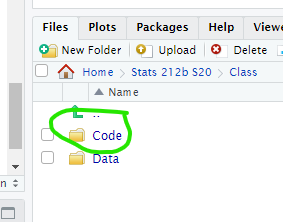
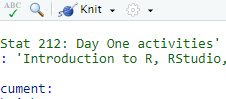

```{r setup, include=FALSE}
library(learnr)
library(readr)
library(dplyr)

knitr::opts_chunk$set(
  echo = FALSE,
  fig.align = "center",
  fig.width = 6, fig.height = 4)

campaign.colors <- read_csv("https://raw.githubusercontent.com/the-pudding/data/master/campaign-colors/colors.csv")
```


## Before we jump in...

### Why use R as our statistical software?

1. It's free (yay!).

1. It's open source.

1. It's powerful and customizable.

1. It's an industry standard and used by many large companies.
    
1. It's vital for sharing and reproducing the cleaning, visualization, and analysis of data.


## The Basics

### Calculator

The simplest way to use R is as a calculator. Below is a box where you can write and run code in R. We will have these boxes in the tutorials to introduce some ideas, but the real coding will happen elsewhere (shown in the next section).

#### Try

Run code as it is shown below to see the result. Then try writing a few of your own commands to solve the following:

- `5 + 4`

- `10 / 2`

- `4 ^ 3`  (what do you think the `^` means?)


```{r first-try, exercise = TRUE}
1 + 1
```

### Objects/variables

Sometimes it is useful to give names particular quantity to increase the readability of what we are doing. For example let's suppose that we want to calculate the area of a circle of radius 2. In R we could do that by writing

```{r first-formula, exercise = TRUE}
radius <- 2
radius
area <- pi * radius^2
area
```

Notice that:

-We use the symbol `<-` to assign a value to a variable. For example, the first line assigns `2` to the variable `radius`. 

-To show the value of a variable we just need to type the name of the variable. For example when write `radius` on line 2, R will return the value `2`

-We can use a variable inside an assignment. For example in line 3 `radius` will be replaced by `2`. Notice also how `pi` is a variable and it will be replaced by `3.14`. R will evaluate the expression `pi *radius^2` to `3.14*4 = 12.56`

#### Try

Can you write code to:

-Calculate the circumference (or length) of a circle of radius 2  (Remember $perimeter = 2\cdot \pi \cdot r$)

-Calculate the circumference (or length) of a circle of radius 3

```{r second-formula, exercise = TRUE}
radius <- 2
```

### Functions

Functions are predefined ways of transforming a set variables. Let's assume you want to calculate the log2 of 8. We can use the function `log2` to do that by typing

```{r functions-formula, exercise = TRUE}
log2(8)
```

Notice that:

-`log2` takes a number (in this case $8$) and produces the number such that $2^x = 8$. In this case $2^3 = 8$.

-By writing `?log2` you can get more details on the function `log2` (Try it!) 

#### Try

Write code to:

-Calculate $e^3$ by using the function `exp`.

-Assign the result of $e^3$ to variable `var`

-Calculate the logarithm of `var` by using the function `log`


```{r functions-2, exercise = TRUE}
exp(3)
```

### Data Analysis with tables / data frames

R can do more than function as a calculator - it can be used to analyze data! Run the code below to load the data set from the article [How candidate diversity impacts color diversity](https://pudding.cool/2020/08/campaign-colors/). 


```{r first-table, exercise = TRUE}
library(readr)
library(dplyr)
campaign.colors <- read_csv("https://raw.githubusercontent.com/the-pudding/data/master/campaign-colors/colors.csv")

head(campaign.colors)
dim(campaign.colors)
summary(campaign.colors)
glimpse(campaign.colors)
```

Notice that:

-The first line tells R that we are going to use all the functions that are in the packages `readr` and `dplyr`, so R loads all those functions for us. In particular we will be using the function `read_csv` which allows to load a table

-The second line creates a new variable `campaign.colors` with the output of the function `read_csv`. The function `read_csv` reads a table from a link (or a file) and outputs a table (more precisely a `data_frame` or a `tibble`, more on data on a little bit)

-Finally the function `head` provides the first 8 rows (or observations) from `campaign.colors`

### Accessing columns

```{r second_frame, exercise = TRUE}
head(campaign.colors$year)
table(campaign.colors$year)
table(campaign.colors$year, campaign.colors$RWB)
```

#### Try

Write code to:

-Summarize the column `party`

-Create a table summarizing `year` by sex (use column `male`)

```{r you-try, exercise = TRUE}

```


Just like that, we are *analyzing data!* However, we can't easily save the results of commands we type into this tutorial box. It would be nice if we could share our results with others, come back next week and build on the analyses we've started, make modifications if, say, the data changes, etc. (And it would also be nice to learn better ways to produce data summaries and graphics...)

## RStudio

### St. Olaf server

RStudio is an R *environment*, basically a fancy program that makes it easier to use R, write code, save it, and share it. Luckily at St. Olaf, we have a server that hosts the program so you don't need to download any files or install software. You can access the server from anywhere, including a tablet or your phone! The link is below, and it is also on our Moodle homepage.

> [r.stolaf.edu](https://r.stolaf.edu) (open this link in a new tab)

All of the code I use and write for class will be accessed through this server. 

You can sign into the server with your stolaf account (it's already set up for you). Investigate the different panes. In the Console, you can type the commands from the previous section and R will execute then for you. But the Console does not let us save code or go back and edit it, so we still need a better way...

### Source editor

In the bottom right pane, under Files, navigate to `Stats 212a S21` $\rightarrow$ `Class` $\rightarrow$ `Code`$\rightarrow$`Chapter_1`. This is where I will post my code for lectures, examples, homework. 


\vspace{5mm}

Click on the file `1_Day1.Rmd`. This should open a file in your Source pane in the upper left that contains the code which produces a handout version of this tutorial. The **Source editor** is exactly what we need. We can write lots of code, run it through the console, edit, and save the results.

### VERY IMPORTANT!

As the instructor, ONLY I can edit and save documents in the `Class` folder. You can create, edit, and save files in your `Sumbit` folder. 

> Save a copy of Day1.Rmd to your `Submit` folder using the **File > Save As** option.

Only you and the professor have access to this folder; it's the place you should take class notes and work on homework assignments.

## RMarkdown

### Knitting

Once the file is saved in your `Submit` folder, you can make changes to the document. `Day1.Rmd` is what we call an **RMarkdown** file. It's a way for us to write and save code that performs statistical analysis *within* a regular text document.

> All of your homeworks and final project will be completed as RMarkdown files! So take some time to get to know one...

First, click on **Knit** at the top of the document and report what happens.


\vspace{5mm}

Second, find the following features in the document, change them slightly and notice the effect they have on the knitted document:

+ `###` vs. `##`

+ `*...*` vs. `**...**`


Remember to hit `Knit` after changing the document to see what effect it has.


