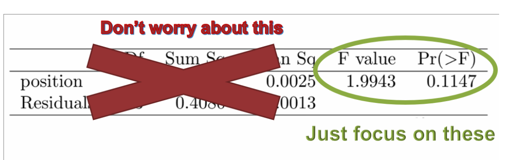

```{r setup, include=FALSE}
#library(learnr)
library(tidyverse)
library(mosaic)
library(ggplot2)
library(openintro)
library(sortable)
library(grid)
knitr::opts_chunk$set(echo = TRUE)

data(toy.anova)

anova_example <- toy.anova %>%
  mutate(x2, x2 = ifelse(groups == "II", (x2+0.35)*1.75, x2)) %>%
  mutate(x2, x2 = ifelse(groups == "I", (x2 - 1)/3, x2))
#anova_example

x1_plot <- ggplot(anova_example, aes(x = groups, y = x1)) +
  geom_violin(aes(fill = groups), alpha = 0.25) +
  geom_jitter(alpha = 0.35, aes(color = groups, size = 1), width = 0.05) + 
  ylim(-2, 5) +
  theme(legend.position = "none")

x2_plot <- ggplot(anova_example, aes(x = groups, y = x2)) +
  geom_violin(aes(fill = groups), alpha = 0.25) +
  geom_jitter(alpha = 0.35, aes(color = groups, size = 1), width = 0.05) + 
  ylim(-2, 5) +
  theme(legend.position = "none")

sleep <- read.csv("https://raw.githubusercontent.com/joeroith/Data/master/SleepStudy.csv")


set.seed(1235)
Growth <- c(rnorm(24, .30, 0.08), rnorm(48, 0.37, 0.07), rnorm(32, 0.38, 0.09), rnorm(14, 0.36, 0.06))
Color <- c(rep("Blonde", 24), rep("Brown", 48), rep("Black", 32), rep("Red", 14))

hairgrowth <- as_tibble(cbind(Color, round(Growth, 3)))
#hairgrowth
#write.csv(hairgrowth, "~/Stats 212b S20/Class/Data/hairgrowth.csv")
```


```{r sleep-prepare}
sleep$Class = factor(sleep$ClassYear, 
                     labels=c("Firstyear","Sophomore","Junior","Senior"))
sleep_model <- aov(GPA ~ Class, data = sleep)
```


## The Setup

### []()

First off, what is **ANOVA**?

> It stands for **AN**alysis **O**f **VA**riance

But as you'll see in a second, it's not really the variance we are analyzing...


### When to use ANOVA

This is one of my favorite types of analysis, because I finally get to let you break away from the limitations of only using one or two groups. ANOVA is in Chapter 4 because we are still dealing with a numeric response variable, but now we have a categorical explanatory variable that can have *as many levels as we want*! So instead of comparing two means, we use **ANOVA to compare means across 3 or more groups**.

+ <font color='blue'>**Response Variable:**</font> Numeric

+ <font color='green'>**Explanatory Variable:**</font> Categorical (3 + levels)

### []()

This is a much more realistic scenario with data. Rarely can good research questions be divided into just two groups, like Yes/No, or even Control/Treatment. ANOVA gives us the flexibility to handle more complex data and situations. For example:

+ Average height between 3rd, 4th, and 5th graders

+ Mean carbon levels at the bottom of several different ponds

+ Increased white blood cell counts for patients using a new drug in different doses; 100mg, 50mg, 25mg, and 0mg (placebo)

### []()

For ANOVA we will introduce another new distribution and test statistic, but at its core, it's still just a test to decide if nothing is different or is there is a difference in the population somewhere. If you get a little lost in the new details, try to come back to the big picture; **We want to infer something about the real means of several population groups. **


## ANOVA is a test

### What's variance got to do with it?

It may be hard to tell from the name, but ANOVA is a **hypothesis test**. We want to test for any difference in means for a numeric variable by comparing three or more groups of a categorical variable (if it were only two means we'd do a 2-sample t-test). Even though we are testing means, ANOVA stands for analysis of variance, what gives?

> We test for the difference in means *using* the spread/variance in the data two different ways:

1) Considering the variation of numeric values in each group individually (within group variation)

2) Considering the variation of numeric values overall, for all groups combined (between group variation)


### A demonstration

We'll work with an example data set first to illustrate the idea of what we are looking for. Below are the summary stats for one numeric variable grouped by one categorical variable with 3 levels: `x1` and `groups`. Judging just by the summary stats, it's hard to tell if there's really a difference in the means of I, II, and III. It's even harder to tell anything about their spread by just looking at the standard deviation values.

```{r}
favstats(~ x1 | groups, data = anova_example)
```

Let's try to visualize this.

### []()

I am introducing you to a different way of visualizing numeric data by several groups here. What you see below are called `violin plots`. They are kind of like a cross between a boxplot and a histogram. They are presented side-by-side and vertically like a boxplot, but the curves of each side bow in or out based on how many points have that `x1` value, like the height of a histogram (you can think about slicing each violin in the center vertically and then rotating the half onto its flat side to get a smoothed out histogram).

The other part that's new is the `jittered points`. Notice that the points do not fall all in a vertical line for each group. I've asked R to randomly move them left or right a little bit so we can better see if any cases are hiding behind one another (take a look at the far right, blue violin for a good example of overlapping points that may be "hidden" if everything was in a straight line). 

```{r}
x1_plot
```

If you don't like violin plots, you can see the regular boxplot by running the code below.

```{r bwplot}
bwplot(x1 ~ groups, data = anova_example)
```

### []()

Take a look at the variation of the points both between and within groups and answer the questions below:
The **overall variation** (ignoring the groups/colors) of points is ______________.^[b]

a) very spread out

b) somewhat spread out

c) not spread out at all

The **group variation** of points (by color) is ____________ and _____________ each other.^[a]

a) somewhat spread out; similar to

b) somewhat spread out; different from

c) very spread out; similar to

d) very spread out; different from

e) not spread out at all; similar to

f) not spread out at all; different from


Sort the variances for each group from smallest to largest based on the plot and summary stats.^[e]

a) I, II, III

b) I, III, II

c) II, I, III

d) III, I, II

e) III, II, I


### A second numeric variable

Now let's look at another numeric variable, `x2`. We'll find the same summary stats, plots, and ask the same questions.

```{r, warning=FALSE}
favstats(~ x2 | groups, data = anova_example)

x2_plot
```

Take a look at the variation of the points both between and within groups and answer the questions below:
The **overall variation** (ignoring the groups/colors) of points is ______________.^[b]

a) very spread out", message = "There is some clustering of points.

b) somewhat spread out

c) not spread out at all

The **group variation** of points (by color) is ____________  than it was for `x1` and group spreads are _____________ each other.^[b]

a) less spread out; similar to

b) less spread out; different from

c) more spread out; similar to

d) more spread out; different from


Sort the variances for each group from smallest to largest based on the plot and summary stats.^[b]

a) I, II, III

b) I, III, II

c) II, I, III

d) III, I, II

e) III, II, I


### []()

Here are the two plots again.

```{r, warning = FALSE}
pushViewport(viewport(layout = grid.layout(1, 2)))
print(x1_plot, vp = viewport(layout.pos.row = 1, layout.pos.col = 1))
print(x2_plot, vp = viewport(layout.pos.row = 1, layout.pos.col = 2))
```


Which variable is a better candidate to have significantly different population means?^[b]

a) The groups I, II, and III are more likely to have different population means for `x1`

b) The groups I, II, and III are more likely to have different population means for `x2`


## The Hypotheses

### []()

We are looking for a difference in many means. The **parameters** we are testing are population means from as many groups as we have in the categorical variable; $\mu_1$, $\mu_2$, $...\mu_k$. We can have as many groups as we'd like (although it's often a more informative analysis if it's capped around 7-8). The key here is to remember what we are testing for exactly.

> ANOVA tests for AT LEAST ONE significant difference in the population group means. Meaning they don't all need to be different.

So, when we run the hypothesis test, using the same approach as our other tests, we will start by assuming there is no difference among any of the true group means. We can then analyze the sample data to determine if it provides enough evidence to suggest at least one of the groups has a different true mean.

### []()

> $H_0:\mu_1=\mu_2=...=\mu_k;$ There is no significant difference in any of the $k$ population group means, they are all equal.

> $H_a: ALOI;$ At least one inequality. At least one of the population means is different from the others (There isn't really a good way to write this with symbols).

It is often useful to think of the alternative hypothesis as "At least one *pair* of means is unequal." As you will see later, we can check each pair to find which means are different.

### Conditions

Just like for any other test, we want to check the conditions before proceeding. Remember, the purpose of checking the conditions is to make sure we don't have biased samples that aren't representing the population. It also ensures that the sampling distribution underlying our decision making and p-value calculations can still hold.

To perform ANOVA we need:

1. **Independent observations:** Each case should not affect or be affect by the other cases in the sample.

2. **Nearly Normal/Sample Size:** We would like to see that the data in each group considered are approximately Normal. But larger sample sizes will allow us to be more forgiving for skewed data. Only when we have small samples (n < 30) with really skewed sample data should we be worried.

3. <font color='red'>**(NEW) Constant Variance:** We want to see that the spreads among each group considered are similar to each other. They don't need to be *exactly* the same but there shouldn't be a huge difference among the spreads.</font>

    + You can check the side-by-side boxplots or violin plots to compare the spread of each group. Consider the length of the "box" first when comparing spread (the length of the whiskers can be a little misleading if there are outliers or a large range from the min to max).
    
    + As a *general* rule of thumb, if the largest standard deviation is more than 3-4 times larger than the smallest standard deviation, we may have a problem with this condition.  


### []()

If all of these conditions are met, we can conduct our test using a new distribution, the **F-distribution**.

## F-distribution and F-test

### []()

Every hypothesis test needs a test statistic. The test statistic is our way to reduce all the sample data down into one value.

Every test statistic needs a sampling distribution so we can see how unusual our sample is under the assumption of the null hypothesis. With that p-value, we can make a statement about the strength of our evidence.

### []()

For ANOVA, the goal is to evaluate the difference in means by assessing the variation in the overall data and within each group. As you saw above, we can visually *see* when groups have different means or similar means (in those obvious cases), but how do we put that into a *numeric value*?

The answer is to consider the ratio of the **variance *between* each group** to the **variance *within* each group**

> For ANOVA we use the F-statistic$^*$: $F = \frac{\text{variance between groups}}{\text{variance within groups}}$

$^*$ The book uses the terms $MSG$ and $MSE$. You don't need to memorize all of those acronyms, but it is interesting to know that $\sqrt{MSE}$ represents the standard deviation of the entire sample. 

### []()

Once again, consider the two examples.

```{r, warning = FALSE}
pushViewport(viewport(layout = grid.layout(1, 2)))
print(x1_plot, vp = viewport(layout.pos.row = 1, layout.pos.col = 1))
print(x2_plot, vp = viewport(layout.pos.row = 1, layout.pos.col = 2))
```

The **plot on the right** shows groups that most likely have similar means for `x1`. The variance between the groups is low (they don't differ from each other very much vertically). And the variance within the groups is pretty high (each group is pretty spread out). So the (eyeballed) test statistic should be:

$F=\frac{\text{low between group variability}}{\text{high within group variability}}=\text{a small number}$


The **plot on the left** shows groups that most likely do have different means for `x2`. The variance between groups is high (they are in very different locations vertically). And the variance within the groups is low (each group doesn't have a lot of spread). So the (eyeballed) test statistic should be:

$F=\frac{\text{high between group variability}}{\text{low within group variability}}=\text{a large number}$

### F-distribution

It's called an F-statistic (and often referred to as an F-test) because we use the F-distribution to describe test statistics under the assumption of the null hypothesis. (The F-distribution is defined by two degrees of freedom parameters, $df_1$ and $df_2$. These are found using the number of groups we consider and the overall sample size, but you won't need to find them for our class.)

```{r}
plotDist("f", df1 = 5, df2 = 50)
```

We will **NOT** be calculating F-statistics and p-values with formulas "by hand" like I showed you for t-tests and proportions. But I want you to notice the shape above, skewed and kind of like a $\chi^2$ distribution. For our two examples, the F-statistic that is small, represented the sample where the null hypothesis was true. The F-statistic that was larger represented the sample where the means were probably different.

> Relatively "small" F-stats are **not unusual** if the null hypothesis is true. Relatively "large" F-stats **are unusual** if the null hypothesis is true.

And just like for every other test we've done, an unusual test statistic (large F-stat) will give us a small p-value on the F-distribution. A small p-value is still our measure for strong evidence against the null hypothesis.

### ANOVA Tables

As I mentioned above, I will not have you calculate the $MSG$, $MSE$, F-stat, or p-value using formulas. We can let R do that for us (example next). But I may ask you to read what we refer to as an ANOVA table. It is a summary of all of those values (and more). I'd just like to point out what an ANOVA table looks like and where the test statistic and p-value are on it.

&nbsp;

{width=75%}

## An Example in R

### []()

Let's go back the the Sleep Study data we've been using this semester. There's a lot of questions we could ask with the variables in this dataset. Can you come up with a numeric response variable and a categorical explanatory variable with 3 or more levels to perform an ANOVA?

```{r}
head(sleep)
```

### []()

I'm going to take `ClassYear` and `GPA` (you can proceed with your variables if you'd like). My research question is: Does mean GPA differ among the four classes (First-year, Sophomore, Junior, Senior)? 

What type of study does this data represent?^[b]

a) Prospective observational study

b) Retrospective observational study

c) Designed experiment

d) Impossible to tell without more context


What is the response variable?^[a]

a) GPA

b) Class Year

What is the explanatory variable?^[b]

a) GPA

b) Class Year

### []()

One thing I *don't like* about our variables is that `ClassYear` is recorded as a numeric value (1, 2, 3, and 4). We went over this a long time ago, but I want to remind you that we can still use it as a categorical variable. I'll create a new variable in the `sleep` data called `Class`, from the original one, `ClassYear`, that is more descriptive.


```{r levelnames}
sleep$Class = factor(sleep$ClassYear, 
                     labels=c("Firstyear","Sophomore","Junior","Senior"))
head(sleep$Class)
```

### Hypotheses

How would you state the null hypothesis?^[a]

a) The mean GPA is similar for all class years at this school, $\mu_{FY}=\mu_{soph}=\mu_{jun}=\mu_{sen}$

b) The mean GPA is similar for at least one class year

c) The mean GPA is similar for all class years in the sample, $\mu_{FY}=\mu_{soph}=\mu_{jun}=\mu_{sen}$

d) At least on of the class years has a different mean GPA

How would you state the alternative hypothesis?^[c]

a) The mean GPA for Juniors is different than the mean GPA for Seniors, $\mu_{jun}\ne\mu_{sen}$

b) The mean GPA is similar for all class years

c) At least one class year mean GPA is different at this school

d) At least one class year mean GPA is different in the sample


### EDA first

Now let's look at the data to get a better feel for it. Our goals should be to build some intuition about the strength of the sample (without creating our own personal bias about the data), and to check the conditions for performing our analysis.

```{r sleepeda}
## Visualize the data by group
## Delete the # in front of the line of code to get a different view
## Add a # in front of a line of code to suppress that plot

bwplot(GPA ~ Class, data = sleep)
histogram(~ GPA | Class, layout = c(1,4), data = sleep)
#ggplot(sleep, aes(x = GPA, fill = Class)) + geom_density(alpha=0.5)
```

```{r}
ggplot(sleep, aes(x = Class, y = GPA)) +
  geom_violin(aes(fill = Class)) +
  geom_jitter(width = 0.1)
```

```{r}
favstats(~ GPA | Class, data = sleep)
```


Check the conditions
The independence condition is:^[d]

a) Not satisfied because the subjects' responses will affect each other.

b) Not satisfied because the sample sizes are too small.

c) Reasonably satisfied because the sample sizes are large enough.

d) Reasonably satisfied because the subjects' responses will not affect each other.

The Nearly Normal/Sample size condition is:^[d]

a) Not satisfied because the samples are skewed and too small.

b) Not satisfied because the samples are too small.

c) Not satisfied because the samples are skewed.

d) Satisfied because the samples are normal and large enough.

e) Satisfied because the samples are skewed, but large enough.

The constant variance condition is:^[d]

a) Not satisfied because the samples have very different spreads.

b) Not satisfied because the samples have somewhat similar spreads.

c) Satisfied because the samples have very different spreads.

d) Satisfied because the samples have somewhat similar spreads.


> Looking at the plots, do you feel like there is a difference in the group means?

### Find F-stat and p-value in R

We have the raw data, we just need the right function to perform our ANOVA/F-test in R. That function is `aov()`. Since this is a function for the relationship between two variables, we will use the `Response ~ Explanatory` format as the argument. There really isn't another argument we need, other than the `data`.

But we are going to save this analysis in R as an object so we can go back and do more things with it later. You should always save it as something like `model` or `ftest`. Then we can get the ANOVA table by finding the `summary()`

> `model <- aov(Response ~ Explanatory, data = dataset_name)`

```{r}
sleep_model <- aov(GPA ~ Class, data = sleep)
summary(sleep_model)
```

### []()

Use the output above to answer the following questions.
What is the F-statistic for this F-test?^[d]

a) 5.13

b) 36.06

c) 3

d) 11.82

What is the p-value for this F-test?^[c]

a) 249

b) 2.91

c) $\approx0$

d) 0.1448

How would you write the conclusion for this F-test?^[a]

a) We have enough evidence to conclude at least one of the population mean class GPAs is different than the others.

b) We have enough evidence to conclude that all of the population mean class GPAs are different from each other.

c) We do not have enough evidence to suggest any population mean class GPAs are different.

d) We do not have enough evidence to suggest all population mean class GPAs are different.


### Interpretation and conclusion

As you can see from the summary of the F-test and the questions you answered above, our sample group means seem to be different enough to conclude that there is at least one significantly different population mean GPA. In other words, our sample is pretty unlikely to have occurred if all the GPAs were similar across all the class years.

But the natural question you may have once we reject the null hypothesis in an ANOVA is:

> **Which group(s) are the ones that are different?**

## Post Hoc Tests: Multiple Comparisons

### []()

The results of significant ANOVA always leave us with a very vague and generic conclusion: *At least one of the population group means is different*. If we want to say this, we can't just stop there, we should try to find out which groups have different means!

We determine which groups are different after an ANOVA with **Post Hoc Tests** (post hoc means 'after the fact', as in 'after a significant F-test'.) The post hoc tests we run are called **Multiple Comparisons**. And the idea is to test *every* pair of groups for a difference in means at the same time.

### []()

I'll say that again, we take every possible combination of group pairs and basically perform a 2 sample t-test to see if that pair has different means. So for an ANOVA with 3 groups, we would have 3 tests for:

$$\mu_1-\mu_2$$

$$\mu_1-\mu_3$$

$$\mu_2-\mu_3$$

For 4 groups in our categorical variable, we'd have 6 pairs to test. You can imagine that it doesn't take many groups to get into LOTS of comparisons to find the different ones.

### One BIG problem

But we can't just run a bunch of 2 sample t-tests, for a very important reason. Think back to **type I error**, the error we get when we incorrectly reject a true null hypothesis (a false positive). Imagine that every time we run a 2 sample t-test, there is a 5% chance that we incorrectly reject a null hypothesis.

That means if there's no real difference between $\mu_a$ and $\mu_b$, we should be able to successfully say 'no difference' 95% of the time.

But if we run two tests, say for $\mu_a-\mu_b$ and $\mu_a-\mu_c$, do we still have only a 5% chance of making a bad conclusion?

> The answer is NO! If there is really no true difference between $\mu_a$ and $\mu_b$ or between $\mu_a$ and $\mu_c$, then the chance that BOTH tests give us successful 'no difference' results is:

$$(0.95)\times(0.95)=0.9025$$

Whoa! That means the probability of getting *at least one* bad conclusion for the two tests is $1-0.9025=0.0975=9.75\%$, **NOT** 5%.

### []()

Are you with me so far? If we have three comparisons, then the chance for getting at least one false positive is $1-(0.95)^3=0.14=14\%$. It just gets worse and worse the more comparisons we do.

So what, running a lot of tests means we have a bigger chance of making a mistake, who cares? Well...

### []()

Have you ever seen a catchy headline like "Research shows eating bananas cures cancer!" Often, to get the 'science' behind these click-bait articles people will collect data on a disease (like cancer) and *dozens* of possible causes/cures (eating bananas, apples, sneezing outside at midnight, etc.). And the chances are good that any **single** factor won't give you a "significant p-value." But over many, many tests for different things, your chances of getting a connection just by random chance for at least one factor is greatly improved. 

So we need a way to control for and adjust this error rate. Just so we can be responsible statisticians when communicating the results of our analysis. 

### Tukey's HSD

To control for the increased chance of a false positive when conducting multiple comparisons, we alter the way we do the 2 sample t-test. We won't get into the specifics of how it's done, but basically **we require stronger evidence (smaller p-values) to believe the difference is real.** So just being less than 0.05 doesn't cut it anymore.

The textbook talks about using Bonferroni adjustments for the comparisons (don't worry about that). I'm going to introduce an alternative way to do multiple comparisons called **Tukey's Honest Significant Difference (HSD)**. Besides being (IMHO) one of the best named tests (we're just being so honest!), Tukey's is better at balancing the error control and finding the right differences. It also helps that there's an easy function in R to use it.

> `TukeyHSD(anova_model_name)`

All we need is the saved ANOVA model from our F-test.

### []()

In the GPA by Class year example:

```{r}
TukeyHSD(sleep_model)
```


To read the output, we can look at each paired group difference and use the adjusted p-value (`p adj`) to determine if the evidence is strong enough to identify a true population difference. The 95% CI for each paired difference is also provided with the `lwr` and `upr` bounds.

### []()

We were able to say through our ANOVA and F-test that we have strong evidence at least one pair of classes has significantly different population mean GPAs. Now, from the Tukey's HSD post hoc comparisons, we can see that `Sophomore-Firstyear`, `Junior-Firstyear`, and `Senior-Firstyear` all are significantly different. The rest of the class years seem to be similar. So First-years have a higher average GPA compared to the rest of the classes at this school (we can tell FY is higher from the CIs). 

It takes careful reading of the output to write these conclusions from Tukey's, so watch out.


## Another Example

### Who's ready for a haircut?

<blockquote class="twitter-tweet"><p lang="en" dir="ltr">Hubby needed a trim and we figured, why not? How bad a job could I possibly do? <a href="https://twitter.com/hashtag/coronacut?src=hash&amp;ref_src=twsrc%5Etfw">#coronacut</a> <a href="https://twitter.com/hashtag/thehorror?src=hash&amp;ref_src=twsrc%5Etfw">#thehorror</a> <a href="https://t.co/oRCRZOcgj8">pic.twitter.com/oRCRZOcgj8</a></p>&mdash; LeAnne Cantrell (@kidsensela) <a href="https://twitter.com/kidsensela/status/1247128733984665602?ref_src=twsrc%5Etfw">April 6, 2020</a></blockquote> <script async src="https://platform.twitter.com/widgets.js" charset="utf-8"></script>

If you're anything like me you're starting to look a little shaggier than usual with our current "stay at home" situation. I haven't been brave enough to bust out the scissors and give myself a trim...yet. But it's got me thinking about how hair grows. I created some data based (loosely) off [a study I found](https://www.atsdr.cdc.gov/HAC/hair_analysis/index.html) tracking monthly hair growth (cm) for four hair colors (Blonde, Brown, Black, and Red). I want to know if hair grows at the same average rate for all the hair colors or if at least one is different.

### The Data

You can find the data in our `Data` folder on the R server, it has already been loaded here as `hairgrowth`. Take a quick look at the plots and summary stats for the variables `Color` and `Growth`.

```{r}
## Boxplot
bwplot(Growth ~ Color, data = hairgrowth)
## Summary stats
favstats(~ Growth | Color, data = hairgrowth)
```

### []()

1. Set up your null and alternative hypotheses in the context of the problem.

2. Check your conditions using the EDA you created above.

3. Find the F-statistic and p-value from the sample data in R.

4. If your p-value for the F-test is small enough, perform the post hoc multiple comparison test, Tukey's HSD to determine which groups are different.

5. Communicate your conclusion in the context of the data.


### My answers

My EDA:

```{r, echo = TRUE}
ggplot(hairgrowth, aes(x = Color, y = Growth)) +
  geom_violin(aes(fill = Color), alpha = 0.25) +
  geom_jitter(alpha = 0.35, aes(color = Color, size = 1), width = 0.05) +
  theme(legend.position = "none")

bwplot(Growth ~ Color, data = hairgrowth)
summary(aov(Growth ~ Color, data = hairgrowth))
```


1. $H_0:\mu_{blo}=\mu_{bro}=\mu_{bla}=\mu_{red};$ The average monthly hair growth in cm is the same for all four colors of hair.

+ $H_a:$ At least one hair color has a significantly different average monthly hair growth from the others.

&nbsp;

2. From my plots and stats above, I can say the samples are close to Normally distributed, the variances seem to be similar, and I will assume the (simulated) subjects are independent.

&nbsp;

3. 

```{r, echo = TRUE}
hair_model <- aov(Growth ~ Color, data = hairgrowth)
summary(hair_model)
```

From the ANOVA output above, I can see that the F-statistic is somewhat large meaning my sample is unusual under the assumption all hair colors grow at the same rate. But more importantly, my p-value (0.0004) is sufficiently small for me to say the sample provides strong evidence all hair colors do not grow at the same rate. At least one color grows at a different average rate.

&nbsp;

4. 

```{r, echo = TRUE}
TukeyHSD(hair_model)
```

Using Tukey's HSD to determine which hair color grows at a different rate, I see that `Blonde-Black` and `Brown-Blonde` have small enough adjusted p-values to suggest a real difference. It looks like our sample shows Blonde hair grows slower than Black and Brown hair on average, but not Red hair. Brown, Black, and Red hair cannot be said to grow at different rates based on this sample.


