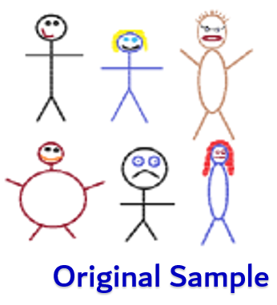
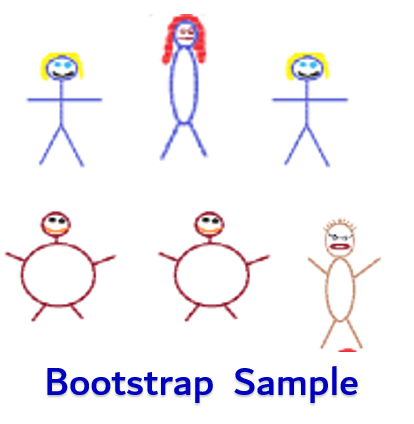

```{r setup, include=FALSE}
library(learnr)
library(mosaic)
library(ggplot2)
library(openintro)
library(infer)
knitr::opts_chunk$set(echo = FALSE)

data(bac)

boot_sds <- NULL
for(i in 1:10000){
  boot_sds[i] <- sd(sample(bac$BAC, size = 16, replace = TRUE))
}

se <- sd(boot_sds)

deprive <- read.csv("https://raw.githubusercontent.com/joeroith/Data/master/SleepDeprivation.csv")

null_distn <- deprive %>%
  specify(improvement ~ treatment) %>%
  hypothesize(null = "independence") %>%
  generate(reps = 1000, type = "permute") %>%
  calculate(stat = "diff in means", order = c("unrestricted", "deprived")) 

obsdiff_means <- 19.82 - 3.90
```


## The Setup

### What do I expect you to know about Bootstrapping?

This is going to be a short tutorial and I'm not going to have test or homework questions about bootstrapping. But it is an interesting topic and since we are using R in this class, we can do the bootstrap and randomization tests very quickly and easily. I would like you to understand the following from this tutorial:


+ The basic concept of bootstrap sampling

+ Using a bootstrap distribution for estimating standard error

+ Basic concept of randomization tests for means, and some practice with them in R (using code we've seen before)


## The Bootstrap

{width=25%}

### []()

Have you ever heard the phrase "Pull yourself up from your bootstraps"? It's the idea that one can start with very little, but use what they have to do something much bigger. Believe it or not, we have this very same concept in statistics. Bootstrapping is an alternative solution to a <font color='red'>**big problem**</font> we have when trying to perform inference, confidence intervals, and hypothesis tests.

### The Problem

The problem we have is trying to <font color='red'>understand how statistics vary from sample to sample, when all we have to go off of is one actual sample</font>. I'm going to focus on one single mean for this tutorial, but the ideas can be used for any of the variable situations we've discussed. What we're talking about is <font color='red'>**how to estimate the standard error of the sample statistic**</font>.

Recall that *in an ideal world* we'd have tons of samples, each one would be slightly different from the others, all the different sample means would make a nice Normal distribution, and we could figure out how much $\bar{x}$ varies just by calculating the standard error:

$$SE_\bar{x}=\frac{\sigma}{\sqrt{n}}$$

But we have a problem with that in **the real world**. What we actually have is **one sample** to work with, and **we don't know the true population standard deviation, $\sigma$**, because *how could we know about the population, that's why we're doing the inference!*

### The Original Solution

What did we do to solve this problem? Well, we did something very clever. We made sure we have a large, representative sample and we said, *why don't we just replace $\sigma$ with the sample standard deviation, $s$?* This makes sense, because if we have a good sample, $s$ should be a pretty good stand-in for $\sigma$. And we've been using the following equation as the standard error in our confidence intervals and test statistic.

$$SE_\bar{x}=\frac{s}{\sqrt{n}}$$

For the most part, this works great and we can test or estimate the population mean, $\mu$, with high levels of confidence. But there is an alternative solution to the problem...


### Alternative Solution for Standard Error


Remember that *ideal world* where we have a ton of different samples and we can get the variation of the statistic directly? Well, the alternative solution to estimating the standard error of our sample mean is to **recreate this distribution of many samples from our original sample.**

Do you get the name now? We are starting with one little sample, and then creating a big distribution of *thousands* of samples from that one original. Hence, the term <font color='blue'>**Bootstrap**</font> for this process.


> But how do you create thousands of *different* samples from one observed sample? 

You resample from the original **with replacement**. So the simulated samples can have repeats from the original sample. And some observations may even be missing from the bootstrap sample. But that's OK, because we will do this thousands of times.

### []()

{width=30%} {width=10%} {width=35%}


## Bootstrapping a Sample

### []()

> How does it work with a real sample, and how can we use it to estimate the standard error? 

Let's go back to the example of students' drinking habits at Ohio State. Remember that the data is in the `openintro` package and is called `bac`. Take a look at the original sample of 16 student blood alcohol content levels.

```{r}
bac$BAC
```

### []()

If we wanted to generate a "new" sample of 16 students from this original, we could use the code below. (Note: you **will not** need this code outside of the tutorial)

Run the code several times to see the different bootstrap samples. Each one is different, but it is important to notice:

1. Each sample is the exact same size as the original.

2. Each sample can only have values from the original.

```{r boot, exercise = TRUE}
boot_sample <- sample(bac$BAC, size = 16, replace = TRUE)
boot_sample
mean(boot_sample)
sd(boot_sample)
```

&nbsp;

Each sample will have its own mean and standard deviation.

```{r quiz1}
quiz(caption = "What do you notice abut the mean and standard deviations of several different bootstrap samples?",
     question("The means are all:",
              answer("Exactly the same", message = "Run a few more bootstrap samples"),
              answer("Totally different"),
              answer("Pretty close to each other", correct = TRUE),
              allow_retry = TRUE,
              random_answer_order = TRUE
     ),
     question("The standard deviations are all:",
              answer("Exactly the same", message = "Run a few more bootstrap samples"),
              answer("Totally different"),
              answer("Pretty close to each other", correct = TRUE),
              allow_retry = TRUE,
              random_answer_order = TRUE
     )
  
)
```


### Simulate thousands of samples

All we need to do is have R create thousands of these bootstrap samples. **For each bootstrap sample, we will collect the different standard deviations.** We can compile all of these standard deviations into a <font color='blue'>**Bootstrap distribution**</font> of standard deviations.

```{r quiz2}
quiz(caption = "",
     question("What shape do you think the bootstrap distribution is likely to be?",
              answer("Normal", correct = TRUE, message = "Of course! Our old friend!"),
              answer("Skewed", message = "Possibly, but more than likely it won't be skewed."),
              answer("IDK, something crazy.", message = "Or something more familiar."),
              allow_retry = TRUE,
              random_answer_order = TRUE
     )
)
```

### []()

I've already randomly generated 10,000 bootstrap samples and collected their standard deviations as `boot_sds` (You can check out the tutorial hard copy if you really want to see the code to do this, it's pretty simple). Run the code below to see what the <font color='blue'>bootstrap distribution</font> looks like for all the standard deviations.

```{r bootdist, exercise = TRUE}
histogram(boot_sds)
```


### Estimate $SE_{\bar{x}}$

> Now for the main trick, in order to estimate the standard error for the sample mean, $SE_{\bar{x}}$, all we need to do is find the standard deviation of all the bootstrapped standard deviations. 

It's a standard deviation of a bunch of standard deviations, kind of a mind bender, but trust me me here...

```{r bootse, exercise = TRUE}
sd(boot_sds)
```

This is our estimate for the standard error, and we can use it directly in **any** inference we want for the population mean.

Plug it in to:

> Confidence intervals: $\bar{x}\pm t_{df}^*\times SE_{\bar{x}}$

> Test statistics: $t=\frac{\bar{x}-\text{null value}}{SE_{\bar{x}}}$

### []()

For the example, here are the summary stats for `BAC`. Find a 95% confidence interval for the real average blood alcohol content levels of students with $SE_{\bar{x}}$ = `r round(se, 4)` (you can use $t_{15}^*=2.13$).

```{r}
favstats(bac$BAC)
```


### How does it compare?

What about our original method of calculating the standard error based on the sample standard deviation and the Central Limit Theorem?

$$SE_{\bar{x}}=\frac{s}{\sqrt{n}}$$

Try it out for yourself below. What is the standard error using our previous method above? Remember $s = 0.044$ and $n=16$ from the summary stats earlier.

```{r check, exercise = TRUE}

```

What did you get? Was it pretty close to the value we got by the bootstrap approach, `r round(se, 4)`? It should be!

Try out the confidence interval from `t.test`, is that also close to what you calculated using the bootstrap standard error?

```{r check2, exercise = TRUE}
t.test(bac$BAC)
```


### When to use

We can use this approach for almost any type of inference. It allows us to not rely on the Central Limit Theorem or formulas, but to directly estimate the standard error from our observed sample. This can be a very powerful tool for more complex types of analysis.

We do need to check certain conditions before trusting the bootstrap estimate:

1. **Independence:** Observations need to be independent from one another. Once again, we always need this condition because we want our samples to be unbiased and representative.

2. **Sample size greater than 30:** Yes, yes, I know I broke this rule with my example. I'll adjust it and just say that, the bootstrap estimate is *better* with larger samples (but all estimates are better with larger samples anyways). It's not hard to imagine bootstrapping doesn't work well with a sample of 4. 

3. **Nearly Normal:** The bootstrap distribution should be close to Normal for our estimate to be accurate. This is one reason I'm OK with my example, since our bootstrap distribution was very Normal looking.


So if you do more stats in your careers, especially if you are working with computational software, there's a good chance you will encounter bootstrap simulation methods. Now you can say you've had at least a small introduction to it.

## Randomization Test for Means

### []()

I want to cover another bonus topic that relates well with the Bootstrap. Remember at the beginning of the semester, when we had our first introduction to hypothesis tests through the randomization tests? This was the *Swimming with the Dolphins* experiment. The key to that approach was based on us mixing up which groups the subjects belonged to and simulating lots of different possible samples if we assumed the null hypothesis was true. We got our first exposure to:

+ Setting up the hypotheses ($H_0:$ Treatment and Outcome are independent vs. $H_a:$ Outcome is different based on Treatment)

+ Simulating a *null distribution*

+ Evaluating our observed sample as typical/unusual

+ Calculating and interpreting p-values

Hopefully all of that rings a bell. And hopefully you can see the connection with the bootstrap, that we are simulating a lot of new/theoretical samples based on an original sample in order for us to say something about the population.

### []()

We can do the same thing when we want to test for the difference in two means. I'll run through an example to demonstrate. Remember the *Sleep Deprivation* example? Where researchers taught a new task to two different groups, one group got to sleep normally afterwards and the other was forced to stay awake. Then a few days later the researchers tested how quickly the participants could complete the task. The variables were:

+ <font color='blue'>**Response Variable:**</font> Improved time to complete task (negative was good) - Numeric

+ <font color='green'>**Explanatory Variable:**</font> Sleep group (Deprived/Unrestricted) - Categorical

The hypothesis that we wanted to test were:

+ $H_0:\mu_{unrestricted}-\mu_{deprived}=0;$ There is no difference in the mean improvement time for the task. In other words, improvement time is independent of the sleep group people belong to.

+ $H_a:\mu_{unrestricted}-\mu_{deprived} \ne0;$ There is a significant difference in the mean improvement time for completing the task for the two groups. Or, improvement time depends on the amount of sleep afterwards, there is a relationship.


### Randomization Test

In the dolphin example, we took the response measurement for each subject and we shuffled which group they belonged to (Dolphin/Control) to represent a sample where the null hypothesis is true; the variables are independent. 

Let's do the same thing here. Imagine that how fast you improve on the task doesn't matter on how much sleep you got afterwards. Each participant was always going to improve by the amount we observed regardless of their sleep. So if we just shuffle the subjects among the two groups (Unrestricted/Deprived), we can recreate what thousands of sample difference in mean improvement times would look like under the null hypothesis.

The data are in `SleepDeprivation.csv` in the data folder.

```{r, eval = FALSE, echo = TRUE}
deprive <- read.csv("~/Stats 212b S20/Class/Data/SleepDeprivation.csv")
```

Here's a quick reminder about what the data are.

```{r}
deprive
```


### []()

The code is similar to what we used earlier from the `infer` package. First we `specify` the relationship of our two variables. Then we define that we'd like to test for `independence` of the two variables. Next, we shuffle (`permute`) and simulate (`reps`) the samples, while keeping track of the `difference in means`.


```{r rand, exercise = TRUE}
## remember this is all in the infer library
## library(infer)

null_distn <- deprive %>%
  specify(improvement ~ treatment) %>%
  hypothesize(null = "independence") %>%
  generate(reps = 1000, type = "permute") %>%
  calculate(stat = "diff in means", order = c("unrestricted", "deprived")) 
```

Remember that this code doesn't have any output. The null distribution is just saved. 

### []()

Now we can calculate our observed difference in means and see where it lands on the null distribution. 

```{r, echo = TRUE}
favstats(~ improvement | treatment, data = deprive)
```


```{r rand2, exercise = TRUE}
obsdiff_means <- 19.82 - 3.90

null_distn %>%
  visualize(method = "simulation") +
  shade_p_value(obsdiff_means, direction = "both")
```

### []()

From here we calculate the p-value by finding the proportion of simulated null samples that were as, or more extreme than ours.

```{r rand3, exercise = TRUE}
null_distn %>%
  get_p_value(obs_stat = obsdiff_means, direction = "both")
```

If you are curious, the p-value we got using the formulas in Ch. 4.3 was 0.02, Pretty close to what you got using the randomization test above. And more importantly, the same conclusion. Pretty strong evidence that there is a difference in the mean improvement time for the two sleep groups. We can say that improvement does depend on sleep.

### []()

I hope this has been a nice connection to our approach to hypothesis tests from earlier in the semester. I think it's always good to come full circle on techniques or concepts.

> I will not ask you to use the randomization approach for homework or the DARs. This was just a (hopefully) quick tutorial to solidify your understanding of some key concepts as well as provide alternative approaches to the analysis we've discussed.


