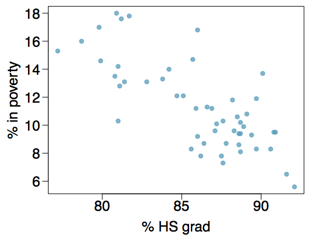
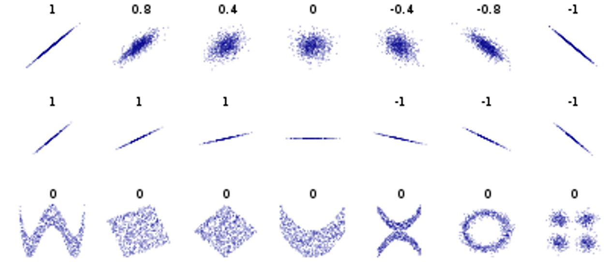
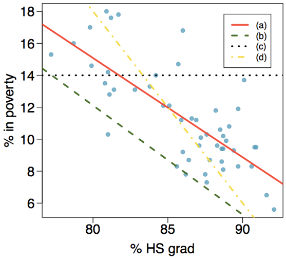
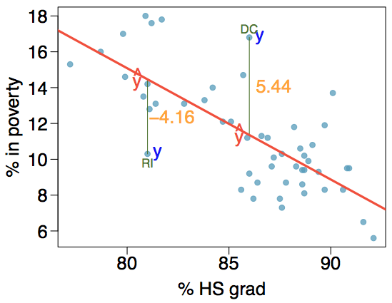

```{r setup, include=FALSE}
#library(learnr)
library(mosaic)
library(openintro)
library(tidyverse)
library(knitr)
knitr::opts_chunk$set(echo = TRUE)


set.seed(78965)
X <- rnorm(50, 10, 2)
Y <- 20 + 2*X

set.seed(8521)
Y1 <- 5 - 4*(X+rnorm(50, 3, 0.75))

#cor(x, y1)
set.seed(9654)
Y2 <- 20 + 2*(X+rnorm(50, 1, 3.5))
#cor(X, Y2)
set.seed(452)
Y3 <- 15 -1 *(X+rnorm(50, 2, 6))


#cor(x,y3)
```

## The Setup

### Our Last Variable Combination

So far we have covered how to summarize, visualize, and analyze variables that were: one categorical, one numeric, two categorical, and one of each. Now we come to our final combination of analyzing variable types:

+ <font color='blue'>**Response Variable:**</font> Numeric

+ <font color='green'>**Explanatory Variable:**</font> Numeric

We have previously discussed, very briefly at the beginning of the semester, the best ways to summarize and visualize two numeric variables. Now add the final piece for analysis:

+ **Summarize:** Correlation

+ **Visualize:** Scatterplots

+ **Analyze:** <font color='purple'>**Linear Regression**</font>

### []()

But before we jump right into things, we need to review a couple key ideas first. The way we define the two numeric variables is very important for later interpretation of our analysis. We need to *clearly* identify the relationship we are assessing, and the direction of the relationship.

> The <font color='blue'>**Response Variable**</font> is the one that we are interested in measuring. It is usually what we want to predict or guess. On a scatterplot, the response variable is always on the **vertical (y) axis.**

> The <font color='green'>**Explanatory Variable**</font> is the one that we want to use to explain or predict what's happening with the response variable. Also referred to as the **predictor**, it will always be on the **horizontal (x) axis.**

We often say that we want to *model the data*. In statistics, a **model** just refers to the process of quantifying a relationship between variables (we were technically modelling data with our previous analysis methods, but a model for a t-test isn't as fun and exciting as one for linear regression).

### Example

The scatterplot below shows the relationship between HS graduate rate in all 50 US states and DC and the percent of residents who live below the poverty line (income below $23,050 for a family of 4 in 2012).

&nbsp;

{width=60%}


What are the cases in the scatterplot above?^[c]

a) $\%$ in poverty

b) $\%$ HS grad

c) all 50 US states and DC

d) family income

What is the response variable in the scatterplot above?^[a]

a) $\%$ in poverty

b) $\%$ HS grad

c) all 50 US states and DC

d) family income

What is the explanatory/predictor variable in the scatterplot above?^[b]

a) $\%$ in poverty

b) $\%$ HS grad

c) all 50 US states and DC

d) family income

What is the relationship we are trying establish?^[d]

a) How does the poverty rate in states affect the high school graduation rates?

b) How many states have a low poverty level?

c) What ratio of states have a high scool graduation rate and poverty level above 15%?

d) How does the high school graduation rate in states affect the poverty rates?

> How would you describe the relationship between the two variables in the scatterplot?
       
+ Linear/Non-linear?

+ Positive/Negative/Neither?

+ Strong/Moderate/Weak?

We need a standard way to talk about and measure the relationship of numeric variables.


## Correlation

### []()

Before we use <font color='purple'>**linear regression**</font>, we need to make sure it is the appropriate thing to do. Because, we can only use linear regression for two numeric variables, but we shouldn't use <font color='purple'>**linear regression**</font> for *every* pair of numeric variables.

As the name implies, we use linear regression on variables that we believe have a **linear** pattern or relationship. 

> What does that look like and how can we tell?

### []()

The **best way** to determine if linear regression is appropriate is to consider the scatterplot AND the correlation for the two variables considered. 

Basically, if you can see a clear linear pattern in the data, then linear regression is a good idea. Take `X` and `Y` for example. Clearly, there's a strong linear relationship between the two.

```{r, echo = TRUE}
gf_point(Y ~ X)
```

### []()

But, in the real world, things are never that neat and perfect. More often the data look like this:

```{r, echo = TRUE}
gf_point(Y2 ~ X)
```

It sort of looks like there's a pattern here, but it may be hard to tell.

### Correlation Coefficient

Looking at plots are often not enough for us to determine if linear regression would be useful. It's hard to define when a plot or pattern starts to show a "strong" linear relationship. We need a way to measure linear relationships numerically.

> **Correlation:** a measure of the strength of <font color='red'>*linear relationship*</font> between two numeric variables.

If I was able to lecture in class, this is the part where I'd jump up and down, underline, highlight, box, and HIGHLY EMPHASIZE the <font color='red'>**linear relationship**</font> part of that definition. Needless to say, it's important.

### []()

The correlation coefficient (the book uses "$R$" as the symbol, I have a habit of using "$r$" as the symbol, but I'll try to stay consistent with the book) can be **any value from -1 to 1.** And it represents how close the points on a scatterplot get to forming a perfect line. When $R=-1$, the points make a perfect line that is *decreasing* as you look from left to right, this is referred to as a **negative linear relationship.** When $R=1$, the points make a perfect line that is **increasing** as you look from left to right, this is referred to as a **positive linear relationship.**

> When $R=0$, it **does not** mean there is no relationship between the two numeric variables. Only that there is no *linear* relationship between the variables.

The closer points on a scatterplot get to creating a line, the closer $R$ will be to -1 or 1. The more spread out/scattered the points are, the closer $R$ will be to zero.

### Examples

It's not a perfect science, but *typically* we can generalize correlation coefficient values into:

+ **Weak linear relationship:** $-0.4 <R<0.4$

+ **Moderate linear relationship:** $-0.6<R<-0.4$ and $0.4<R<0.6$

+ **Strong linear relationship:** $-1<R<-0.6$ and $0.6<R<1$

> This is just an unofficial, *general* guide to putting labels on correlations. Feel free to combine categories, like "Moderately strong".

```{r stong}
gf_point(Y1 ~ X)
cor(X, Y1)
```


```{r moderate}
gf_point(Y2 ~ X)
cor(X, Y2)
```

```{r weak}
gf_point(Y3 ~ X)
cor(X, Y3)
```

&nbsp;

Notice the use of `gf_point()` for scatterplots and `cor` to calculate correlations in R.

### []()

Try some out on your own. The following link is a chance for you practice matching correlations with scatterplots. See how long you can make your streak of correct matches!

> [Correlation Matching Game](https://istics.net/Correlations/) (hold `Ctrl/Command` and `click` to open the link in a new window and keep your place in the tutorial)


### []()

{width=90%}


#### Some important things to remember:

+ If you can look at the scatterplot and immediately detect a pattern, it's probably safe to assume there's a strong correlation.

    + You may have been surprised in the matching game to find some "loosely" grouped points actually have moderate correlations.
    
+ **Don't** confuse the slope of the pattern with the strength of the relationship.

    + Look at the second row of the grid above. ALL of those (except the middle one) have the same correlation, perfect linear relationship. Don't confuse a "steeper" line with a "stronger" relationship.
    
+ A correlation coefficient of zero does not necessarily mean there is no relationship.

    + The last row shows very strong patterns and relationships between the two variables, they are just not *linear* relationships.

## Example: Anscombe's Data

> "I don't need to make plots and look at the data! I can get all of the information I need from summary statistics" - Poor, misguided statistics students around the world

Consider the following 4 datasets `[x1, y1]`, `[x2, y2]`, `[x3, y3]`, `[x4, y4]`. The output below is the means for each variable.

```{r, include = FALSE}
data("anscombe")
```


```{r}
round(apply(anscombe, 2, mean), 2)
```

The output below is the standard deviations for each variable.

```{r}
round(apply(anscombe, 2, sd), 2)
```


All of the `x` variables have a mean of:^[d]

a) 7.5

b) 3.32

c) 2.03

d) 9.0

e) They all have different means

All of the `y` variables have a mean of:^[a]

a) 7.5

b) 3.32

c) 2.03

d) 9.0

e) They all have different means

All of the `x` variables have a standard deviation of:^[b]

a) 7.5

b) 3.32

c) 2.03

d) 9.0

e) They all have different standard deviations

All of the `y` variables have a standard deviation of:^[c]

a) 7.5

b) 3.32

c) 2.03

d) 9.0

e) They all have different standard deviations


### That's weird...

The means and standard deviations are identical for all the `x`'s and `y`'s. OK, OK, but I just learned about **correlation coefficients ($R$)** as another way to summarize two numeric variables. Let's look at that. The first line of code checks the first pair of data. Find the rest of the correlation coefficients (for the pairs `[x2, y2]`, etc.) on your own.

```{r c2}
cor(anscombe$x1, anscombe$y1)
```

All of the correlation coefficients are:^[d]

a) $R$ = -0.816

b) $R$ = 1.63

c) $R$ = 1

d) $R$ = 0.816

e) They all have different correlation coefficients

If you switch the order of `x` and `y` (try it), the correlation coefficient will be:^[d]

a) $R$ = -0.816

b) $R$ = 1.63

c) $R$ = 1

d) $R$ = 0.816

e) They all have different correlation coefficients

If you multiply the `x` variable by 2 (try it), the correlation coefficient will be:^[d]

a) $R$ = -0.816

b) $R$ = 1.63

c) $R$ = 1

d) $R$ = 0.816

e) They all have different correlation coefficients 


### Same data?

What?! The correlation coefficients are all the same? So is this just four sets of the same data?


The correlation coefficient of `R = 0.816` *suggests* that the relationships are:^[a,d,e]

a) linear

b) non-linear

c) negative

d) positive

e) strong

f) moderate

g) weak
 

> What do you think? Are these all the same variables, is every number identical?


### Plot the data!

Use the code below to plot each of the pairs of variables. Are you surprised at what you see?

```{r c3}
gf_point(y1 ~ x1, data = anscombe, color = "blue", size = 3)
gf_point(y2 ~ x2, data = anscombe, color = "red", size = 3)
gf_point(y3 ~ x3, data = anscombe, color = "darkgreen", size = 3)
gf_point(y4 ~ x4, data = anscombe, color = "purple", size = 3)
```


### The Lessons

> 1) We can't trust only numerical summaries and we can't just use graphs to make decisions about our data. Only by considering BOTH can we get the full picture. 

> 2) Strong correlations do not always indicate a linear model is appropriate. Data can have non-linear relationships (`x2` & `y2`), or outliers can greatly affect the correlation value (`x4` & `y4`).

P.S. This is called Anscombe's data after the statistician who created the variables to illustrate the fact we always need to visualize our data.


## Regression

### In General

So, you've identified two numeric variables that have a strong (or even moderate) linear association by using the correlation coefficient and the scatterplot. The next step is to identify the *best line* that fits the data. Consider the scatterplot from earlier.

&nbsp;

{width=60%}


Which line best fits the pattern of the points?^[a]

a) - red solid line

b) - green dashed line

c) - black dotted line

d) - yellow dashed line


### Equation for a line

Do you remember the equation for a line from algebra? Typically it is taught like this:

$$y=mx+b$$

Where $m$ is the **slope coefficient** and $b$ is the **y-intercept**.

Check out [this link (`Ctrl/Command` + `click`)](https://dtkaplan.shinyapps.io/DA_slope_intercept/) to review the equation for a line and play around to see what happens when slope and intercept change.

> For a line, if we know the slope and intercept, we can just plug in any $x$ value to get the $y$ value. For linear regression, we'll do the same thing; if we we know slope and intercept, we can plug in a value for the explanatory variable to get a **predicted response.**

### []()

For regression, we use a slightly modified version of the equation for a line, but it has the same pieces:

The general form of the linear regression equation is:

> $$\hat{y}=\beta_0+\beta_1\cdot x$$

where $\hat{y}$ ("y-hat") is the predicted response value

$\beta_0$ ("beta-zero") is the $y$-intercept

$\beta_1$ ("beta-one") is the slope coefficient

$x$ is the explanatory variable

## Residuals

### []()

You may have noticed already that rarely do the points in a scatterplot from real data form a *perfect* line. This means that our linear regression model rarely gives us *exactly correct* predicted response values. But the goal isn't to be perfect in our predictions, only to be as close as possible.

> Every predicted response value from our regression model (when we plug in a value for $x$) will be *off* from the actual response we observe. The amount our prediction is off by is referred to as the **residual.**

### []()



&nbsp;

In the scatterplot above, Rhode Island (RI) has about a 81% HS graduation rate. Using the red linear regression line (just by eye-balling it), we can see that the predicted poverty rate ($\hat{y}$) is about 14.2%. But the actual poverty rate for RI is a point below the line, around 10%. So our prediction from the line is off by about 4.2%, the residual (4.16% exactly). And since the real value was less than our prediction, the residual is negative.

### []()

The height of each point on the plot is its **observed value** or $y$.

The height of the line is then the **predicted value** or $\hat{y}$. We can plug in a value for $x$ into a regression equation to get a prediction for the response.

The difference between these two numbers is called the **residual** or $e_i$. The $i$ subscript stands for the fact that every point in our data will have a residual, $i$ lets us know which observation that residual is from.

> Always calculate residuals as **observed** - **predicted**.

> $$e_i=y-\hat{y}$$


### []()

In the next section, we will talk about how we use the residuals to find the **best fitting** line for our data, and for estimating the slope coefficient and y-intercept.
