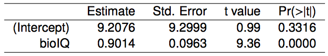

```{r setup, include=FALSE}
#library(learnr)
library(mosaic)
library(openintro)
library(tidyverse)
library(knitr)
library(gridExtra)
knitr::opts_chunk$set(echo = TRUE)

porsche <- read.csv("https://raw.githubusercontent.com/joeroith/Data/master/PorschePrice.csv")
porsche <- porsche[,-1]

model_porsche <- lm(Price ~ Mileage, data = porsche)

porsche$predicted <- predict(model_porsche)   # Save the predicted values
porsche$residuals <- residuals(model_porsche)

predict_at <- data.frame(Mileage = 30)

set.seed(741)
x <- rnorm(30, 10, 2);y <- 5+0.5*(x+rnorm(30, 0, 1))
x1 <- c(x, 7); y1 <- c(y, 15.5) 
x2 <- c(x, 20); y2 <- c(y, 10)

low_lev <- gf_point(y1~x1, title = "Outlier with LOW Leverage") 
high_lev <- gf_point(y2~x2, title = "Outlier with HIGH Leverage")

```


## The Setup

### []()

You can now summarize and visualize two numeric variables with a scatterplot and correlation coefficient. And you can find and interpret the linear regression equation to describe the relationship between those two variables. But fitting the model is just the start, we need to check the data, model, and determine whether the linear pattern is one that really exists for the population.

We'll finish Linear Regression with:

+ Looking for outliers in the data

+ Checking the conditions

+ Performing inference on the slope coefficient for relationships in the population

+ Performing inference on any predictions we want to make using the model

### Residual Plots

One tool that we will start to use a lot (especially for checking for outliers and conditions) are residual plots. We know that every observation in the data has a real response value ($y$). And once we fit the linear regression model, we can calculate a predicted response value for every observation ($\hat{y}$). So that means we can find the residual for *every* observation ($y-\hat{y}$) and it is often useful for us to create a scatterplot of those residuals against the explanatory variable.

In the last tutorial we looked at the price of used Porsches as predicted by the mileage. We then fit the model, but we didn't consider how close our model gets to predicting the correct prices (other than looking at $R^2$). Watch below as we go from scatterplot, to fitted line, to residuals and finally the residuals plotted with Mileage.

```{r, eval = FALSE, include = FALSE}
ggplot(porsche, aes(x = Mileage, y = Price)) +
  geom_point() + # size also mapped
  ggtitle("Scatterplot of Price vs. Mileage")


ggplot(porsche, aes(x = Mileage, y = Price)) +
  geom_smooth(method = "lm", se = FALSE, color = "lightgrey") +
  geom_point() + # size also mapped
  ggtitle("Scatterplot of Price vs. Mileage")

ggplot(porsche, aes(x = Mileage, y = Price)) +

  geom_smooth(method = "lm", se = FALSE, color = "lightgrey") +
  geom_segment(aes(xend = Mileage, yend = predicted), alpha = .2) +

  # > Color AND size adjustments made here...
  geom_point(aes(color = abs(residuals))) + # size also mapped
  scale_color_continuous(low = "black", high = "red") +
  guides(color = FALSE, size = FALSE) +
  ggtitle("Scatterplot of Price vs. Mileage")

ggplot(porsche, aes(x = Mileage, y = residuals)) +

  geom_hline(yintercept = 0, color = "lightgrey") +
  geom_segment(aes(xend = Mileage, yend = 0), alpha = .2) +

  # > Color AND size adjustments made here...
  geom_point(aes(color = abs(residuals))) + # size also mapped
  scale_color_continuous(low = "black", high = "red") +
  guides(color = FALSE, size = FALSE) +  # Size legend also removed
  ggtitle("(Fancy) Residual plot from Regression Model")

  #geom_point(aes(y = predicted), shape = 1)

```

&nbsp;


### []()

Picture taking the line that we fit for the data and "turning" it so it was horizontal at 0. The residuals would come along for the ride and stay in their relative positions either above or below the regression line. I've added some color to the residual plot below to really emphasize the true prices that were farther away from out predicted prices (brighter red = bigger residual/prediction error).


```{r}
ggplot(porsche, aes(x = Mileage, y = residuals)) +

  geom_hline(yintercept = 0, color = "lightgrey") +
  geom_segment(aes(xend = Mileage, yend = 0), alpha = .2) +

  # > Color AND size adjustments made here...
  geom_point(aes(color = abs(residuals))) + # size also mapped
  scale_color_continuous(low = "black", high = "red") +
  guides(color = FALSE, size = FALSE) +  # Size legend also removed
  ggtitle("(Fancy) Residual plot from Regression Model")
```

We will use these types of plots more as we go along.

## Outliers

### How to find them

The term *outlier* can mean different things to different people, and looking at a scatterplot, your neighbor may consider one point an outlier, while you consider it part of the pack. The first test of detecting outliers is a simple visual check. There are some outliers that are easy to spot, the ones that are "away from the herd", or "apart from the cluster" of other points. 

But what about the ones that are harder to tell? There are lots of technical ways to measure and detect outliers in regression. We're just going to cover some of the basic concepts without getting into the calculations.

### Leverage

Not all outliers are created equally. Some have a major effect on our ability to define the relationship between response and explanatory variables, while others don't change that relationship at all. For example, points that are <font color='blue'>vertically</font> far away from the "center of the cloud", **will not** have that much of an impact on the linear regression equation (left plot).

But points that are <font color='red'>**horizontally**</font> far away from the "center of the cloud" will impact the linear regression equation. These outliers are ones with <font color='red'>**high leverage**</font>, and they are the ones to look out for (right plot).

```{r}
grid.arrange(low_lev, high_lev, ncol = 2)
```

### Influential Points

For those points that are **high leverage**, far from the rest horizontally, they can either make the regression equation *stronger*, or they could potentially **change the entire slope drastically**. We can classify high leverage points as either **influential** or not.

+ **Non-influential points** are those that have high leverage AND would NOT drastically change the slope of the regression line.

    + They are basically outliers, but still on the same "track" as the rest of the points. The slope doesn't change much, but these outliers can make the correlation seem **much stronger** than it would be without them.
    
+ **Influential points** are those that have high leverage AND DO drastically change the slope of the regression line.

    + Try to imagine what the line would look like with and without that point.
    


> You can play around with testing out your own [scatterplots with outliers here](https://psu-eberly.shinyapps.io/Regression_Lines/)

### []()

Residual plots can also help identify leverage. Below each of the following scatterplots is the residual plot for that linear model.

{width=45%} []() {width=47%}

&nbsp;

The outlier in Plot A is:^[a,d]

a) High Leverage

b) Low Leverage

c) High Influence

d) Low Influence


The outlier in Plot B is:^[b,d]

a) High Leverage

b) Low Leverage

c) High Influence

d) Low Influence

Which of the following is true?^[d]

a) Influential points always change the intercept of the regression line.

b) Influential points always reduce $R^2$.

c) It is much more likely for a low leverage point to be influential, than a high leverage point.

d) None of the above


### What to do with outliers?

Once you've identified an outlier, and what sort of influence it might have on your regression analysis, you need to know what to do with it. Outliers are useful to us for several different reasons:

1. They are a nice way to check for mistakes in the data.

    + You could potentially catch a value that was mismeasured or misentered and fix it (if possible).
    
2. They illustrate interesting real features of the population.

    + Outliers are actual parts of the population, without them, we may not have a representative sample.
    
> You should **never** take a legitimate outlier out of your sample.

The most I'd be willing to do is a second plot/regression line with the outlier removed, **only as a comparison** to the full dataset. It's sometimes interesting to see how much a few points can affect the model. But "cherry-picking" the observations you want to use for an analysis is a serious breach of statistical ethics.

## Regression Conditions

### Checking Conditions

Unlike other analysis we have done in this class, the conditions for linear regression can only be checked *after* we fit the model. This is because we need to examine the residuals to know if they meet the criteria we need. Remember that the conditions are:

+ **Linearity**

+ **Nearly Normal residuals**

+ **Constant variance**

+ **Independent observations**

The first three conditions can be assessed using plots from our fitted linear regression model. Let's examine some of these plots (often referred to as **diagnostic plots**) for the Porsche dataset and model. To get the plots we need, I'll just `plot(model_name)`.

### []()

```{r diag}
plot(model_porsche, which = 1:3)  ## we only want the first 3 diagnostic plots
histogram(model_porsche$residuals) ## and we'll add in a histogram of the model residuals
```


The **linearity** of the data is apparent in the original scatterplot. But we also check the plot of the residuals. Here we look for NO patterns in the points. They should just look like they are random all over the graph. This means there are some values we overestimate, some we underestimate, some by a little, some by a lot... It's a random collection of points. `plot(model_name)` gives several plots and the first one is the residual plot. 

+ Our original scatterplot looked pretty linear.

The **normality** of the residuals is represented in the second plot from `plot(model_name)` (Normal Q-Q). Here we are seeing how well the residuals follow a *perfect* Normal distribution. The more the points follow the diagonal line, the more Normal they are. If the points have too much of a bowed or "S" shape, that indicates skewed or non-symmetric residuals. You can also check normality with a gold ol' fashioned histogram (also shown above).

+ The residuals from our Porsche example seems pretty Normal.

**Constant variance** is important so the regression line isn't really good for some values and much worse for other. If there is a funnel or trumpeting shape in the residual plot or scale-location plot (plots 1 and 3), then we have a problem. This indicates that there is non-constant variance. We look at the range of the points from left to right on these plots and see if both sides have the same range top to bottom. 

+ Our example shows that variance is fairly consistent.

**Independent observations** is just something we need to think about, rather than check in a plot. Does it seem reasonable for us to assume each case is unrelated to the others? In most random samples or experiments with random assignment, this is a reasonable enough assumption.


### Examples of violated conditions

Here are some examples of **bad** residual plots. The data and the model that produced these are violating several of our conditions. First, notice that the residual plot fans out from left to right. This indicates a **violation of constant variance**. The response variable for larger values of $x$ are more spread out than the smaller ones. The points on the Normal Q-Q plot also does not follow the theoretical line very well. This is a **violation of residual normality**. And even though the histogram looks symmetric, the tails on each end trail off too much (it is skewed in both directions!)

{width=95%}


### []()

{width=45%} []() {width=45%}


What condition is being violated in Plot A?^[b]

a) Constant variance

b) Linearity

c) Nearly Normal residuals

d) Independence

What condition is being violated in Plot B?^[a]

a) Constant variance

b) Linearity

c) Nearly Normal residuals

d) Independence


> Reading diagnostic plots is hard and takes practice. As with several other tasks in statistics, it is subjective and different from person to person. There are not always clear "correct" answers when dealing with real data, **just be prepared to justify your position with valid reasoning.**


## Regression: Inference on Slope

### Two reasons

There are two main purposes for performing a regression analysis.

+ **Inference** to determine the true relationship between two numeric variables.

+ **Prediction** of new observations or values of the explanatory variable.


Similar to the other analyses we have performed this semester, our driving motivation is to determine if patterns in the sample data are due to random chance, or because of larger relationships in the population. You will see below that for the case of two numeric variables, we use regression and the least squares line to make this decision in a way that is identical to our other methods. We will **infer** something about the true relationship by quantifying how unusual our observed sample is under the assumption of no relationship.

### []()

Once we have inferred a real relationship between variables, we may want to use that knowledge to our advantage by **predicting** how future cases, with different values for their explanatory variable, might behave. We have seen this in its most basic form by plugging values into our regression equation. But as with any of our estimates in statistics, a single value is not good enough, we'll demonstrate how we can create and interpret a <font color='blue'>**prediction interval**</font>, which is similar to a confidence interval with some key difference.


### Quick Comparison

Consider when we want to estimate or test the true population mean from a sample. We would use a sample mean to estimate, the standard error of the sample mean to calculate the interval or test statistic.

| Goal                    | Sample                     | Formula                                         |
| :---------------------- | :------------------------- | :---------------------------------------------- |
| Estimate $\mu$          | Use sample mean, $\bar{x}$ | $\bar{x}\pm2\cdot SE_{\bar{x}}$                 |
| Test value of $\mu$     | Use sample mean, $\bar{x}$ | test stat = $\frac{\bar{x}-\mu_0}{SE_{\bar{x}}}$|

&nbsp;

When it comes to regression, we are trying to determine if there is a relationship between two numeric variables. This relationship is represented by the slope. So, we want to estimate or test the true population slope ($\beta_1$) between our response and explanatory variables using the sample slope, $b_1$.

| Goal                    | Sample                     | Formula |
| :---------------------- | :------------------------- | :------ |
| Estimate $\beta_1$      | Use sample slope, $b_1$    | ? ? ?   |
| Test value of $\beta_1$ | Use sample slope, $b_1$    | ? ? ?   |

We will focus on how to use the sample slope to perform inference on the population.


### Slope for No Relationship

To understand how we use the slope of a line to determine the relationship between two numeric variables, consider an example of variables with no relationship.

```{r, echo = FALSE, fig.width=4}
set.seed(9874)
x <- rnorm(100, 5,1); y <- rnorm(100, 5,1)

gf_point(y ~ x) %>%
  gf_lm()

```

What is the slope (roughly) of the regression line in the scatterplot above?^[a]

a) $b_1=0$

b) $b_1=-1$

c) $b_1=1$

d) $b_1=5$


### Testing for 0

When there is no relationship between two numeric variables, they should have no slope. As $x$ increases by 1, we don't really know how $y$ reacts. Therefore, the hypothesis test we run for the slope is:

> $H_0:\beta_1=0$; There is no relationship between our two numeric variables.

> $H_a:\beta_1\ne0$; There is a significant linear relationship between our two numeric variables.

where $\beta_1$ is the true slope between the two variables.


### Test statistic

> How unusual is our observed slope under the null hypothesis? 

We are still using the sample as our evidence to reject the null hypothesis. If our sample slope, $b_1$ is *unusually* far from zero, we will have strong evidence. But how can we tell if it is unusual?

$$\text{test statistic}=\frac{\text{observed slope - null slope}}{\text{standard error for slope}}=\frac{b_1-0}{SE_{b_1}} \sim t_{df=n-2} $$

We get to use the same general format for all of our other test statistics this semester! Not only that, the test statistic follows a $t-$distribution so we can find p-values easily (but we'll just stick with reading the output from R).

### An Example

In 1966 Cyril Burt published a paper called *The genetic determination of differences in intelligence: A study of monozygotic twins reared apart?* The data consist of IQ scores for [an assumed random sample of] 27 identical twins, one raised by foster parents, the other by the biological parents. The research question was whether IQ is something that can be attributed to biology (nature) or environment (nurture). More specifically, can we predict the IQ of the foster child by knowing the IQ of the child raised by biological parents?

+ **Response:** Foster child IQ

+ **Explanatory:** Biological child IQ

&nbsp;

{width=75%}

### []()

{width=65%}

Use the table above to answer the following questions.
What is the linear regression equation?^[c]

a) $\widehat{bioIQ}=9.2+0.9 \cdot fosterIQ$

b) $\widehat{fosterIQ}=0.9+9.2 \cdot bioIQ$

c) $\widehat{fosterIQ}=9.2+0.9 \cdot bioIQ$

d) $\widehat{fosterIQ}=9.3+0.09 \cdot bioIQ$

The test statistic for testing the slope coefficient of the regression equation is:^[d]

a) 9.21

b) 0.90

c) 0.99

d) 9.36

The p-value and decision for the test of the slope coefficient are:^[b,f]

a) 0.33

b) 0.00

c) Weak evidence, there is NO relationship between foster and biologically raised twin IQs.

d) Weak evidence, there IS a relationship between foster and biologically raised twin IQs.

e) Strong evidence, there is NO relationship between foster and biologically raised twin IQs.

f) Strong evidence, there IS a relationship between foster and biologically raised twin IQs.

&nbsp;


### Confidence interval for $\beta_1$

If we have a point estimate and standard error from the sample, and we know what to use for the sampling distribution, then we can also find a confidence interval.

> The 95% Confidence Interval for the true slope value, $\beta_1$:

$$b_1\pm t_{df=n-2}^* \times SE_{b_1}$$

Use the table below and the code box to find the 95% confidence interval for $\beta_1$ in our example.

{width=65%}


What is the 95% confidence interval for $\\beta_1$?^[a]

a) [0.70, 1.10]

b) [-1.76, 1.95]

c) [-9.9, 28.4]

d) [0.09, 0.99]

Does it surprise you that zero is/isn't in your interval based on the hypothesis test?^[d]

a) It does surprise me that zero is in the interval.

b) It doesn't surprise me that zero is in the interval.

c) It does surprise me that zero isn't in the interval.

d) It doesn't surprise me that zero isn't in the interval.


### []()

So you could say from this sample that we have strong evidence (t = 9.36, p-value < 0.0001) there is a positive linear relationship between the IQ of the biologically raised child and the IQ of their foster raised twin. For every additional IQ point in the biologically raised child, we would expect the IQ of the foster twin to also increase by anywhere from 0.7 to 1.1 points. This is suggestive of a *nature* theory, where it doesn't matter where the child was raised, a smarter biological child implies the twin is also smarter.


## Regression: Predictions

### Confidence vs. Prediction

This is a tricky concept to think about for the first time. But I will present two situations where we will want to estimate some range of values for different predictions:

1) Predicting the average response value for ALL observations at a particular explanatory variable value.

2) Predicting the response value for a single new observation at a particular explanatory variable value.


These are two different situations that call for two different types of intervals. For each situation above use:

1) **Confidence interval** for the response outcome. Less variation, smaller interval width since it is explaining an *average* response value for the population at that point.

2) **Prediction interval** for the response outcome. More variation, larger interval width since it is explaining possible values **for an individual** in the population.

### Example

Let's go back to our used Porsche example, since we have the raw data and I'll only ask you to find these intervals in R. Consider:

1) What is the average price of all used Porsches with 30,000 miles?

2) What is the price of the used Porsche down the block that has 30,000 miles?

For the first scenario, we would want to fit our linear model using the data we have, and then use the `predict()` function for our model when `Mileage = 30` (the default is 95% confidence).

```{r pred}
## First, I create a new observation for the explanatory var.
predict_at <- data.frame(Mileage = 30)

## Then, I ask for a confidence interval using the model from earlier
## making sure to specify 'confidence' for all cars at 30,000 miles
predict(model_porsche, predict_at, interval = "confidence")
```

For the second scenario, we want to fit our linear model first, then predict one new car at that mileage.

```{r pred2}
## Be sure to use 'prediction' if you want to estimate one observation
predict(model_porsche, predict_at, interval = "prediction")
```


### []()

What do you notice about the two intervals above? Both intervals have the same `fit` or point estimate (from plugging 30 into the equation). The `prediction` interval is larger than the `confidence` interval. Hopefully this makes sense, because if we want to estimate the average price of 100 cars, we would expect less variation than the single price for one car. (Another analogy is like saying, we may expect the height of the next person we see to be anywhere from 5 ft to 6.5 ft, but the average height of the next 30 people we see should be between 5.5 ft and 6 ft.)

For scenario 1): We are 95% confident that all used Porsches with 30,000 miles on them will have an average price between \$50,669 and \$56,149.

For scenario 2): We are 95% confident that the used Porsche down the block will have an asking price between \$38,467 and \$68,350.

> Pay careful attention to what we actually want to predict.


### []()


You can look back at the Porsche example from earlier or in the last tutorial to see that model summary and test for the significance of Mileage as a predictor of price.


## Updated EDA and Analysis Guide

I have a bonus tutorial that demonstrates another regression example using COVID-19 data and a technique called data transformation. We will also cover this with a worksheet example during the week in one of our classes. For now, here is the final addition to our EDA and Analysis guide.


