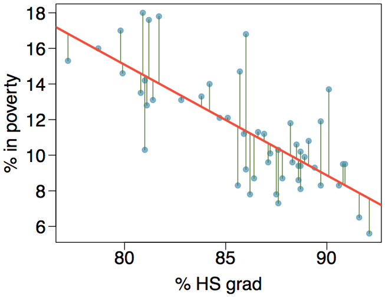
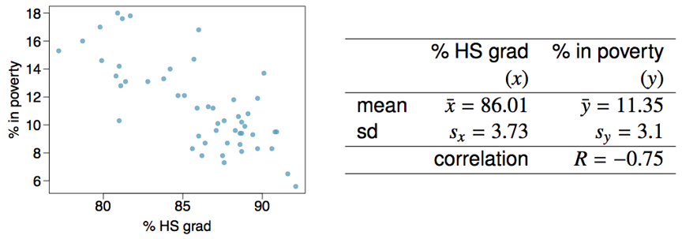
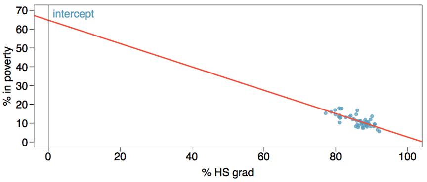
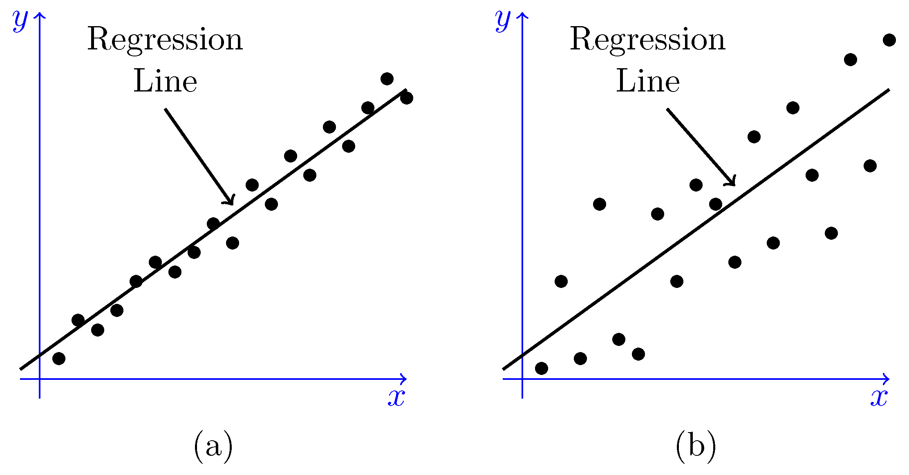
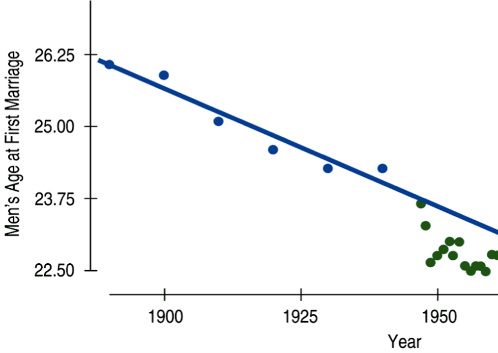
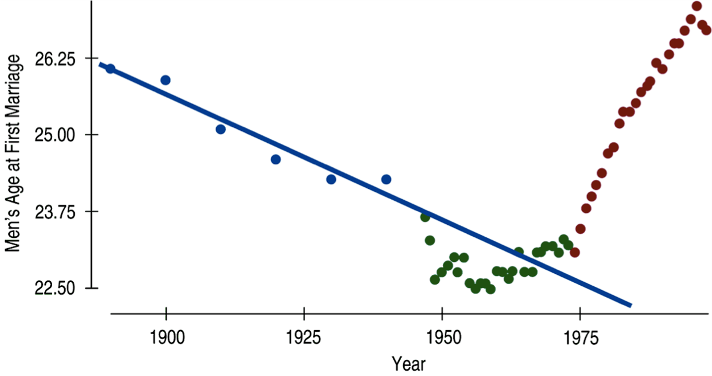

```{r setup, include=FALSE}
library(mosaic)
library(openintro)
library(tidyverse)
library(knitr)
knitr::opts_chunk$set(echo = FALSE)

porsche <- read.csv("https://raw.githubusercontent.com/joeroith/Data/master/PorschePrice.csv")
porsche <- porsche[,-1]

```

## The Setup

### []()

So you've identified two numeric variables that seem to have a moderate to strong linear pattern. How can you find you find the best fitting line? "Eyeballing it" just isn't going to cut it. We need a more precise way.

+ We can use the idea of **residuals** to quantify what "best line" means for modelling data.

+ Slope and intercept for the best line can easily be estimated using simple summary statistics (or R).

+ Predictions for new observations can then be made from our regression model.


### Most important

We will be able to **interpret the slope coefficient** for our best fitting linear regression equation. Why is this so important? Because we don't want to lose sight of the original purpose of ANY statistical analysis: defining patterns and relationships.

> The slope of a linear regression line is a way to represent the relationship between response and explanatory variables. It will be the most important aspect of the regression model and what we focus on for interpretation and inference.

### A note about conditions

There are conditions to using linear regression, some very familiar and one new. The conditions are listed below, however, linear regression is one of the few methods of analysis where it is easier to check the conditions after the model has been found. So I will talk more about these in the next tutorial.

+ **Linearity**

+ **Nearly Normal residuals**

+ **Constant variance**

+ **Independent observations**


## Least Squares Regression

### []()

Recall from the last tutorial that **residuals** are the leftovers from a model, the error between an observed and predicted value.

&nbsp;

{width=75%}


### []()

It would make sense then, that the *best line* for any given scatterplot, is the one that minimizes all of the residuals. This is the idea behind <font color='red'>**Least Squares Regression**</font>, a method for finding that best line. We won't get into the technical details of how least squares regression works, but I want to cover just the basic concept:

+ We consider many potential lines for the best line (each with different slope and intercept)

    + technology allows us to consider ALL potential lines at the same time

+ We **square** all of the residuals for each line

    + residuals are squared so they all become positive, and so we can give a bigger 'penalty' to points that are really far from the model


+ The line that gives us the **smallest sum of all squared residuals** is our best model for the data.

    + hence the name, <font color='red'>least squares regression</font>
    
    
I think there is a benefit to visualizing this process. Watch the video below of me walking you through different lines for a dataset and see the squared residuals change. Then you can follow the link provided to play around yourself.

&nbsp;


> [Visualize least square regression](https://dtkaplan.shinyapps.io/DA_least_squares/)


### Estimating the Equation

$$\hat{y}=\beta_0+\beta_1\cdot x$$

This is our Least Squares Regression equation. We need to think about the intercept and slope as **parameters** for us to estimate using sample data. We estimate the intercept and slope with $b_0$ and $b_1$ respectively. So the estimated regression equation is:

$$\hat{y}=b_0+b_1\cdot x$$


### []()

For the most part, we will get these estimates using R, but there is a simple way to find them with just the sample standard deviations and the correlation coefficient. First we estimate the slope:

$$b_1=\frac{s_y}{s_x}\cdot R$$


And once we have that, we can find the intercept with the sample means and slope estimate:

$$b_0=\bar{y}-b_1\cdot \bar{x}$$

### Try it out

Give it a shot using the summary statistics below from the HS grad rate and Poverty level example.

&nbsp;

{width=85%}


Use the code box below for calculations if you like
What is the slope estimate, $b_1$, from the sample data?^[c]

a) 1.28

b) -0.90

c) -0.62

d) 0.83


What is the intercept estimate, $b_0$, from the sample data?^[b]

a) -41.97

b) 64.68

c) -80.11

d) 78.97


## Interpreting Slope and Intercept

### []()

One important thing to remember when writing or talking about your regression equation (or any analysis) is to put context to the numbers. **Your equation should never *actually* use the letters $y$ and $x$. And you should never give a generic interpretation of the intercept and slope.**

I may use $x$ and $y$ in examples and to illustrate a point, but when you're using real data, those are just letters that don't mean anything. In the previous example, I would not accept a regression equation like this:

$$\hat{y}=64.68-0.62\cdot x$$

I'd much rather have you write:

$$\hat{\text{% in poverty}}=64.68-0.62\cdot \text{% HS grad}$$

### Slope interpretation

This is the big one, the one that explains the entire relationship between the response and explanatory variables. This is the only time you will see me give you a generic interpretation. For any dataset, fill in the blue parts with the appropriate context.

> For an increase of one <font color='blue'>unit</font> in the <font color='blue'>explanatory variable</font>, we can expect that the <font color='blue'>response variable</font> will change by the amount of the <font color='blue'>slope coefficient value</font>.

Notice that the amount we increase $x$ is not blue, meaning you should always interpret the slope as the change in $y$ for **one** increase in $x$. You can also make the interpretation sound a little nicer than what I have up there, but it's a starting point.

Using the previous example.
Select the best interpretation of the slope coefficient, -0.62:^[c]

a) As x increases by 1, y changes by -0.62

b) As poverty increases by 1%, we can expect the high school graduation rate to decrease by 0.62%

c) As high school graduation increases by 1%, we can expect the poverty rate to decrease by 0.62%

d) As high school graduation increases by 1%, we can expect the poverty rate to increase by 0.62%


### Intercept interpretation

Although typically less important for the understanding of the relationship, we can still interpret the intercept. Once again, fill in the blue text for the generic interpretation below with the data context.

> When the <font color='blue'>explanatory variable</font> is zero, we can expect the <font color='blue'>response variable</font> to be equal to the <font color='blue'>intercept value</font>.

Notice that the intercept always describes $y$, when $x=0$. Also take note that in real data, it will often not make much sense for the explanatory variable to be zero. This leads to an intercept interpretation that sounds like non-sense. It's fine, we do need the intercept in order to define our line, but we don't need it to make sense in the context of the problem.

Using the previous example.
Select the best interpretation of the intercept value, 64.68:^[b]

a) When $x=0$, $y=64.68$

b) When the high school graduation rate is 0% in a state, we can expect the poverty rate to be 64.68%

c) When the poverty rate is 0% in a state, we can expect the high school graduation rate to be 64.68%

d) When the high school graduation rate is 64.68%, we can expect the poverty rate to be 0%

Does the interpretation of the intercept make real world sense?^[c]

a) No, not at all. The intercept is not even a possible value for poverty rate.

b) Yes, it makes perfect sense.

c) Not *really*, while the intercept is possible for the poverty rate, it's not realistic for the high school graduation rate to be 0% for a state.
### []()

{width=85%}

## Introducing $R^2$

### []()

We will talk about one more numeric statistic for understanding linear regression models better, $R^2$. Remember the correlation coefficient, $R$? Well, $R^2$ is just what you might expect, the correlation squared. This means that $R^2$ must be between 0 and 1.

$$R^2=(R)^2=correlation^2$$

This is a very useful statistic as a measure of the "model fit", or how well the points in the scatterplot actually form a line. The stronger the linear relationship $\Rightarrow$ the closer the correlation is to -1 or 1 $\Rightarrow$ the closer $R^2$ is to 1 $\Rightarrow$ **the better the model fits the data**.

Another way to think bout $R^2$ is as <font color='green'>the proportion of variability in the response variable that is explained by the linear model</font>. Naturally, we would like our model to explain as much variability as possible, so we like it when $R^2$ is closer to 1. Any leftover variability is just unexplained and unknown.


Remember that the correlation from the previous example is $R=-0.75$. Calculate the $R^2$ value.


Select the best interpretation of the $R^2$ value.^[b]

a) 38% of the variability in the percent of HG graduates among the 51 states is explained by the model.

b) 38% of the variability in the percent of residents living in poverty among the 51 states is explained by the model.

c) 38% of the time percent HS graduates predict percent living in poverty correctly.

d) 62% of the variability in the percent of residents living in poverty among the 51 states is explained by the model.

### []()

{width=75%}

Which plot above would have the higher $R^2$ value?^[a]

a) (a)

b) (b)

### []()

{width=55%}


## Using the Model

### Interpreting Predictions

Other than defining the relationship between response and explanatory, the regression model is useful for making predictions. This is one of the most interesting parts of linear regression, where you get to test out your model and see how well it performs in the real world. 

Take the previous example, if we know that the high school graduation rate for 2016 (most currently available data) in Minnesota was 82.2%, what can we expect the poverty rate to be that year?

$\hat{\text{% in poverty}}=64.68-.062\cdot \text{% HS grad}$

What is the expected poverty rate for MN in 2016 if the HS grad rate was 82.2%?^[c]

a) 10.8%

b) 64.68%

c) 13.72%

d) 115.64%


### BEWARE!

While predictions are fun and interesting, you need to be mindful about making predictions beyond the information you have. **Never make a prediction using a value of the explanatory variable outside the range of values that was observed**. This is a major risk and is called <font color='green'>**Extrapolation**</font>.

> The relationship in the *observed* data may be linear, you there is no guarantee that the linear pattern extends *before or after what was observed*.

What is the average age of men's first marriage would you predict for 1960 using this data? 1990? 2020?

&nbsp;

{width=65%}

### []()

Be careful not to extrapolate the model and make predictions past what was observed. This is especially true when dealing with time as an explanatory variable. Trends change and cycle, we wouldn't expect the pattern to stay as a negative relationship or else average age at first marriage would eventually be 0 or even negative!

&nbsp;

{width=85%}


## Example in R

### Used car prices

Can you predict the price of a used Porsche by only using the mileage? The data below contains the price and mileage of 30 used Porsches. Note that the `Price` is measured in thousands of dollars and `Mileage` is measured in thousands of miles. 

&nbsp;

```{r, eval = FALSE, echo = TRUE}
porsche <- read.csv("~/Stats 212b S20/Class/Data/PorschePrice.csv")
```

&nbsp;

```{r c4}
porsche
```

&nbsp;

Set up the variables.
What is the response variable?^[a]

a) Price

b) Mileage

c) Age

What is the explanatory variable?^[b]

a) Price

b) Mileage

c) Age


### EDA: Summarize and visualize

Plot the variables and find the correlation coefficient. Plug in the appropriate variables in the code.

```{r c5, eval = FALSE}
gf_point(_______ ~ _______, data = porsche)

cor(porsche$______, porsche$______)
```


The correlation coefficient *suggests* that the relationships are:^[a,c,e]

a) linear

b) non-linear

c) negative

d) positive

e) strong

f) moderate

g) weak

### Find the line

What is the best line to describe the relationship between `Price` and `Mileage`? Use `lm()` (for 'linear model'), this function uses arguments in the `Response ~ Explanatory, data = dataset_name` form. 

Just like we did for ANOVA, we will want to save the model as a named object in R so we can refer to it later and pull out more information. You can use any name for your model. Try to fit the linear regression line and get the slope and intercept estimates for the Porsche data.


```{r example-hint-2}
# Fit the best line
fitline <- lm(Price ~ Mileage, data = porsche)

# Get the slope, intercept, and other important information
summary(fitline)
```


What is the equation of the regression line?^[b]

a) $\hat{y}=\beta_0+\beta_1\cdot x$

b) $\hat{\text{Price}}=71.1-0.59\cdot \text{Mileage}$

c) $\hat{\text{Price}}=-0.59+71.1\cdot \text{Mileage}$

d) $\hat{\text{Price}}=2.37+0.057\cdot \text{Mileage}$


### []()

There are plenty of different ways to make scatterplots and add the regression line, but I think this is one of the simplest. (Be sure you load the `mosaic` package before using any `gf_` functions.)


```{r plot}
# Plot the points and the line
gf_point(Price ~ Mileage, data = porsche) %>%
  gf_lm()
```


### Interpret the values

$$\hat{\text{Price}}=71.1-0.59\cdot \text{Mileage}$$

Think about how you would interpret the intercept and slope. Do they make sense in the context of the problem?

How would you interpret the slope coefficient?^[b]

a) For every extra one mile on a used Porsche, the expected price will decrease by 59 cents.

b) For every extra one thousand miles on a used Porsche, the expected price will decrease by $590.

c) For every extra 590 miles on a used Porsche, the expected price will decrease by $71,100.

d) For every extra 590 miles on a used Porsche, the expected Price will decrease by $1,000.

How would you interpret the intercept value?^[a]

a) For a used Porsche that has zero miles on it, we would expect an average asking price of $71,100.

b) For a used Porsche with 71,100 miles on it, we would expect an average asking price of $0.

c) For a used Porsche with 0 miles on it, we would expect an average asking price of $71.10.

d) For a used Porsche with 71.1 miles on it, we would expect an average asking price of -$590.

Does the intercept interpretation make sense for this data?^[a]

a) Yes, it does.

b) No, it does not.

Look back at the `R` output summary of the regression model for the $R^2$ value and select the best interpretation. (The code is in the second `Hint` in the *Find the line* section if you need help getting the summary. You can use the `Adjusted R-squared`)^[c]

a) This model will accurately predict the price of 78% of all used Porsches.

b) On average, the price of our predictions using the model is off by $78.72.

c) Our model, using mileage, is able to predict 78% of the variation we see in the price of used Porsches.

d) 78% of the points on the scatterplot are close to the line.


### Make a couple predictions

$$\hat{\text{Price}}=71.1-0.59\cdot \text{Mileage}$$

I'm in the market for a used Porsche (OK, not really), and I found a few different options. What should sort of offers should I make on the following cars? Use the code box for calculations if you'd like.


What should I offer for a car I found that has 60,000 miles on it?^[d]

a) $4,265.41

b) -$35,328.90

c) $35.70

d) $35,700

e) Don't use this model to make an offer.

What should I offer for a car that has 150,000 miles on it?^[a]

a) Don't use this model to make an offer.

b) $17,400

c) -$17,400

d) -$17.40


If I had a budget of $20,000 for buying my used Porsche, about what mileage should I being looking at?^[b]

a) Around 59,000 miles

b) Around 86,000 miles

c) Around 86 miles

d) Around 59 miles

e) Impossible to determine", message = "Plug in 20 as the price in the model and work backwards to solve for the mileage.

I found a car with 65,000 miles on it and the owner was asking $29,000. What is the residual for this observation and should I take the deal or negotiate?^[a]

a) The residual is -$3,750, I should take the deal.", correct = TRUE, message = "A negative residual means the model **overestimated** the price.

b) The residual is -$3,750, I should negotiate a better price.", message = "This is the correct residual, but the asking price is less than what the model predicts, so I'd probably be better off taking the deal.

c) The residual is $3,750, I should take the deal.

d) The residual is $3,750, I should negotiate a better deal.

## Bonus Time

Feel free to create a linear regression model for the relationship between `Price` and `Age` of used Porsches, or `Age` and `Mileage`. I think for this particular dataset you could create a reasonable research question where any variable is the response or explanatory. Play around and get some practice.


