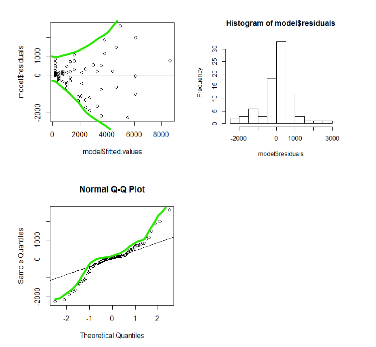

How did you know that the red line was the best fit? 

We consider the line that best fits the data as the one that comes closest to all of the points. It minimizes the distance between itself and each point. Even though some points are farther than others, the overall average distance of each point is as small as possible.

The height of each point on the plot is its **observed value** or $y$. We are interested in the $y$ values because that is our response variable.

The height of the line is then the **predicted value** or $\hat{y}$. We can plug in a value for $x$ and get a prediction for the response.

The difference between these two numbers is called the **residual** or $e_i$. The $i$ subscript stands for the fact that every point in our data will have a residual, $i$ lets us know which observation that residual is from.

> $$e_i=y-\hat{y}$$

> Always calculate residuals as **observed** - **predicted**.


To play around more with the idea of the minimizing residuals to find the best fitting line, visit [this link](https://dtkaplan.shinyapps.io/DA_least_squares/)

### Regression Equation

The general form of the regression equation is

> $$\hat{y}=\beta_0+\beta_1\cdot x$$

where $\hat{y}$ is the predicted response value

$\beta_0$ is the $y$-intercept

$\beta_1$ is the slope

$x$ is the explanatory variable

> Whenever writing a regression equation for a real dataset, NEVER use the symbols. This provides no context for the data, ALWAYS use variable names and estimated values.

For example, the poverty and HS diploma data above and in the slides has the regression equation

$$\widehat{\text{% in poverty}}=64.68-0.62\cdot\text{% HS grad}$$

See the slides and later examples for more on the interpretation of the slope and intercept in context.

### Conditions

Just like our other methods of analysis this semester, we have conditions and assumptions to meet in order to use regression. These conditions are:

+ Linearity

+ Nearly Normal Residuals

+ Constant Variance

+ Independence

**Linearity** is checked from the very first scatterplot we create. But can also be checked using a *residual plot* and looking for patterns (patterns in residual plot = not linear).

**Normal residuals** are checked by plotting the histogram of the residuals created by our linear model. Or by using a *normal QQ plot* to see how well the residuals follow a normal distribution (see example later in tutorial).

**Constant variance** is also checked with a *residual plot*. Again patterns are bad, we want to see the residuals randomly spread out all over the place.

**Independence** needs to be thought about but can't be checked without knowing the exact methods of data collection. Sometimes we simply need to assume independence.


## Example

Can you predict the price of a used Porsche by only using the mileage? The data below contains the price and mileage of 30 used Porsches.

```{r, include = FALSE}
porsche <- read.csv("~/Stats 212c F19/Class/Data/PorschePrice.csv")
```

```{r c4, exercise = TRUE}
head(porsche)
```

### Set up the variables

```{r quiz5}
quiz(
  question("What is the response variable?",
           answer("Price", correct = TRUE),
           answer("Mileage"),
           random_answer_order = TRUE,
           allow_retry = TRUE
           ),
    question("What is the explanatory variable?",
           answer("Price"),
           answer("Mileage", correct = TRUE),
           random_answer_order = TRUE,
           allow_retry = TRUE
           )
)
``` 


### Summarize and plot

Plot the variables and find the correlation coefficient. Plug in the appropriate variables in the code.

```{r c5, exercise = TRUE}
gf_point(_______ ~ _______, data = porsche)

cor(porsche$______, porsche$______)
```


```{r quiz6}
quiz(
  question("The correlation coefficient *suggests* that the relationships are:",
           answer("linear", correct = TRUE),
           answer("non-linear"),
           answer("negative", correct = TRUE),
           answer("positive"),
           answer("strong", correct = TRUE),
           answer("moderate"),
           answer("weak"),
           allow_retry = TRUE
           )
)
```


### Find the line

What is the best line to describe the relationship between `Price` and `Mileage`? Use the `lm()` function below, remember to keep track of the response and explanatory variables.

```{r c6, exercise = TRUE}
# Fit the best line
fitline <- lm(Price ~ Mileage, data = porsche)

# Plot the points and the line
gf_point(Price ~ Mileage, data = porsche) %>%
  gf_lm()

# Get the slope, intercept, and other important information
summary(fitline)
```


```{r quiz7}
quiz(
  question("What is the equation of the line?",
           answer("y = B0 + B1 * x", message = "Not the general form of the line"),
           answer("Price = 71.1 - 0.59 * Mileage", correct = TRUE),
           answer("Price = -0.59 + 71.1 * Mileage", message = "Which is the intercept and which is the
                  slope?"),
           answer("Price = 2.37 + 0.057 * Mileage", message = "These are the SE's for intercept and slope, look under the Estimate column for the coefficients"),
           random_answer_order = TRUE,
           allow_retry = TRUE
           )
)
```

### Interpret the values

Think about how you would interpret the intercept and slope. Do they make sense in the context of the problem?

> In general we say that for every one **[unit]** increase in the **[explanatory variable]** the predicted **[response]** will change by **[the value of the slope].**

> When the **[explanatory variable]** is 0, the predicted value of the **[response variable]** will be **[the value of the intercept].**


Now for any problem with interpreting regression lines, just replace the bold text with the values and terms from your data and analysis. When you get more comfortable, you can personalize the form of these general statements.


### $R^2$

The other numerical summary we use is $R^2$. This is the square of the correlation coefficient.

When we square r, it has a nice interpretation of the model for the best line. $R^2$ tell us how much the model accounts for differences in the response variable.

It is the percentage of variation in the response explained by the regression equation. Think of it as another way to tell the strength of the linear association. When the points fall really close to the line, there's not a lot of variation that we aren't accounting for. But if the points aren't really close to the regression line, it's not doing a very good job of telling us what's going on. In other words, there's a lot of variation that is left unexplained.

Let's look at the summary of `fitline` again. We'll be interested in the **Multiple $R^2$**.

```{r, include = FALSE}
fitline <- lm(Price ~ Mileage, data = porsche)
```


```{r}
summary(fitline)
```


```{r quiz8}
quiz(
  question("What is $R^2$ for this regression model?",
           answer("0.7945", correct = TRUE),
           answer("7.17"),
           answer("108.3"),
           answer("28"),
           random_answer_order = TRUE,
           allow_retry = TRUE
           ),
  question("What is the correct interpretation of $R^2$?",
           answer("79.45% of the variation in Porsche Price can be explained by the model using Mileage.", correct =
                    TRUE),
           answer("79.45% of the time, the model can predict Price correctly."),
           answer("The variation of the model is 0.7945."),
           answer("There is a 79.45% chance that this model will vary from car to car."),
           random_answer_order = TRUE,
           allow_retry = TRUE
           )
)
```

Want to find the $R^2$ value "by hand"? The formula is fairly simple. It only involves two standard deviations: for the response, `Price` and for the `residuals` from the model.

$$R^2=\frac{s_{price}^2-s_{residuals}^2}{s_{price}^2}$$
Run the code to find it in `R`:

```{r c7, exercise = TRUE}
s_price <- sd(porsche$Price)
s_residual <- sd(fitline$residuals)

# R-square
(s_price^2 - s_residual^2) / s_price^2
```

### Checking Conditions

Unlike other analysis we have done in this class, the conditions for linear regression can only be checked *after* we fit the model. This is because we need to examine the residuals to know if they meet the criteria we need. Remember that the conditions are:

+ Linearity

+ Nearly Normal Residuals

+ Constant Variance

+ Independence


The **linearity** of the data is apparent in the original scatterplot. But we also check the plot of the residuals. Here we look for NO patterns in the points They should just look like there are random all over the graph. This means there are some values we over estimate, some we underestimate, some by a little, some by a lot... It's a random collection of points. `plot(fitline)` gives several plots and the first one is the residual plot. It seems pretty random for our example.

The **normality** of the data is represented in the second plot of `plot(fitline)`. Here we are seeing how well the residuals follow a *perfect* Normal distribution. The more the points follow the diagonal line, the more normal they are. If the points have too much of a bowed or "S" shape, that indicates skewed or non-symmetric data. You can also check normality with a histogram (also shown with the code below.)

**Constant variance** is important so the regression line isn't really good for some values and not so good for other. Think about a funnel or trumpeting shape in the residual plot. This indicates that there is non-constant variance. We look for the range of the points from left to right on the residual plot (first graph) and see if both sides have the same range top to bottom. Our example shows that variance is fairly consistent.

```{r}
plot(fitline)
histogram(fitline$residuals)
```


### Examples of violated conditions

Here are some examples of **bad** residual plots. The data and the model that produced these are violating several of our conditions. First, notice that the residual plot fans out from left to right. This indicates a **violation of constant variance**. The response variable for larger values of $x$ are more spread out than the smaller ones. The normal QQ plot also does not follow the theoretical line very well. This is a **violation of residual normality**. And even though the histogram looks symmetric, the tails on each end trail off too much (it is skewed in both directions!)




### Predictions

But if you fit a regression line and the conditions are all OK, it is time to use the model by making predictions. This is as easy as plugging a value for your explanatory variable into the equation. Recall for our example that the regression equations is:

$$\widehat{Price} = 71.1 - 0.59 * Mileage$$

```{r c8, exercise = TRUE}
## Use this space to calculate your predition
```

```{r quiz9}
quiz(
  question("What is the predicted price for a Porsche with 30,000 miles?",
           answer("$53.4 (in thousands)", correct = TRUE),
           answer("$-17,628.90", message = "Be careful, mileage was measured in 1,000 miles"),
           answer("$88.8 (in thousands)"),
           answer("Impossible to know!"),
           random_answer_order = TRUE,
           allow_retry = TRUE
           ),
  question("What is the predicted price for a car with 150,000 miles",
           answer("-$17.4 (in thousands)", correct = TRUE),
           answer("-$88,428.9"),
           answer("$0"),
           answer("Impossible to know!"),
           random_answer_order = TRUE,
           allow_retry = TRUE
           ),
  question("What's wrong with trying to make a prediction for the previous question?",
           answer("It is extrapolation, we shouldn't make predictions for values beyond what we observed.", correct = 
                    TRUE),
           answer("Porsches don't last for 150,000 miles."),
           answer("Nothing, the owner is paying someone to take the car off their hands."),
           answer("I broke statistics.", message = "Nice try, you can't break stats."),
           random_answer_order = TRUE,
           allow_retry = TRUE
           )
)
```

### Next Steps

We will see in the next sections that we can also run hypothesis tests and confidence intervals on the slope coefficient value. This will help us determine significant relationships between two quantitative variables. Stay tuned!


