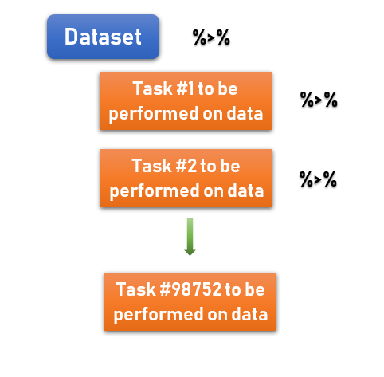

```{r setup, include=FALSE}
library(learnr)
library(mosaic)
library(openintro)
library(tidyverse)
library(knitr)

movies <- read.csv("https://raw.githubusercontent.com/joeroith/Data/master/movies.csv")
movies <- movies[,-1]

movies_sbst <- movies %>%
  select(title, genre, runtime, mpaa_rating) %>%
  filter(runtime > 75) %>%
  mutate(runtime_hrs = runtime/60) %>%
  mutate(type = "Movies!")

City <- c("Northfield", "St. Paul", "Rochester", "Minneapolis")
Population <- c(20084, 306621, 219802, 425403)
Size <- c(8.52, 56.18, 57.49, 55.48)

pop <- as.data.frame(list(City, Population))
names(pop) <- list("City", "Population")
pop

area <- as.data.frame(list(City, Size))
names(area) <- list("City", "Size")
area


Town <- c("Rochester", "Minneapolis", "Northfield", "St. Paul")
County <- c("Olmsted", "Hennepin", "Rice", "Ramsey")

county <- as.data.frame(list(County, Town))
names(county) <- list("County", "Town")
county

new_data <- pop %>% # just start with one of the datasets, doesn't matter which
  left_join(area, by = "City")

knitr::opts_chunk$set(echo = FALSE)
```


## Most common needs for "clean data"

> Happy families are all alike; every unhappy family is unhappy in its own way.
> - Leo Tolstoy (famous Russian author)

> Tidy datasets are all alike, but every messy dataset is messy in its own way.
> - Hadley Wickham (famous New Zealander R programmer)
 
 
 There are many things you may need to do to a dataset to get it ready for your analysis and each dataset is different. This tutorial will help you with the *most common* issues you will run into. 

+ **filtering** out missing or non relevant data

+ **selecting** certain variables of interest (trimming down a large dataset)

+ creating new variables from existing ones (**mutating** them)

+ **joining** two datasets with a variable in common

+ **grouping** observations by a categorical variable

+ **summarizing** variables

If it sounds like you may need to do one or more of these, please read on. If you need to do more than this, try [this cheatsheet](https://github.com/rstudio/cheatsheets/raw/master/data-transformation.pdf) for help, or google it, ask me, or ask a student fellow in the CIR.
 
## `dplyr`

### Why we use it

{width=250px}

&nbsp;

The package to use for handling data in R is called `dplyr`. It is the most commonly used and most intuitive (even if you don't think so at first). It is so useful and universal that if you get good at it, it's worth including as a skill on a resume or graduate school application.

### Pipes

`dplyr` uses the pipe notation (`%>%`) that we have briefly seen before. This notation helps us organize the task we are performing and makes code easier to read for others. Remember to always start broad and pipe down to more specific things.



Start with your dataset name and read `%>%` as "and then do this...". When you have written the last thing you'd like to do to the data for that chunk, leave out the pipe and R will know to stop there.

### Verbs
 
Yes, verbs. R is a language and you need to know how to speak it to be understood. Use the correct verb to perform the tasks listed earlier. Thankfully these are very intuitive verbs (most of the time). These are the tasks you will fill in after the data and first pipe in your code:

| **verb** | **action** | **example** |
| :------ | :------------------------------------------ | :------- |
| `filter()` | Select rows based on some criteria | `filter(age > 40)`|
| `select()`  | Select columns(variables) and ignore all others | `select(age, sex)` |
| `mutate()` | Add new variables | `mutate(time_hrs = time_min / 60)` |
| `left_join()` | Combine/merge multiple datasets *if they have a column in common* | `left_join(data2, by = "id")` |

Let's get started...

## Filter

### Selecting Rows

Use `filter()` when you want to eliminate **rows**. We will use the example dataset called `movies` from Rotten Tomatoes. First take a look at the data (and a quick summary).


```{r, echo = TRUE, eval = FALSE}
movies <- read.csv("~/Stats 212 I21/Class/Data/movies.csv")
```

Now how about the summary of the variables
```{r, c1_1, exercise = TRUE}
movies
summary(movies)
```

 
Lots of good data here. But maybe a little too much. Notice the `runtime` variable. What if we only wanted movies that were longer than 75 minutes?

### Filter with Logic

We need to filter out the shorter movies using a **logical expression**. All that means is we tell R what we want using (`>`, `<`, `==`, and `!=`) the last one is 'not equal to' (`!` means 'not' in coding).

```{r c2, exercise = TRUE}
library(dplyr) ## remember to load the library if you haven't already done so

movies %>%  # start big with the whole dataset and pipe to the next line
  filter(runtime > 75)
```

We went from 651 to 643 rows. But this only shows us the rows with movies more than 75 mins long. 

> Assign the data to a new name to save the subset data later for a plot, test, or just to make the file smaller.
> Always keep an original version of the data. Never reuse the original name. 

```{r c3, exercise = TRUE}
long_movies <- movies %>%
  filter(runtime > 75)
long_movies
```

### Missing data

Often you will use `filter()` to handle missing data. We use a neat function for this called `is.na()` which just finds the `NA`'s for a variable. But since we *don't want* these missing values we can say `!is.na()` to tell R to keep the values that **are not** `NA`.

Not every movie has a second actor listed. Some movies don't have a director listed. I only want movies with a director.

```{r c4, exercise = TRUE}
movies %>%
  filter(!is.na(director))
```


We can use multiple filters together. Most of your filter needs for the project should be simple. But if you need to think about and/or statements talk to me.

```{r c5, exercise = TRUE}
movies %>%
  filter(!is.na(director)) %>%
  filter(runtime > 75)
```


### Your data

Play around here with filtering your data. Remember to read in the file first.

```{r c6, exercise = TRUE}

```

```{r c6-hint, , eval = FALSE}
_____ <- read.csv(...)
```


## Selecting variables (columns)

Many datasets have more variables than we really need. And dealing with so much information can slow things down. To simplify, we can `select` the variables we want to use.

### Movies Example

If I only want to know the `title`, `genre`, `runtime`, and `mpaa_rating` of the movies, I can use the following code.

```{r c7, exercise = TRUE}
movies_sbst <- movies %>%
  select(title, genre, runtime, mpaa_rating)

movies_sbst
```

You can also select then filter:

```{r c8, exercise = TRUE}
movies_sbst <- movies %>%
  select(title, genre, runtime, mpaa_rating) %>%
  filter(runtime > 75)

movies_sbst
```

### You try with your project data

```{r c9, exercise = TRUE}

```


## Create new variables

You can create a new variables with `mutate()` either from scratch or from existing variables. Here, the new variable name is defined inside the function. `mutate(new_name = ...)`

### Movies Example

Suppose I want `runtime` in hours rather than minutes. And what if I wanted a variable that just said "Movies" (for no reason other than to show you). Each new variable gets its own mutate line.

```{r c10, exercise = TRUE}
movies_mutate <- movies_sbst %>%
  mutate(runtime_hrs = runtime/60) %>%
  mutate(type = "Movies!")

movies_mutate
```

You can see your new variables if you click the arrow in the upper right of the box.

### You try with your project data

Only if you need/want to create new variables

```{r c11, exercise = TRUE}

```

## EDA after cleaning

There may be more cleaning to do. But we have a much simpler dataset to work with for some of our EDA. Now I can use `favstats()`, `histogram()`, `table()`, and all of the other functions we've used earlier.

```{r, include = FALSE}

```


```{r, echo = TRUE, message=FALSE, warning=FALSE}
# runtime by itself and by the rating
favstats(~ runtime, data = movies_sbst)
favstats(runtime ~ mpaa_rating, data = movies_sbst)
bwplot(runtime ~ mpaa_rating, data = movies_sbst)

# genre and rating
ytable <- table(movies_sbst$genre, movies_sbst$mpaa_rating)
ytable

## Too many genres and ratings. Maybe I just want Drama and Comedy
## for movies rated PG, PG-13, and R.

movies_smaller <- movies_sbst %>%
  filter(genre == c("Comedy", "Drama")) %>%
  filter(mpaa_rating == c("PG", "PG-13", "R")) %>%
  droplevels()  # this makes sure we drop the unused rating and genres
  
movies_smaller

ytable <- table(movies_smaller$genre, movies_smaller$mpaa_rating)
ytable
mosaicplot(genre ~ mpaa_rating, data = movies_smaller, color = TRUE)
```


### More open space for you to try things out

```{r c12, exercise = TRUE}

```


## Merging data

Some of you will need to merge more than one datasets. You can do that with `left_join()` (among other functions). There is one thing that is vital to remember when merging:

> Only merge data when you have measurements on the SAME observations (students, countries, patients etc.). You NEED to have one column in common between the two dataset to merge by.

### Here is an example of some made up data.


```{r, echo = TRUE}
pop
area
county
```


You can see that these three datasets all have the city/town name in common. So we can join them into one dataset. The first code demonstrates when the variable names are the same. If it is not the same, you need to force it to be the same. Note below that the order of the cities in the original datasets does not matter

```{r c13, exercise = TRUE}
new_data <- pop %>% # just start with one of the datasets, doesn't matter which
  left_join(area, by = "City")
new_data
```


### Can't join City and Town as they are right now, so we `rename` Town in the third dataset to match what we have in the others.

```{r c14, exercise = TRUE}
new_data2 <- county %>%
  rename(City = Town) %>%
  left_join(new_data, by = "City")

new_data2
```


## More fun

Check out a couple other verbs to use with `dplyr` that can be helpful.

| **verb** | **action** | **example** |
| :------ | :------------------------------------------ | :------- |
| `group_by()` | Group data by a variable's levels (best used with plots or summaries) | `group_by(year_in_school)` |
| `summarize()` | Summarize a variable | `summarize(age_mean = mean(age))` |
| `arrange()` | Sort rows | `arrange(date, group)` |
| `rename()` | Rename columns | `rename(new = old)`|


### Remember to seek help

You are not supposed to memorize this stuff. **I don't have all of it memorized!!** But you are expected to ask for help (not only from me).


