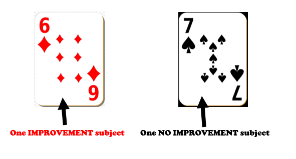
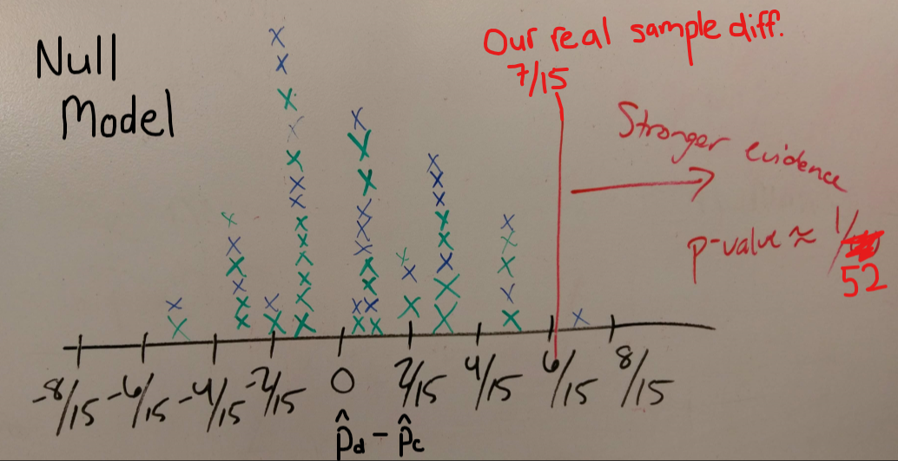

```{r setup, include=FALSE}
library(learnr)
library(openintro)  
library(infer)
library(mosaic)  
library(dplyr)  
library(ggplot2)
library(readr)
library(knitr)

dolphins <- read.csv("https://raw.githubusercontent.com/joeroith/Data/master/Dolphins.csv")
dtable <- table(dolphins$Treatment, dolphins$Outcome)
ptable <- prop.table(dtable, 1)
obs.diffinprop = ptable[2,1] - ptable[1,1]


null_distn <- dolphins %>%
  specify(Outcome ~ Treatment, success = "Improvement") %>%
  hypothesize(null = "independence") %>%
  generate(reps = 1000, type = "permute") %>%
  calculate(stat = "diff in props", order = c("Dolphin", "Control")) 

knitr::opts_chunk$set(
  echo = FALSE,
  fig.align = "center",
  fig.width = 6, fig.height = 4)
```

## Dolphins and Depression

### Steps 1 & 2: Data and Background

[Antonioli and Reveley (2005)](https://www.ncbi.nlm.nih.gov/pmc/articles/PMC1289317/) investigated whether swimming with dolphins was therapeutic for patients suffering from clinical depression. The researchers recruited 30 subjects aged 18-65 with a diagnosis of mild to moderate depression through announcements on the internet, radio, newspapers, and hospitals in the United States and Honduras. Subjects were required to discontinue use of antidepressant drugs and psychotherapy four weeks prior to the experiment. 

The subjects traveled to an island off the coast of Honduras, where they were randomly assigned to one of two treatment groups. At the beginning of the study, the depression level of the subjects was evaluated. Both groups engaged in one hour of swimming and snorkeling each day, but one group (Dolphin Therapy) did so in the presence of bottlenose dolphins and the other group (Control) did not.

At the end of two weeks, each subjects' level of depression was evaluated again and they were categorized as experiencing substantial improvement in depression symptoms or not. The data is summarized are the table below.


{width=75%}

&nbsp;

> Try to clearly identify the research question.


### The Data


From the 30 subjects split into two groups of 15 per treatment type.

```{r}
kable(tally(~ Treatment + Outcome, data = dolphins, margin = TRUE))
```


### The Research Context

Let's understand the research and data a little better.

```{r context-quiz}
quiz(caption = "",
  question(
    "Was this an observational study or a designed experiment?",
    answer("Observational study"),
    answer("Designed experiment", correct = TRUE),
    random_answer_order = TRUE,
    allow_retry = TRUE
  ),
    question(
    "What types of variables do we have?",
    answer("Treatment: Categorical, Outcome: Categorical", correct = TRUE),
    answer("Treatment: Numeric, Outcome: Categorical"),
    answer("Treatment: Categorical, Outcome: Numeric"),
    answer("Treatment: Numeric, Outcome: Numeric"),
    random_answer_order = TRUE,
    allow_retry = TRUE
  ),
  question(
    "What are the explanatory and response variables?",
    answer("Explanatory: Treatment (Control/Dolphin), Response: Outcome (Improvement/No Improvement)", correct = TRUE),
    answer("Explanatory: Treatment (Improvement/No Improvement), Response: Outcome (Control/Dolphin)"),
    answer("Explanatory: Outcome (Control/Dolphin), Response: Treatment (Improvement/No Improvement)"),
    answer("Explanatory: Outcome (Improvement/No Improvement), Response: Treatment (Control/Dolphin)"),
    random_answer_order = TRUE,
    allow_retry = TRUE
  )
)
```


## Step 3: EDA 

### Compare the groups

Now we want to determine if there is any sort of relationship between our response and explanatory variable. Since we are dealing with categorical variables, we'll want to calculate proportions. Specifically, we want the proportion of the `Improved` (the response variable category we're interested in) and we can report it for each treatment group (the explanatory variable levels).

```{r compare-quiz}
quiz(caption = "",
  question(
    "What proportion of the subjects in the dolphin therapy group showed improvement?",
    answer("$\\frac{10}{15}=0.67$", correct = TRUE),
    answer("$\\frac{10}{30}=0.33$"),
    answer("$\\frac{10}{5}=2$"),
    answer("$\\frac{10}{13}=0.77$"),
    random_answer_order = TRUE,
    allow_retry = TRUE
  ),
    question(
    "What proportion of the subjects in the control group showed improvement?",
    answer("$\\frac{3}{15}=0.20$", correct = TRUE),
    answer("$\\frac{3}{30}=0.10$"),
    answer("$\\frac{3}{12}=0.25$"),
    answer("$\\frac{3}{13}=0.23$"),
    random_answer_order = TRUE,
    allow_retry = TRUE
  ),
  question(
    "What is the difference between proportions?",
    answer("$\\frac{10}{15} - \\frac{3}{15} = \\frac{7}{15}=0.47$", correct = TRUE, message = "As you'll see later on, the order you chose to take the difference doesn't matter, AS LONG AS YOU ARE CONSISTENT WHEN INTERPRETTING!"),
    answer("$\\frac{3}{15} - \\frac{10}{15} = \\frac{-7}{15} = -0.47$", correct = TRUE),
    random_answer_order = TRUE,
    allow_retry = TRUE
  )
)
```

#### What do you think?

> Does the difference in proportions support the claim that dolphin therapy is more effective than control? Why or why not?

> Could the difference in proportions have arisen by chance alone?

## Step 4: Formal Analysis

### Hypotheses

Is swimming with dolphins better? Set up the competing hypotheses for the research question. What are the possible options for comparing the dolphin and control groups? What should we assume and what should we need to prove with strong evidence?

```{r htest-quiz}
quiz(caption = "",
  question(
    "State the null and alternative hypotheses (using words) in terms of the difference of proportions.",
    answer("Null hypothesis: There is no real difference in the proportion of improvement for either group, any difference observed is due to chance. Alternative hypothesis: There is a significant difference in the proportion of improvement between the two groups and it's not due to chance.", message = "Make sure the alternative matches your question, this alternative leaves room for the possibility that the control group could actually show more improvement."),
    answer("Null hypothesis: Swimming with the dolphins will improve depression symptoms better than swimming alone. Alternative hypothesis: There is no real difference in the proportion of improvement for either group, any difference observed is due to chance."),
    answer("Null hypothesis: There is no real difference in the proportion of improvement for either group, any difference observed is due to chance. Alternative hypothesis: Swimming with the dolphins will improve depression symptoms better than swimming alone.", correct = TRUE),
    random_answer_order = TRUE,
    allow_retry = TRUE
  ),
  question(
    "State the null and alternative hypotheses (using symbols) in terms of the difference of proportions.",
    answer("$H_0: p_d - p_c = 0$, $H_a: p_d - p_c >0$", correct = TRUE),
    answer("$H_0: p_d - p_c > 0$, $H_a: p_d - p_c = 0$"),
    answer("$H_0: p_d - p_c = 0.47$, $H_a: p_d - p_c \\ne 0.47$", message = "The observed sample proportions should not be a part of the hypotheses."),
    random_answer_order = TRUE,
    allow_retry = TRUE
  )
)
```

$p_d:$ Proportion of ALL patients who improve symptoms with dolphin therapy.

$p_c:$ Proportion of ALL patients who improve symptoms with just swimming.

## Model the Data

### Under the Null hypothesis

We'll next create a model of how the observed differences in proportions are expected to vary **assuming the null hypothesis is true** (the null model). Assume that there is no difference in the proportions between the two groups.

The idea is that if there's no difference, then it didn't matter whether each subject was swimming with dolphins or not. Under the null model, we assume that there were just 13 people who would improve and 17 people who would not, regardless of their treatment.

> The <font color='blue'>**key question**</font> is how unlikely is it for the random assignment process alone to place 10 or more of these 13 who showed improvement into the dolphin therapy group? We'll model the variability expected from random assignment under the null hypothesis using cards.

### With your own with a deck of cards



Grab a deck of cards and  <font color='red'>**take out 13 red cards to represent "improvers"**</font> and then **take 17 black cards to represent "non-improvers"** (if you don't have cards, you can create little scraps of paper with "improve" or "no improvement" written on them and toss them in a hat). You should have 30 total cards, one for each participant in the experiment.

Shuffle the 30 cards and deal 15 of them into a stack representing Dolphin Therapy and deal the remaining 15 cards into a stack representing Control. (We are now simulating the researchers randomly assigning the subjects into each treatment group.)

### []()

Here is my adorable niece Aislin to give you an example of how it's done.

<iframe src="https://stolaf.hosted.panopto.com/Panopto/Pages/Embed.aspx?id=a4c889a1-9283-421f-80fb-ab9400f848dc&autoplay=false&offerviewer=true&showtitle=true&showbrand=false&start=0&interactivity=all" width=720 height=405 style="border: 1px solid #464646;" allowfullscreen allow="autoplay"></iframe>

### []()

Then, count the number of improved and non-improved for each group to complete the contingency table below. This table now shows how the results might have turned out assuming the null hypothesis is true.

&nbsp;

| | Improvement | No Improvement | Total |
| :--| :------- | :-------| :-------|
Dolphin Therapy | | | 15 | 
Control | | | 15 | 
Total | 13 | 17 | 30 | 


Calculate the difference in proportion of improvement (dolphin - control) after your reshuffling procedure. Write this number down: _______  

### Repeat

Repeat this process 4 more times, and write down your 4 additional differences in proportions: _______ , _______ , _______ , _______  

### Class Results

Here is the histogram of 52 simulations (from a past class) using the cards. This represents values we would expect to get by chance alone for the difference in sample proportions, $\hat{p}_d-\hat{p}_c$ (assuming swimming with dolphins has no effect).

&nbsp;

{width=85%}

> Notice that the <font color='purple'>**p-value**</font> is the fraction of simulated samples that have a difference in proportions that is the same, or larger than our real sample (# of times $\hat{p}_d-\hat{p}_c >\frac{7}{15}$ / # total simulations).

$$p-value = \frac{1}{52}=0.02$$


### Anything unusual?

Now let's answer a couple of questions:

1. Based on your (and the class') simulated data, how would you answer the <font color='blue'>**key question**</font>: how unlikely is it for the random assignment process alone to place 10 or more of the 13 who showed improvement into the dolphin therapy group?  

&nbsp;

2. Based on the class simulated data, how unlikely is it to get a difference in proportions of $\frac{7}{15}$ or more if there's really no effect of dolphin therapy?  

&nbsp;

3. Argue that the answers to the two questions above must *always* be the same. 

&nbsp;

4. Can you claim that dolphin therapy is *statistically significantly* better than control?  Why or why not?  

&nbsp;

5. What if we wanted to find out if dolphin therapy is significantly *different from* (not necessarily *better than*) control?  That is, what if we wanted to find a **two-sided p-value**.  How would you do this?  

&nbsp;

### A Better Way?

In reality, we should get hundreds or thousands of simulated differences in proportions under the assumption of no difference between treatments, so we will need to turn to technology. We'll use `R` to perform a randomization test of the dolphins data.

## Randomization through Simulation

### Set up in R

Let's have the computers do the tedious task of shuffling and assigning subjects into treatments groups for the null model.

Remember to load the correct packages and bring the data into your R session.

```{r, eval = FALSE, echo = TRUE}
library(openintro)  
library(mosaic)  
library(dplyr)  
library(ggplot2)
library(infer)  # new package we haven't included yet
```


```{r, eval = FALSE, echo = TRUE}
dolphins <- read.csv("~/Stats 212d F20/Class/Data/Dolphins.csv")
```


### Dolphin EDA

This dataset contains 30 records (one for each subject).

```{r, eda1, exercise = TRUE}
names(dolphins) # variable names 
head(dolphins) # first few cases
```

Here we use `R` to construct the contingency table for the cross-tabulated data using the `table()` function and then plot the relationship using the `mosaicplot()` function.  Put the treatment variable first so is is represented in the rows.  

```{r, eda2, exercise = TRUE}
dtable <- table(dolphins$Treatment, dolphins$Outcome)
dtable 
```

```{r, eda3, exercise = TRUE}
mosaicplot(dtable, color=c("blue", "light blue"), 
           main="Dolphins and Depression")
```


### Calculate proportions

The proportion improving for the dolphin therapy and control groups are provided below.

```{r, prop1, exercise = TRUE}
ptable <- prop.table(dtable, 1)  # '1' here tells R to find the row proportions
ptable
```

In order to take the difference of the proportions we are interested in ($p_{d}-p_{c}$), we need to locate them in the table above. We do that by calling the table and pointing to the location with `[row#, col#]`. So `ptable[2,1]` refers only to the number in the 2nd row and 1st column in `ptable`. And we get the difference below. We'll save this value as `obs.diffinprop` to use it later for comparison.

```{r, prop2, exercise = TRUE}
obs.diffinprop = ptable[2,1] - ptable[1,1]
obs.diffinprop 
```

### Test statistic aka Our Evidence

We observe a difference of `r round(obs.diffinprop,4)*100`% between the two groups with respect to the proportion improving. This is our observed **test statistic**.  Again, we face our <font color='blue'>**key question**</font>: could the observed difference happen just by chance?  Or: how often would we observe a difference this large if dolphin therapy was no better than control?  

### Simulate no difference (null model)

We'll ask `R` to replicate the cards exercise and simulate differences in proportions that we would expect to see just by chance. We'll randomly assign 30 subjects (13 of which are improvers and 17 of which are non-improvers) to be in either the Control or Dolphin Therapy group (15 in each).  We'll then calculate the simulated (random) difference in the proportion improving for the two groups. We'll repeat this a large number of times and get a good idea of what the differences in proportions would look like if there really is no difference in the probability of improvement for the two groups. Basically, we are *simulating differences in proportions under the null hypothesis*.

### In R

This set of code will be very useful for us when performing **randomization tests**. A few things will never change: 

```{r, eval = FALSE, echo = TRUE}
null_distn <- __________ %>%
  specify( ______ ~ ______, success = "________") %>%
  hypothesize(null = "________") %>%
  generate(reps = "_________", type = "permute") %>%
  calculate(stat = "_________", order = c("_______", "_______"))
```

You just need to fill in the parts that are specific to the data, like data set name, variable names, type of test, etc.

```{r, rand1, exercise = TRUE}
null_distn <- dolphins %>%
  specify(Outcome ~ Treatment, success = "Improvement") %>%
  hypothesize(null = "independence") %>%
  generate(reps = 1000, type = "permute") %>%
  calculate(stat = "diff in props", order = c("Dolphin", "Control")) 

```

**Only click Run Code once!** It may look like nothing happened, but you just simulated shuffling the deck and calculating the difference in proportion improved 1000 times!

Visualize the **null distribution** to see what kinds of differences in proportions we'd expect by chance. Describe the *center*, *unusual outliers*, *shape*, and *spread* of the distribution of random differences.


```{r, rand2, exercise = TRUE}
null_distn %>%
  visualize(method = "simulation") +
  shade_p_value(obs.diffinprop, direction = "right")
```

### P-value

The **observed difference** of `r round(obs.diffinprop, 3)` is indicated by the red line.  We can calculate a one-sided p-value by counting the number of simulated differences at or above the red line and dividing by the number of simulations we ran (1000): 

```{r, rand3, exercise = TRUE}
null_distn %>%
  get_p_value(obs_stat = obs.diffinprop, direction = "right")
```


> Very few simulated experiments were able to recreate what we actually observed in the real experiment...

## Step 5: Communicate Results

### Wrap it up

Remember to always conclude things referring to the original research question and context. Let's return to our questions from the Dolphin Lab:

1. Based on the simulated data from `R`, how unlikely is it to get a difference in proportions of $\frac{7}{15}$ or more if there's really no effect of dolphin therapy?  

1. Based on the simulated data from `R`, how would you answer the <font color='blue'>**key question**</font>: how unlikely is it for the random assignment process alone to place 10 or more of these 13 who showed improvement into the dolphin therapy group?  

1. Argue that we could use either the observed difference in proportions or the number of successes in the dolphin group as our **test statistic**.  What else could we use as a test statistic and obtain the same p-value?  

1. What if we wanted to find out if dolphin therapy is significantly *different from* (not necessarily *better than*) control?  That is, what if we wanted to find a **two-sided p-value**.  Adjust the `R` code to do this.  

1. Can you claim that dolphin therapy is *statistically significantly* better than control?  Why or why not?  


