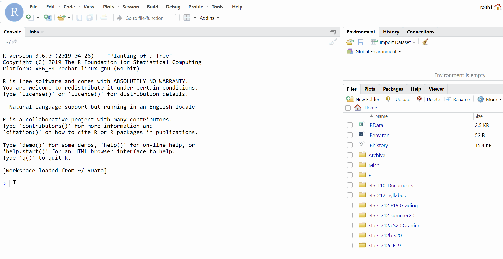
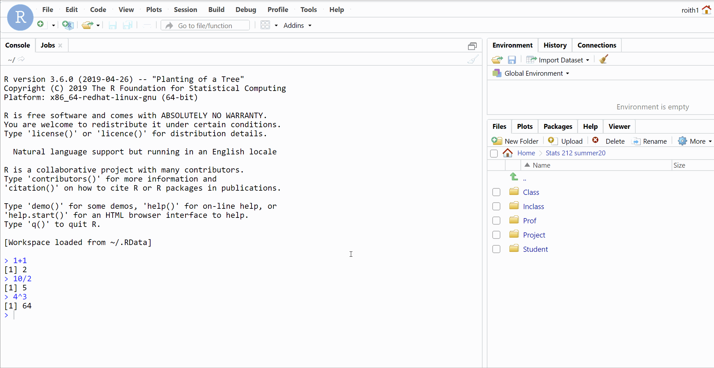

```{r setup, include=FALSE}
library(learnr)

knitr::opts_chunk$set(
  echo = FALSE,
  fig.align = "center",
  fig.width = 6, fig.height = 4)
```


## Before we jump in...

### Why use R as our statistical software?

1. It's free (yay!).

1. It's open source.

1. It's powerful and customizable.

1. It's an industry standard and used by many large companies.
    
1. It's vital for sharing and reproducing the cleaning, visualization, and analysis of data.

### Why do we need to code?

```{r color-mapping-quiz}
quiz(
  question(
    "Imagine you need to bake a cake, what method would you prefer?",
    answer("Trial and error", message = "You may eventually get a cake, but probably after a lot of frustration and poor attempts."),
    answer("Have a friend describe the process", message = "Not a bad way, but your friend may not be great at giving directions. And what if you decide to explain to someone else how to bake a cake? A lot can get lost in the translation."),
    answer("Follow a written recipe", correct = TRUE, message = "The code we use is just a recipe the computer follows to get the result we want. It is clear, precise, and doesn't change unless we want it to."),
    random_answer_order = TRUE,
    allow_retry = TRUE
  )
 
)
```

You should be able to follow the exact steps someone performed for any data analysis. That way you can:

   - Check their work for mistakes or unethical practices. 
      
   - Replicate it to ensure you get the same results. 
      
   - Expand on their work to further advance the field.

This can all be done with a record of the code used for data analysis. This is why we will use R. You should find that you won't need to *write* much of your own original code for this class. Rather you will use code I've written and alter it for different variables or data sets.

## The Basics

### Calculator

The simplest way to use R is as a calculator. Below is a box where you can write and run code in R. We will have these boxes in the tutorials to introduce some ideas, but the real coding will happen elsewhere (shown in the next section).

First, run the code in the box as it is shown below to see the result. Then try a few of the commands below, can you figure out what they are doing?

- `10 / 2`

- `4 ^ 3`  (what do you think the `^` means?)

- `log10(1000)`


```{r first-try, exercise = TRUE}
1 + 1
```


### Data Analysis

R can do more than function as a calculator - it can be used to analyze data! Run the code below for the data set `cars`. 

Note: anything following `#` is just a comment for anyone reading the code and is ignored by R, you don't need the comments for the code to run, but it is good practice to explain what the code does.

```{r, eval = FALSE}
?cars           # learn about a data set that comes with R (one of many)
```


```{r first-analysis, exercise = TRUE, echo = TRUE}
summary(cars)   # summary is a "function"
hist(cars$dist) # data set name (cars) and variable name (dist) separated by $
plot(cars)      # autoplot all variables in cars data set (there are just 2)

# find best line relating speed to dist
fitline <- lm(dist ~ speed, data = cars)
summary(fitline)

# add best line to current scatterplot
abline(fitline)
```

### Your turn

Modify the code above to show the summary statistics and a scatterplot for variables in the data set called `pressure`.

```{r you-try, exercise = TRUE}

```


```{r you-try-hint, eval = FALSE}
summary(...fill in data set name...)
plot(...fill in data set name...)
```


Just like that, we are *analyzing data!* However, we can't easily save the results of commands we type into this tutorial box. It would be nice if we could share our results with others, come back next week and build on the analyses we've started, make modifications if the data changes, etc. (And it would also be nice to learn better ways to produce data summaries and graphics...)

## RStudio

### St. Olaf server

RStudio is an R *environment*, basically a fancy program that makes it easier to use R, write code, save it, and share it. Luckily at St. Olaf, we have a server that hosts the program so you don't need to download any files or install software. You can access the server from anywhere, including a tablet or your phone! The link to the server is below, and it is also on our Moodle homepage.

> [r.stolaf.edu](https://r.stolaf.edu) (open this link in a new tab)

All of the code I use and write for class will be accessed through this server. 

You can sign into the server with your stolaf account (it's already set up for you). Investigate the different panes. In the Console, you can type the commands from the previous section and R will execute then for you. But the Console does not let us save code or go back and edit it, so we still need a better way...

{width=80%}


### Source editor

In the bottom right pane, under Files, navigate to `Stats 212 I21` $\rightarrow$ `Class` $\rightarrow$ `Code`. This is where I will post my code for lectures, examples, homework. 

{width=80%}

\vspace{5mm}

Click on the file `Day1.Rmd`. This should open a file in your Source pane in the upper left that contains the code which produces a handout version of this tutorial. The **Source editor** is exactly what we need. We can write lots of code, run it through the console, edit, and save the results.

### VERY IMPORTANT!

As the instructor, ONLY I can edit and save documents in the `Class` folder. You can create, edit, and save files in your `Sumbit` folder. 

> Save a copy of Day1.Rmd to your `Submit` folder using the **File > Save As** option.

Only you and the professor have access to this folder; it's the place you should take class notes and work on homework assignments.

## RMarkdown

### Knitting

Once the file is saved in your `Submit` folder, you can make changes to the document. `Day1.Rmd` is what we call an **RMarkdown** file. It's a way for us to write and save code that performs statistical analysis *within* a regular text document.

> All of your homework and final project will be completed as RMarkdown files! So take some time to get to know one...

First, click on **Knit** at the top of the document and report what happens (Hint: you may need to turn off your ad-blocker).

{width=80%}


\vspace{5mm}

Second, find the following features in the document, change them slightly and notice the effect they have on the knitted document:

+ `title`

+ `[...](...)`

+ `eval = FALSE` vs. `echo = FALSE`

+ `###` vs. `##`

+ `*...*` vs. `**...**`


Remember to hit `Knit` after changing the document to see what effect it has.


