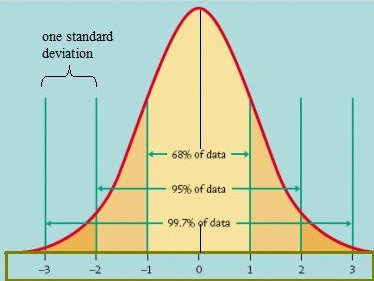
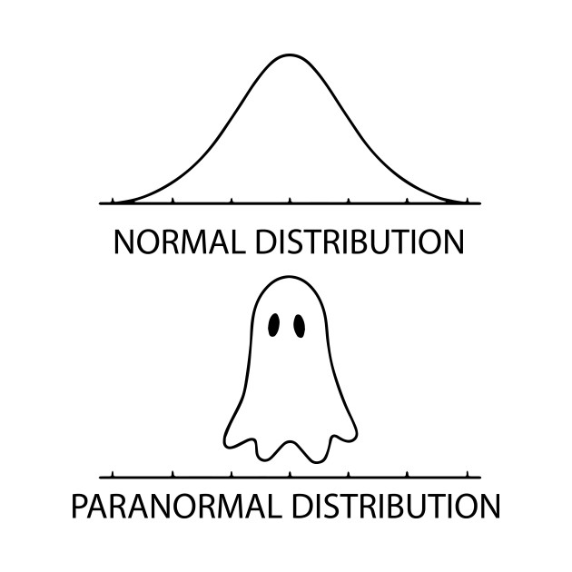

```{r setup, include=FALSE}
library(learnr)
library(mosaic)
knitr::opts_chunk$set(echo = FALSE)
```


## Characteristics of the Normal Distribution

> We run into the Normal distribution a lot in the real world and in statistics. What are some of the things that define a Normal distribution?

{width=50%}

&nbsp;

```{r quiz1}
quiz(caption = "",
  question("What is the shape of a Normal distribution?",
           answer("Skewed"),
           answer("Symmetric", correct = TRUE),
           answer("Bimodal"),
           answer("Unimodal", correct = TRUE),
           random_answer_order = TRUE,
           allow_retry = TRUE
           ),
  
  question("What is the best numerical summary to use for the center of a Normal Distribution?",
           answer("Mean", correct = TRUE),
           answer("Median", message = "Median is a good way to locate the center on a Normal curve, but not what we typically use for symmetric data."),
           answer("Standard deviation"),
           answer("IQR"),
           random_answer_order = TRUE,
           allow_retry = TRUE
           ),
  
  question("What is the best numerical summary to use for the spread of a Normal Distribution?",
           answer("Standard deviation", correct = TRUE),
           answer("Mean"),
           answer("Median"),
           answer("IQR", message = "IQR could be used but is typically not as helpful to us."),
           random_answer_order = TRUE,
           allow_retry = TRUE
           )
)
```

## Empirical Rule

The **Empirical Rule**, or **68-95-99.7 Rule** applies to any Normal distribution. This rule lets us understand what are the *most common* values for observations from the population. It is useful to know what values occur most frequently and which ones are rare.

{width=50%}

&nbsp;

```{r quiz2}
quiz(
  caption = "Approximate the following using the Emirical Rule and Z ~ N(0, 1)",
  question("What percentage of observations will be between $Z = -1$ and $Z = 1$? In shorthand: $P(-1 < Z < 1) =$",
           answer("100%"),
           answer("99.7%"),
           answer("95%"),
           answer("68%", correct = TRUE),
           allow_retry = TRUE,
           random_answer_order = TRUE
           ),
  question("$P(Z > -2) =$",
           answer("95%", message = "Close, but think about the entire upper tail"),
           answer("50%"),
           answer("5%"),
           answer("97.5%", correct = TRUE),
           allow_retry = TRUE,
           random_answer_order = TRUE
           ),
  question("$P(-2 < Z < 1) =$",
           answer("81.5%", correct = TRUE),
           answer("68%"),
           answer("95%"),
           answer("78.5%"),
           random_answer_order = TRUE,
           allow_retry = TRUE
           ),
  question("$P(-z^* < Z < z^*) = 0.95$",
           answer("$z^* = 2$", correct = TRUE),
           answer("$z^* = 1$"),
           answer("$z^* = 3$"),
           answer("Impossible to know"),
           random_answer_order = TRUE,
           allow_retry = TRUE
           )
  
)
```


```{r quiz_3}
quiz(
  caption = "Approximate the following using the Emirical Rule and X ~ N(100, 10). Hint: Draw a picture of the curve.",
  question("$P(X > 80) =$",
           answer("97.5%", correct = TRUE),
           answer("95%"),
           answer("75%"),
           answer("2.5%"),
           random_answer_order = TRUE,
           allow_retry = TRUE
           ),
  question("$P(90 < X < 120) =$",
           answer("81.5%", correct = TRUE),
           answer("68%"),
           answer("95%"),
           answer("78.5%"),
           random_answer_order = TRUE,
           allow_retry = TRUE
           ),
  question("$P(a < X < b) = 0.95$",
           answer("$a = 80$ and $b = 120$", correct = TRUE),
           answer("$a = 90$ and $b = 110$"),
           answer("$a = 95$ and $b = 95$"),
           answer("$a = -2$ and $b = 2$"),
           random_answer_order = TRUE,
           allow_retry = TRUE
           )
)
```


## Beyond the Empirical 

### Old way - if you're interested...

In most cases, we would like to use a Normal Distribution with more than "whole" standard deviations. It is difficult to find the proportion below -1.5 or above 2.33 standard deviations using the Empirical Rule.

In the past, we used a standard Normal table. But with the technology we have now, this method has gone the way of the dodo.


### New way

Now we can use `R` to calculate and visualize area under the Normal curve. The function `xpnorm` in the `mosaic` package provides a nice way to calculate and visualize these areas. To use `xpnorm`, you need some basic argument inputs:


> `xpnorm(q, mean, sd, lower.tail)`

&nbsp;

| Argument | Purpose | Default |
| -------- | -------------------------- | --------------- |
| `q`      | the quantile (`q`) value(s) on the x-axis we would like to use as a vertical cutoff. In other words: the value(s) on the Normal curve we are interested in | No default, must specify in code |
| `mean` | the mean value for the Normal distribution we are interested in | `mean = 0` |
| `sd` | the standard deviation for the Normal distribution we are interested in | `sd = 1` |
| `lower.tail` | specify the direction to calculate the proportion (the purple tail) | `lower.tail = TRUE` |

On a Standard Normal Distribution ($Z \sim N(0,1)$), to find: $$P(Z < -1.5)=$$

```{r help, exercise=TRUE, exercise.eval = TRUE}
xpnorm(q = -1.5, mean = 0, sd = 1, lower.tail = TRUE)
```

We can see that $\approx 6.7\%$ of observations are more than 1.5 standard deviations below the mean on a Standard Normal curve.

### Your turn

Find the following probabilities from $Z \sim N(0,1)$:

$P(Z < 0.5)=$

```{r p1, exercise = TRUE}

```

$P(-1.5 < Z < 0.5)=$

```{r p2, exercise = TRUE}

```

```{r p2-hint, eval = FALSE}
xpnorm(q = c(___, ___), mean = ____, sd = ____, lower.tail = ______)
```


Find the following probabilities from $X \sim N(100, 10)$:

$P(X > 85) =$

```{r p3, exercise = TRUE}

```

$P(85 < X < 105)=$

```{r p4, exercise = TRUE}

```

> These are all examples of finding the probability when we have a known quantile (reference point). We can also reverse the process.

## Finding Quantiles/Percentiles

### The `xqnorm` function

Explore the help documentation for `?xqnorm` or use your intuition to answer the following questions. (Advice: help documentation looks sort of weird in these tutorials, so you may want to switch to regular RStudio when using `?xqnorm`)

For $Z \sim N(0,1)$, find the 85th percentile:

```{r q1, exercise = TRUE}

```

```{r q1-hint, eval = FALSE}
# In the previous examples we entered a quantile and 
# got a proportion for the lower tail.
# Now try entering a proportion to get a  
# quantile/percentile
xqnorm(p = ____, mean = ______, sd = _____, lower.tail = ______)
```

Find the cutoffs (quantiles) for the middle 90% ($P(-z^*<Z<z^*) = 0.90$) on a Standard Normal curve.

```{r q2, exercise = TRUE}

```

```{r q2-hint-1, eval = FALSE}
## Think about what two lower tail percentiles could
## be used to find the middle 90%
xqnorm(p = c(___, ___), mean = ____, sd = _____, lower.tail = _______)
```

```{r q2-hint-2}
xqnorm(p = c(0.05, 0.95), mean = 0, sd = 1, lower.tail = TRUE)
```


Find the quantile for the *upper* 10% of $X \sim N(100, 10)$:

```{r q3, exercise = TRUE}

```

```{r q3-hint}
## change the lower.tail argument
```

Find the cutoff values for the middle 90% of $X \sim N(100, 10)$:

```{r q4, exercise = TRUE}

```


## Recap

### Bringing it all together

So `xpnorm` gives us a proportion (`p`) under the Normal curve when we **already know** the quantile(s) (`q`).

And `xqnorm` gives us a quantile(s) (`q`) for a proportion (`p`) under the Normal curve we are **already interested in**.


Quantiles and area under the Normal curve allow us to answer questions about populations and samples. Recall that our simulated null distributions all looked very similar to the Normal curve. And remember that when we are calculating p-values to measure strength of sample evidence, we needed to know the proportion of simulated samples more extreme than our observed sample. This is a preview of what we use the normal distribution for...

### Hopefully the Normal distribution is a little less scary now.



