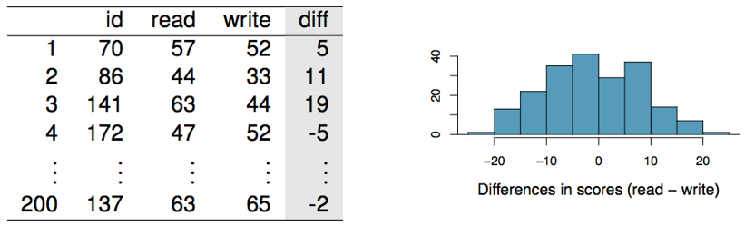
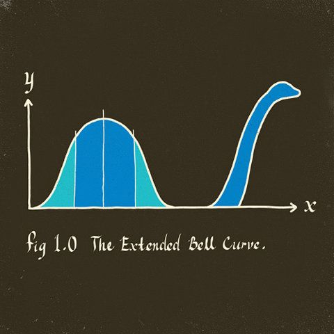

```{r setup, include=FALSE}
#library(learnr)
library(mosaic)
library(openintro)
knitr::opts_chunk$set(echo = FALSE)

data(friday)
Friday <- friday[1:10,]
```


## Adding a Second Variable

### []()

While it can certainly be interesting to examine one numeric variable, research questions typically involve multiple variables. We've explored this with two categorical variables (difference in two proportions, $\chi^2$ test of independence), now we want to think about ways to incorporate numeric variables.

In this section, we focus on one numeric variable and one categorical variable *under a very special circumstance* called **paired data** (or **matched pairs**). We will cover the general approach of one numeric and one categorical variable in 4.3 & 4.4.

### Violation of a Condition

In the last tutorial we talked about the conditions for performing inference of one population mean (one numeric variable). Those conditions are:

1. Independence

2. Nearly Normal/Sample Size

I spent a lot of time discussing that we use the $t-$distribution because it works well with small and large samples and is very close to the Normal distribution. But what happens if we add an additional categorical variable to our research question that makes the **independence condition violated?**

### []()

Consider the following situations:

+ A statistics instructor would like to know whether his online tutorials really help students understand the material better. He decides to give a short quiz to assess student knowledge on a topic before letting students access the tutorial. At the end of the tutorial he gives another short quiz to assess the same topic. Using these two scores, he will determine if his tutorial helped the students understand the material better.

+ Researchers want to determine if a new cancer treatment is more effective than the current best treatment available. They recruited 50 lung cancer patients, administered the new treatment for 6 months and measured the change in tumor size. As a comparison, the researchers matched 50 additional patients to the treatment group by age, gender, medical history, and original size of tumor. Those patients underwent the traditional treatment. At the end of the study, change in tumor size was compared for each pair of patients.

### []()

Let's look at it again and break it down into a <font color='red'>**Research Question**</font>, <font color='blue'>**Numeric Response Variable**</font>, and <font color='green'>**Categorical Explanatory Variable**</font>.

+ A statistics instructor would like to know whether his online tutorials really help students understand the material better. He decides to give a short quiz to assess student knowledge on a topic before letting students access the tutorial. At the end of the tutorial he gives another short quiz to assess the same topic. Using these two scores, he will determine if his tutorial helped the students understand the material better.

    + <font color='red'>**Research Question**</font>: Did the tutorial improve the material knowledge?
    
    + <font color='blue'>**Numeric Response Variable**</font>: Quiz score
    
    + <font color='green'>**Categorical Explanatory Variable**</font>: Test (Pre or Post tutorial)

+ Researchers want to determine if a new cancer treatment is more effective than the current best treatment available. They recruited 50 lung cancer patients, administered the new treatment for 6 months and measured the change in tumor size. As a comparison, the researchers matched 50 additional patients to the treatment group by age, gender, medical history, and original size of tumor. Those patients underwent the traditional treatment. At the end of the study, change in tumor size was compared for each pair of patients.


    + <font color='red'>**Research Question**</font>: Can the new treatment significantly reduce tumor size?
    
    + <font color='blue'>**Numeric Response Variable**</font>: Tumor size
    
    + <font color='green'>**Categorical Explanatory Variable**</font>: Treatment (New or Traditional)


### Paired samples

In each case, we can't really say that the measurements for quiz score or tumor size are independent from each other. In the first example, it's fair to say that the pre *and* post tutorial score for a student who had taken a stats class in high school or at a community college would tend to be higher than a student who is taking stats for the first time. For the second example, we can similarly say that the tumor size of patients who have an aggressive cancer will be larger than those with a milder form.

> What we are really interested in for both examples is **the difference in a pair of measurements**.

+ The difference in each student's pre and post tutorial quiz.

+ The difference in the tumor sizes after treatment for each pair of patients.

The condition of independence has been violated. The student has two quiz scores, so we can't say all observations are independent from one another. The patients were specifically chosen based on age, gender, medical history, and original tumor size, so their observations are not independent from one another. *This is OK when two sets of observations have this special correspondence.* We will deal with it by creating a new variable that just measures the **paired difference.**

## Paired Difference

### []()

When the data and research question are appropriately paired for observations (think pre/post tests, case/control subject matching, or any time an observation has two measurements) it is often more interesting to focus on the *difference* between the two measurements, rather than each measurement on the same/similar observation.

+ Post tutorial score - Pre tutorial score = Difference in scores

+ Tumor size for new treatment - tumor size for traditional treatment = Difference in tumor sizes


This "new variable" for difference, is still informative for our research questions. I know that a positive different in quiz scores means that student improved after the tutorial. I know that a negative difference in tumor sizes means the patient on the traditional treatment has a larger tumor. And I know in either case that a difference of 0, means there's no difference at all!

### []()

So we can focus on the difference for each pair and try to perform our inference on the true population mean difference, $\mu_{diff}$. 

Consider an example where 200 students each took a reading and writing test. Their scores are shown below.

{width=30%}


Are the reading and writing scores of each student independent of each other?^[b]

a) Yes

b) No

### []()

If we create a new variable called `diff` we can see who is better at reading and who's better at writing. (As an added bonus, if the two scores are both Normally distributed, then the differences in scores will also be Normally distributed.)

{width=90%}


<font color='red'>**This essentially turns our data into one numeric variable that measures difference**</font>. And as we saw in the last tutorial (Ch. 4.1), we know how to handle one numeric variable. The only difference is that now we have a reference value that we are very interested in (think back to when we estimated and tested for the difference in two proportions).

Think about the reading and writing scores, and the difference (`read - write`)
What would it mean for a student to have a negative difference?^[a]

a) The student has a higher writing score

b) The student has a higher reading score

c) The student had the same score for both

     
What would it mean for a student to have a positive difference?^[b]

a) The student has a higher writing score

b) The student has a higher reading score

c) The student had the same score for both,
     
What would it mean for a student to have a difference of zero?^[c]

a) The student has a higher writing score

b) The student has a higher reading score

c) The student had the same score for both

What would it mean for the POPULATION MEAN DIFFERENCE, $\\mu_{diff}$ to be zero?^[a]

a) All students performed equally well in both areas

b) All students performed better on average in reading

c) All students performed better on average in writing

What would it mean for the POPULATION MEAN DIFFERENCE, $\\mu_{diff}$ to be positive?^[b]

a) All students performed equally well in both areas

b) All students performed better on average in reading

c) All students performed better on average in writing

What would it mean for the POPULATION MEAN DIFFERENCE, $\\mu_{diff}$ to be negative?^[a]

a) All students performed equally well in both areas

b) All students performed better on average in reading

c) All students performed better on average in writing


## Confidence Intervals for Paired Data

### []()

Since we can treat our differences as a new variable, we can estimate the true population mean difference with a confidence interval just like we would for a single sample. We just need to find the mean difference for the sample, $\bar{x}_{diff}$, the standard deviation of the differences, $s_{diff}$, and know what the sample size is (how many pairs do we have), $n$.

+ <font color='red'>**Point Estimate**</font> = $\bar{x}_{diff}$

+ <font color='orange'>**Critical Value**</font> = $t^*_{df=n-1}$

+ <font color='blue'>**Standard Error**</font> = $SE_{\bar{x}_{diff}}=\frac{s_{diff}}{\sqrt{n}}$

> The confidence interval for estimating $\mu_{diff}$ is:

$$\bar{x}_{diff}\pm t^*_{df=n-1}\times \frac{s_{diff}}{\sqrt{n}}$$

### Conditions Check

We still want to check some conditions. The data should not be extremely skewed for small samples, just like we checked for a single mean. And we want to make sure the pairs are independent from each other. In our example, it wouldn't be good if one student's reading score affected another student's score (like cheating). We should be OK if we take random samples or conduct good experiments.

### Try it out

So if the average difference of our 200 students is -0.55 and the standard deviation of the differences is 8.9, can you conduct a 90% confidence interval to estimate the true mean difference between reading and writing for all students?

```{r sandbox1, exercise = TRUE}

```


Use the code box above for calculation and finding critical values.
What is the point estimate for the 90% confidence interval for $\\mu_{diff}$?^[a]

a) -0.55

b) 0

c) 8.9

d) 200

What is the critical value for the 90% confidence interval for $\\mu_{diff}$?^[c]


a) 1.96

b) 1.83

c) 1.65

d) I have no idea how to find this

What is the standard error for the 90% confidence interval for $\\mu_{diff}$?^[d]

a) 8.9

b) 0.04

c) 0.12

d) 0.63

What is the margin of error for the 90% confidence interval for $\\mu_{diff}$?^[b]

b) 2.28

a) 1.04

c) 1.26

d) -0.35

What is the 90% confidence interval for $\\mu_{diff}$?^[c]


a) [-2.59, 1.49]

b) [-1.78, 0.68]

c) [-1.59, 0.49]

d) [0.41, 2.65]

Using the 90% confidence interval for $\\mu_{diff}$, what can you say about the average score differences for all students?^[a]

a) We cannot say that there is a significant difference in the average scores for reading and writing.

b) The average writing score is significantly larger than the average reading score.

c) The average reading score is significantly larger than the average writing score.


### []()

> Just like the difference in two proportions, we want to know if `0` "falls in the interval". A difference that is potentially zero is meaningful, it implies there's a chance the two populations could have the same mean. But a difference that is either positive or negative, implies our sample is evidence one of the population means is significantly larger.

## Hypothesis Test for Paired Data

### []()

We can determine if one population is larger than the other by interpreting the confidence interval, but to get a better sense of how *strong* our sample evidence is, we need to run a hypothesis test.

We will almost *always* want to test if the population mean difference, $\mu_{diff}$, is equal to zero. So our *null value* for paired data is 0. (The only time you would not use 0, is if you were testing for a specific difference, "Did students perform at least 10 points better on average after the tutorials?")

### []()

> $H_0:\mu_{diff}=0$. There is no difference between the means of the two categorical groups.

> $H_a:\mu_{diff}\ne 0$ (or use $>$/$<$ for appropriate research questions). There is a difference between the means of the two categorical groups.

### []()

The rest of the test is the exact same as for a one sample mean. The test statistic is:

$$t=\frac{\bar{x}_{diff}-0}{SE_{\bar{x}_{diff}}}$$

where $SE_{\bar{x}_{diff}}=\frac{s_{diff}}{\sqrt{n}}$

### Our example

For the reading and writing data (reminder of the summaries in the table below). Test whether the mean score difference between reading and writing is non-zero.

| $n$  | $\bar{x}_{diff}$ | $s_{diff}$ |
| :--- | :--------------- | :--------- |
| 200  | -0.55            | 8.9        |

### Hypotheses

Write out your hypotheses for this test in symbols and words.

### Condition Check

Still good from when we checked it for the confidence interval.

### Calculate the test statistic

Use R

What is the test statistic value for this sample? ^[c]

a)-0.06

b) 0.87

c) -0.87

d) -12.36

Do you feel like this test statistic is unusual under the null hypothesis assumption?^[a]

a) No, it does not seem like an unusual sample or test statistic.

b) Yes, this sample and test statistic are unusual.


### Calculate and interpret the p-value

Use R

```{r pval-hint, echo = TRUE, eval = FALSE}
## fill in the test statistic and df
## don't forget to multiply by 2 since this is a two-tailed test!
2*xpt(q = _____, df = _______ )
```


If the test statistic is `-0.87`, find the p-value.^[d]

a) 0.193

b) 0.583

c) 0.00045

d) 0.385

How would you interpret the p-value?^[c]

a) It is not that small, weak evidence.

b) The p-value shows that our sample (or one more extreme) is really unlikely to occur if we assume there is no difference between average reading and writing scores for the students.

c) The p-value shows that our sample, (or one more extreme) is not unusual if we assume there is no difference between average reading and writing scores for the students.

d) The p-value doesn't tell us anything important about the sample or strength of the evidence.

How would you state a decision about this hypothesis test?^[a]

a) There is not enough evidence to suggest a significant difference between the average reading and writing scores for all similar students. We 'Fail to reject $H_0$'

b) There is strong evidence to suggest a significant difference between the average reading and writing scores for all similar students, we 'Reject $H_0$'

c) There is marginal evidence to suggest a significant difference between the average reading and writing scores for all similar students, we can't really make a decision about $H_0$

d) The sample evidence shows there is no difference between average reading and writing scores for all similar students, we 'Accept $H_0$'

### []()

Hopefully this example was mostly a review of the 4.1 single sample material. If you had a hard time calculating or interpreting, go back to the previous tutorial and worksheet to review.

## Example with R Code - Friday the 13th

{width=50%}

### Using raw data

Between 1990 - 1992 researchers in the [UK collected data on traffic flow, accidents, and hospital admissions](https://www.ncbi.nlm.nih.gov/pubmed/8292946) on Friday 13th and the previous Friday, Friday 6th. The data are below and called `Friday` (make note of the variable names for later). Below is an excerpt of the data. We can assume that traffic flow on given day at locations `7 to 8` and `9 to 10` are independent.

```{r fri, exercise = TRUE}
Friday
```

### []()

We want to investigate if people's behavior is different on Friday 13th compared to Friday 6th. Each case in the data set represents traffic flow recorded at the same location in the same month of the same year: one count from Friday 6th and the other Friday 13th. That means the cases are not independent, there are two measurements at each location for a given month and year.


So one approach is to compare the traffic flow on these two days as paired data.

What are the null and alternative hypotheses in words and symbols?^[b,c]


a) $H_0:\\mu_{diff}\\ne0;$ Average traffic flow on Friday 6th and 13th are different.

b) $H_0:\\mu_{diff}=0;$ Average traffic flow on Friday 6th and 13th are equal.

c) $H_a:\\mu_{diff}\\ne0;$ Average traffic flow on Friday 6th and 13th are different.

d) $H_a:\\mu_{diff}=0;$ Average traffic flow on Friday 6th and 13th are equal.

### []()

+ <font color='red'>**Research Question**</font>: Is the traffic flow different on the 6th and 13th?
    
+ <font color='blue'>**Numeric Response Variable**</font>: Traffic flow
    
+ <font color='green'>**Categorical Explanatory Variable**</font>: Day (6th or 13th)

### Check conditions

+ **Independence**: Besides being paired data, we are told the rest of the cases are independent.

+ **Nearly Normal/Sample Size**: We have a small sample here, only $n=10$. So we need to make sure there isn't an extreme skew with our data. Check for yourself, create a histogram below for the variable `diff` in the dataset `Friday`.

Use R

Is the Nearly Normal condition satisfied?^[d]

a) Yes, the sample data are extremely skewed.

b) No, the sample data are extremely skewed.

c) No, the sample data are not extremely skewed.

d) Yes, the sample data are not extremely skewed.


### Use R for Confidence Interval and Hypothesis Test

Since our conditions check out, all we need to do now is run a t-test and confidence interval to estimate the true population mean difference in traffic flow for Friday 6th and 13th, $\mu_{diff}$.

Run this the same way you would for a single sample mean.

Use R

+ What is your confidence interval for $\mu_{diff}$?

+ What is the test statistic for the sample?

+ What is the p-value for the hypothesis test?

+ What is your conclusion and interpretation in the context of the problem?


### []()

You can also run the test without even using the `diff` variable. All we need are the original pairs of measurements for the `sixth` and `thirteenth`. We still use the `t.test()` function, but now we want to specify that the data are `paired`.

> `t.test(x = *first variable*, y = *second variable*, paired = TRUE, mu = 0, alternative = "two.sided)`

Try it out in R.


> Are you able to get the same confidence interval, test statistic, and p-value?

### Check it by hand

If you want some more practice using the formulas, find the summary stats for `diff` and see if you can get the same values as the `t.test()` function.


### Answers

```{r, echo = TRUE}
## checking the normality condition
histogram(Friday$diff)

## using the diff variable
t.test(Friday$diff, mu = 0, alternative = "two.sided", conf.level = 0.95)

## using the original variables
t.test(x = Friday$sixth, y = Friday$thirteenth, paired = TRUE, mu = 0, alternative = "two.sided", conf.level = 0.95)
```

+ `95% CI: [994.5, 2677.1]`

+ `test stat = 4.94`

+ `p-value = 0.0008`

We are 95% confident that the true average difference in traffic flow in the UK for Friday 6th and 13th is between 995 and 2677 (I'm not sure what the units of measurement are on this!). The sample we took seems to be unusual if we assume that traffic behaves the same on each day. In fact, it is strong evidence (p-value = 0.0008) that there actually is a significant difference in the average traffic flow between these two days. We can see from our confidence interval that there seems to be more traffic on the 6th. Maybe people are trying to avoid any *spooky* incidents on the roads.


### Using formulas

```{r, echo = TRUE}
favstats(Friday$diff)
```


```{r, echo = TRUE}
xbar <- 1835.8
s <- 1176.014
n <- 10

SE <- s/sqrt(n)

tstar <- xqt(c(0.025, 0.975), df = 9)

## 95% confidence interval
xbar + tstar*SE

## test statistic
test_stat <- xbar / SE
test_stat

## p-value - we have a positive test stat so make sure lower.tail = FALSE
2*xpt(test_stat, df = 9, lower = FALSE)
```

### []()

Next time we will talk about what we do when there is a numeric variable and a categorical variable but no pairing.


