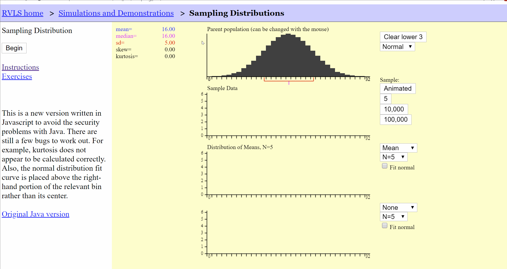
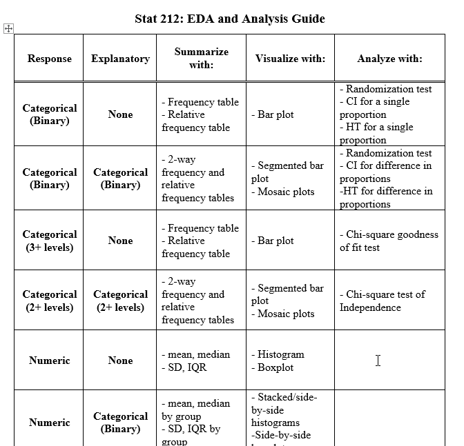

```{r setup, include=FALSE}
library(learnr)
library(mosaic)
library(openintro)
knitr::opts_chunk$set(echo = FALSE)

#temp_anomolies <- read.csv("https://raw.githubusercontent.com/joeroith/Data/master/temp_anomolies.csv")
data("bac")

```


## Review

Let's review a little.

### Big Picture

**The Statistical Process**

{width=100%}


### Populations and Samples

Our goal is to detect patterns and relationships in sample data that is strong enough to infer those relationships are present in the populations. This is our process of **inference**, going from the sample to the population. While it may be interesting to see a pattern in a sample, we want to know if that pattern exists in the *entire* population.

Recall that for numeric variables:

{width=90%}

### Central Limit Theorem

Understanding how samples behave is critical in our ability to infer things about the population. We saw, through lots of simulations and examples, that sample statistics (proportions, means, standard deviations, etc.) change each time we take a new sample. And that when we take enough samples, we can actually predict how those stats vary and what that **sampling distribution** looks like.

The **Central Limit Theorem** *guarantees* us that, under the right conditions, our sample statistics will be normally distributed and we can calculate how much variation we should expect.

More on this specifically for numeric variables later in the tutorial.

### Inference Procedures: Confidence Intervals

We take advantage of the CLT and our knowledge that random samples look similar to their populations ("the acorns fall close to the tree"). If we want to estimate the true value of a population parameter, like the proportion of ALL people who vote for a candidate or the mean weight of ALL babies born in a country, we can start by using a sample statistic as a first guess or **point estimate.**

Since we know that a single sample isn't likely to give us the *exact* population parameter value, we use the CLT. If we know that 95% of sample statistics fall within two **standard errors** of the true population parameter value, then let's create an interval for our estimate where the **margin of error** is two standard errors. As long as our sample is one of the 95% that are close enough, our interval should be able to capture the true value.


> Confidence interval to estimate a population parameter:

> <font color='red'>**Point Estimate**</font> $\pm$ <font color='purple'>**Margin of error**</font>

And if we want to change the level of confidence we have in our interval, we can adjust how many standard errors we want to make the margin of error. This **critical value** is based on the type of distribution we know the sample statistics follow.

> <font color='red'>**Point Estimate**</font> $\pm$ <font color='orange'>**Critical Value**</font> $\times$ <font color='blue'>**Standard Error**</font>


### Inference Procedures: Hypothesis Tests

When we want to formally identify a relationship in the population, we need to test for it. Starting with an assumption that there is no relationship, we determine if the relationship in a single sample is strong enough evidence to conclude the entire population must also have this relationship (otherwise it wouldn't have been so pronounced in the sample).

This relationship can be between two variables (Dolphins and Depression) or for a single variable (ESP guessing rate). And we've demonstrated several ways to evaluate our sample evidence through hypothesis tests:

+ Randomization tests through simulations

+ Tests based on theoretical distributions (like Normal or $\chi^2$ distributions)

### []()

In each case, the goal is to determine *how unusual is our observed sample under the null assumption of "no relationship/effect/difference"?* We take our sample and compute a **p-value** to quantify just that. 

> The **p-value** is the proportion of samples that will provide the same strength of evidence, or stronger, *against* the null hypothesis.

> The **p-value** is the probability that we would observe the same sample we saw, or one more extreme, when we assume there is no relationship/effect/difference in the population.

Read those two definitions for the p-value again, do you see that they are saying the same thing?

### []()

Now that we are hopefully on the same page and primed to continue, let's move past only thinking about **categorical** variables to start considering what to do when we have **numeric** variables.

## Means and the CLT

### Sampling distribution for means

We need to understand how sample means ($\bar{x}$) behave, just like we did for sample proportions ($\hat{p}$), before we can talk about inference of the population. What does the distribution of sample means look like for different populations?

Open this [CLT for means link](http://onlinestatbook.com/stat_sim/sampling_dist/) in a new window. Watch the short video below about how to use this applet.

<iframe src="https://stolaf.hosted.panopto.com/Panopto/Pages/Embed.aspx?id=f6256224-b1a2-4e3a-8733-ab93013c575c&autoplay=false&offerviewer=true&showtitle=true&showbrand=false&start=0&interactivity=all" width=720 height=405 style="border: 1px solid #464646;" allowfullscreen allow="autoplay"></iframe>

Now play around with the applet to answer the following questions (you can also see these questions as a worksheet in the Ch. 4 folder on the R server):

### []()

1. The initial population shown is normal with mean ($\mu=16$) and SD ($\sigma=5$).  If we take samples of size ($n=25$), what distribution do we expect sample means ($\bar{x}$) to follow according to the Central Limit Theorem?

```{r quiz1}
quiz(caption = "",
     question("I'd expect the distribution of sample means to be:",
       answer("Normal Distribution", correct = TRUE, message = "If the population is normal, it's easy to expect the distribution of sample means to be normal!"),
       answer("$\\chi^2$ Distribution"),
       answer("Binomial Distribution"),
       answer("Exponential Distribution"),
       answer("Impossible to tell"),
       allow_retry = TRUE,
       random_answer_order = TRUE
     ),
    question("Generate 10,000 sample means in the applet, is the distribution what you expected in the previous question?",
      answer("Yes", correct = TRUE, message = "It should be a nice, neat, Normal distribution"),
      answer("No", message = "Did you get a Normal distribution? Make sure sample size is set to n = 25."),
      allow_retry = TRUE
    )
)
```


2. Change the distribution to `Uniform`. How big does $n$ have to be before sample means follow a Normal distribution? Try out different sample sizes (`N=`) and generate 10,000 samples to see when the distribution becomes Normal. *Hint: Click the* `Fit normal` *box under the sample size drop-down menu.*

```{r quiz2}
quiz(caption = "",
     question("How big does $n$ have to be for the means to be Normal?",
              answer("At least $n=2$", message = "The distribution is more of a pyramid than a Normal distribution, but it is already pretty close."),
              answer("At least $n=5$", correct = TRUE, message = "It doesn't take a very large sample for the CLT to produce means that follow a Normal distribution."),
              answer("At least $n=10$", message = "It is Normal at this sample size, but is it also Normal for smaller sizes?"),
              answer("At least $n=16$", message = "It is Normal at this sample size, but is it also Normal for smaller sizes?"),
              answer("At least $n=20$", message = "It is Normal at this sample size, but is it also Normal for smaller sizes?"),
              answer("At least $n=25$", message = "It is Normal at this sample size, but is it also Normal for smaller sizes?"),
              allow_retry = TRUE
     )
  
)
```


3. Change the distribution to `Skewed`. How big does $n$ have to be before sample means follow a Normal distribution? Generate 10,000 samples for different sample sizes.

```{r quiz3}
quiz(caption = "",
     question("How big does $n$ have to be for the means to be Normal?",
              answer("At least $n=2$", message = "The distribution is still a little skewed"),
              answer("At least $n=5$", message = "The distribution is still a little skewed, but it's closer to Normal"),
              answer("At least $n=10$", correct = TRUE, message = "The distribution is already fairly Normal at $n=10$"),
              answer("At least $n=16$", message = "It is Normal at this sample size, but is it also Normal for smaller sizes?"),
              answer("At least $n=20$", message = "It is Normal at this sample size, but is it also Normal for smaller sizes?"),
              answer("At least $n=25$", message = "It is Normal at this sample size, but is it also Normal for smaller sizes?"),
              allow_retry = TRUE
     )
  
)
```

### []()

{width=90%}

### []()

4. Change the distribution to `Custom`.  Can you "break" the Central Limit Theorem by creating a weird enough custom distribution?

```{r quiz4}
quiz(caption = "",
     question("Can you create a custom distribution where the sample means do not form a Normal distribution when you generate 10,000 samples for $n=25$?",
              answer("Yes", message = "No, you didn't. I don't believe you!"),
              answer("No", correct = TRUE, message = "As hard as you try, you can't make a population where the means aren't normally distributed for a sample of 25. This is why the CLT is great! It works for ANY distribution, so we don't even really care where the sample came from!"),
              allow_retry = TRUE
     )
)
```

### []()

{width=90%}

### Conditions

There are a few conditions that need to be met for the CLT to work with on sample means.

1. **Independent observations:** Just to ensure that individual cases don't influence the results of each other. This is always an assumption we need in statistics.

2. **Nearly Normal/Sample Size:** In order to ensure the sampling distribution is Normal, it's better if the population distribution is close to normal (or at least not extremely skewed). But even if it is skewed, a large enough sample ($n\ge30$) will be enough to get the CLT to work (for extremely skewed data, we may need $n\ge60$, which is still not that much in most cases).

### []()

What we've shown is that the CLT works for sample means, as well as sample proportions. And just like for proportions, we know *exactly* what the distribution of sample means will be, if the sample is large enough.

Maybe you noticed in the applet, but every time you generated a sampling distribution, the mean of that distribution was **the same as the population mean!** So the center of the sampling distribution of a bunch of means is the same as the population parameter....this could be useful.

### []()

{width=80%}

### []()

```{r quiz5}
quiz(caption = "",
     question("How does the spread of the sampling distribution change as the sample size increases?",
              answer("The spread decreases", correct = TRUE, message = "Just like it did for proportions!"),
              answer("The spread increases", message = "Try to compare two different sample sizes at the same time and take a closer look."),
              answer("The spread stays the same", message = "Try to compare two different sample sizes at the same time and take a closer look."),
              allow_retry = TRUE,
              random_answer_order = TRUE
     )
  
)
```


### []()

> But can we calculate the spread from the sampling distribution?

Yes! Remember, this is what the standard error represents - the variation of statistics from sample to sample.

> The <font color='blue'>**Standard Error** for $\bar{x}$</font> is

<font color='blue'>**$$SE_{\bar{x}}=\frac{s}{\sqrt{n}}$$**</font>

Where $s$ is the sample standard deviation. There's just one problem, when we use $s$ we are adding another sample statistic that has its own variation (it changes from sample to sample too). That means there is more uncertainty in our Standard Error and the **Normal distribution is no longer accurate for small samples.**

We need a new distribution for when we have small samples.

## The $t-$Distribution

### To the rescue!

Remember, it's important to be able to accurately define the sampling distribution for $\bar{x}$ for Confidence Intervals (so we know where the middle XX% falls) and Hypothesis Tests (so we know when a sample is unusual). If using sample standard deviation $s$ in the calculation of standard error results in more uncertainty, we need to account for that.

Thankfully, there isn't *a lot* of extra uncertainty. In fact, the sampling distribution is still symmetric and unimodal, it just has "thicker" tails and is spread out a little more.

We use the $t-$distribution rather than the Normal for sample means because of this.

### []()

{width=90%}

&nbsp;

As you can see, the $t-$distribution is just a little more spread out. This means that we see more observations outside of 2 standard errors away from the mean.

### It is adjustable

What about the fact that the larger the sample size, the better our estimate for standard error? Meaning, there will be less uncertainty if we have a large sample.

The $t-$distribution has you covered, because it has one parameter called **degrees of freedom (df)**. The degrees of freedom changes the thickness of the tail. When using the $t-$distribution for a single sample mean, **$df=n-1$**.

{width=85%}

```{r quiz6}
quiz(caption = "",
     question("What happens to the $t-$ distribution as the degrees of freedom increase?",
              answer("It looks more like the Normal distribution", correct = TRUE),
              answer("It looks less like the Normal Distribution"),
              answer("It doesn't change at all"),
              allow_retry = TRUE,
              random_answer_order = TRUE
              )
)
```

### []()

This means that as the sample size increases, the $t-$distribution will be approximately the same as the Normal distribution anyways!

> When performing inference for means, **always use the $t-$distribution**. It is more accurate for small samples and works just as well as the Normal distribution for large samples.

### No Tables!

Don't worry about reading tables for the $t-$distribution. The textbook covers this, but we will just use R to calculate the critical values and p-values.

## Confidence Intervals for a Single Mean

### []()

Now, with an understanding of the sampling distribution for $\bar{x}$, we can perform our inference on population means ($\mu$). Remember that when we want to estimate a parameter, we use a **Confidence Interval**. And for estimating a single mean, the three parts of the confidence interval are:

+ <font color='red'>**Point Estimate**</font> = $\bar{x}$

+ <font color='orange'>**Critical Value**</font> = $t^*_{df=n-1}$

+ <font color='blue'>**Standard Error**</font> = $SE_{\bar{x}}=\frac{s}{\sqrt{n}}$

> The confidence interval for estimating $\mu$ is:

$$\bar{x}\pm t^*_{df=n-1}\times \frac{s}{\sqrt{n}}$$

### Finding the critical value in the $t-$distribution

Most of the pieces in the confidence interval can be obtained through regular summary statistics. But we need to be able to find the critical value based on the $t-$distribution. Luckily, this can be done in R just like we would do it for proportions (when we used $z^*$).

Remember that when we want a certain percentage of confidence, say 90%, we are looking for the $middle$ 90% in the sampling distribution. So in terms of our percentiles, finding the 5th and 95th would give us cutoffs for the middle 90%. Using `xqt()` in the `mosaic` package will do this for us. To use this function, we need to include the proportions we want in the lower tail, and the degrees of freedom for the $t-$distribution.

For example, if we wanted the critical value for a 90% confidence interval from a sample with $n=20$ (so $df=n-1=19$):

```{r cv_check, exercise = TRUE}
## Make sure to load the mosaic package when you use this function
## It's already loaded for you here
xqt(c(0.05, 0.95), df = 19)
```

```{r cv_t_quiz}
quiz(caption = "Alter the code above to find the critical values in the following situations:",
     question("Find the critical value for a 95% CI from a sample with $n=15$.",
       answer("2.14", correct = TRUE),
       answer("1.96", message = "This is the critical value for a Normal distribution, we can't use the Normal distribution here."),
       answer("1.76", message = "Did you change the percentile cutoffs to `c(0.025, 0.975)`?"),
       answer("2", message = "Remember there is more uncertainty with the smaller sample so we need to go a little further than 2 SE away from the center to get 95%"),
       allow_retry = TRUE,
       random_answer_order = TRUE
     ),
     question("Find the critical value for a 95% CI from a sample with $n=10$.",
              answer("2.26", correct = TRUE, message = "The $t-$ distribution changes depending on the sample size, so the critical value changes too."),
              answer("1.83", message = "Did you change the percentile cutoffs to `c(0.025, 0.975)`?"),
              answer("2.14", message = "The $t-$ distribution changes depending on the sample size, so the critical value changes too. Change the degrees of freedom."),
              answer("1.96", message = "This is still for the Normal distribution, but not for small samples when working with means."),
              allow_retry = TRUE,
              random_answer_order = TRUE
              ),
     question("Find the critical value for a 95% CI from a sample with $n=400$.",
              answer("1.96", correct = TRUE, message = "When the sample is large, th $t-$ distribution and the Normal distribution are almost identical, so it should make sense the critical value is the same."),
              answer("1.65", message = "Did you change the percentile cutoffs to `c(0.025, 0.975)`?"),
              answer("2.14", message = "Change your degrees of freedom"),
              answer("1.83"),
              allow_retry = TRUE,
              random_answer_order = TRUE
     ),
     question("Find the critical value for a 99% CI from a sample with $n=6$.",
              answer("4.03", correct = TRUE, message = "We need to go pretty far away from the center with such a small sample size!"),
              answer("3.71", message = "Is your $df=n-1$?"),
              answer("2.02", message = "Did you change the percentile cutoffs to `c(0.005, 0.995)`?"),
              answer("2.57", message = "Did you change the percentile cutoffs to `c(0.005, 0.995)`?"),
              allow_retry = TRUE,
              random_answer_order = TRUE
     )
  
)

```

### A quick example

A new physical therapy technique is being studied to determine how long it takes to recover from knee ligament replacement surgery. A random sample of 79 patients who recently had the procedure done found that the average recovery time using the new physical therapy was 78.4 days, with a standard deviation of 8.2 days. Provide an estimate with 95% confidence for the average recovery time of all patients using the new physical therapy technique.

### []()

First, this is the information you should take away from reading the problem:

+ There is a single, numeric measurement variable, recovery time (in days)

+ The sample size is $n=79$ patients

+ The sample mean is $\bar{x}=78.4$ days

+ The sample standard deviation is $s=8.2$ days

+ We want to estimate the TRUE mean recovery time, $\mu$, with a 95% confidence interval

### Check conditions

1. **Independent observations:** Since the patients were selected randomly, it is probably safe to assume they won't have any influence on each others' recovery time.

2. **Nearly Normal/Sample size:** The biggest thing to check for here is when we have small samples ($n<30$) are the data extremely skewed? I didn't give you the raw data, but we know the sample is large enough to just use the $t-$distribution and not need to worry much. This is the beauty of the CLT and knowing how samples will behave will just a handful of observations!

### Calculate the pieces

+ <font color='red'>**Point Estimate**</font> = $\bar{x}=78.4$

+ <font color='orange'>**Critical Value**</font> = $t^*_{df=78}=1.99$

```{r, echo = TRUE}
xqt(c(0.025, 0.975), df = 78)
```


+ <font color='blue'>**Standard Error**</font> = $SE_{\bar{x}}=\frac{8.2}{\sqrt{79}}=0.92$

```{r, echo = TRUE}
8.2/sqrt(79)
```

### Put it all together

$$78.4\pm1.99\times0.92$$

### []()

$$78.4\pm1.83$$
(1.83 is the margin of error)

### []()

$$[76.57, 80.23]$$

### Interpret in context

We're 95% confident that the true mean recovery time from knee ligament replacement surgery with this new physical therapy technique is between 76.57 and 80.23 days. (It would be fine to say between 76 and 81 days, since we typically don't count fractional days)


## Hypothesis Tests for a Single Mean

### []()

Hypothesis testing is also very similar to what we have done in the past (for the theoretical approach). We need to follow the same steps as before:

1. State the null and alternative hypotheses in the context of the problem, and using symbols.

2. Collect/access the data and check any conditions that need to be met.

3. Calculate a test statistic and p-value to measure the strength of evidence against the null hypothesis.

4. Make a decision and state a conclusion in the context of the problem.


### Hypotheses

The hypotheses for testing a single mean will always involve a reference mean or *null value*. This could be a value based on previous research, last year's numbers, or just a guess for what the population mean might actually be.

Since we are testing for a population mean, we want to use $\mu$.

### Example continued

Suppose the researchers from our physical therapy study wanted to know if their technique has a significantly different mean recovery time than 85 days, which is the current mean recovery time for these surgeries. We can define the population mean as $\mu:$ the true mean recovery time for ALL knee ligament replacement patients who use the new technique.

> $H_0: \mu = 85$, the true mean recovery time for the new technique is 85 days, same as for the old techniques.

> $H_a: \mu \ne 85$, the true mean recovery time for the new technique is significantly different than the old techniques.

### Get data and check conditions

Ideally, in a real world setting, we would set up our hypotheses first and then collect the data (this is to avoid any sort of bias when thinking of the hypotheses). But often as a statistician, we get the data first and then need to test for patterns or relationships. Recall from the previous example:

| $n$ | $\bar{x}$ | $s$ | $SE_{\bar{x}}$ |
| :------ | :------ | :------ | :------ |
| 79 | 78.4 | 8.2 | 0.92 |


Once again, we just want to make sure that each observation is independent from the others. And for small samples, we want to avoid data that is extremely skewed.

These are the same conditions as for the confidence interval, so in our example we are still good.

### Calculate the test statistic

It's all about how unusual is our sample under the assumption that the null hypothesis is true. Whenever we want to know how unusual something is, we turn to the **test statistic**. In this case, we are using a $t-$distribution, so we want to know where does our sample land on the distribution in relation to the null (center). The test statistic is essentially a z-score:

$$\text{test statistic: }t=\frac{\text{point estimate}-\text{null value}}{\text{standard error}}$$

So, if the real mean recovery time for the new technique is the same as the old one, 85 days. Then our sample from 79 patients with a mean of 74.2 days has a test statistic of:

$$t=\frac{74.2-85}{0.92}=-11.74$$

### Calculate the p-value

The $t-$distribution isn't *quite* the same as a Normal distribution, but it's really close. So imagine getting a z-score of -11.74. Would that seem unusual? On a $t-$distribution it would also be very unlikely to get a sample that is almost **12 standard errors below the mean**.

The p-value will tell us exactly how unlikely our observed sample is under the null hypothesis. We just need to find the area "more extreme" than -11.74 on a $t-$distribution with $df=n-1=78$. The `xpt()` function will do just that.

```{r pval, exercise = TRUE}
xpt(-11.74, df = 78, lower.tail = TRUE)
```


### []()

If this was a one-tailed test, we would have our p-value right now. But since this is a two-tailed test, we need to consider "more extreme" on the other end, or greater than 11.74. Thankfully, because the distribution is symmetric, we can simply multiply the value above by 2.

In our example, a really, really, small number times 2 is still a really, really small number.

### Interpret the p-value in context

Our p-value is off the charts! -11.74 is so far away from the center of 0, it isn't even shown. And the probability of getting a mean of 74.2 days (or more extreme) in a sample of 79 patients if the true average is 85, would be 0 (0.000000000000000006% actually, basically impossible).

### Make decision and state conclusion in context

Using the p-value from above, we can see that it is extremely unlikely to observe our sample mean of 74.2 days if the true mean recovery time is the same as the old techniques, 85 days. So, based on our very small p-value, we've shown that our sample is **strong evidence against the null hypothesis**. We can reject the idea that the new technique is only as good as the old ones in favor of saying the new technique will lead to *significantly* faster recovery times on average.

### []()

Notice that we rejected the null hypothesis of an 85 day mean recovery time AND the 95% confidence interval, [76.57, 80.23], did not contain 85. This is not a coincidence. In our interval, we essentially claimed that 85 days was not a reasonable estimate for $\mu$ since it's not in the interval. The two-tailed hypothesis test gave us the same conclusion by quantifying how unusual our sample would be under that assumption of $\mu=85$ days.

## An Example with R code

### Data Context

Researchers at Ohio State University performed a study on how much students drink at parties and what blood alcohol content levels they have. They randomly sampled 16 students at parties over the course of several weeks. The researchers wanted to estimate the average BAC of students at campus parties as well as determine if it was significantly higher or lower than the legal limit in Ohio, which is 8%. The dataset `bac` is provided below.

```{r}
data(bac)
bac
```

### []()

So we want both a confidence interval to estimate the true mean BAC of students, and also to test whether that mean is greater than 8% (or 0.08). Let's set up the hypotheses for the test first.

```{r ex_quiz}
quiz(caption = "",
     question("What are the null and alternative hypotheses?",
              answer("$H_0: \\mu=0.08$ and $H_a: \\mu \\ne 0.08$", correct = TRUE),
              answer("$H_0: \\mu=0.08$ and $H_a: \\mu<0.08$"),
              answer("$H_0: p = 0.08$ and $H_a: p<0.08$"),
              answer("$H_0: \\mu > 0.08$ and $H_a: \\mu<0.08$"),
              answer("$H_0: \\mu=0.08$ and $H_a: \\mu > 0.08$"),
              allow_retry = TRUE,
              random_answer_order = TRUE
     )
  
)
```


### What about the conditions?

```{r, echo = FALSE}
histogram(bac$BAC, xlab = "Student BAC", ylab = "Frequency")
```


```{r cond_quiz}
quiz(caption = "",
     question("The condition of Independence is:",
              answer("Reasonably met", correct = TRUE, message = "Since the sample was taken randomly, we can assume the students are independent of one another"),
              answer("Not met", message = "Maybe if the students were all at the same party, but it's safe to assume since the sample was random the students are independent"),
              allow_retry = TRUE,
              random_answer_order = TRUE
     ),
     question("Using the histogram of `BAC` above, the condition of Nearly Normal/Sample size is:",
              answer("Reasonably met, even though the sample is small the data don't seem extremely skewed", correct = TRUE),
              answer("Not met, the sample is too small and the data are too skewed"),
              answer("Reasonable met, the sample is large enough for the CLT to kick in", message = "We'd like to see at least 30 for the CLT to work."),
              answer("No way to know with this information"),
              allow_retry = TRUE,
              random_answer_order = TRUE
       
     )
)
```


### Raw data

This tutorial so far has focused on how to calculate confidence intervals and perform hypothesis tests when we have a summary of sample data. What should we do if we have the raw data? As you may imagine, R has nice built-in functions to handle such situations. We can use the `t.test()` function to perform both hypothesis tests and to calculate confidence intervals.

*I ask you to do it both using the formulas (like the last examples) and in R for the homework.*

> `t.test(x, conf.level, mu, alternative)`

| Argument | Purpose | Default |
| :-------- | :-------------------------- | :--------------- |
| `x`      | the data in raw form (no summaries) | no default |
| `conf.level` | the confidence you would like for your interval as a proportion `[0.0 to 1.0]` | `conf.level = 0.95` |
| `mu` | the null value for hypothesis tests | `mu = 0` |
| `alternative` | the type of test you'd like to run `("two.sided", "less", or "greater")` | `alternative = "two.sided"` |


### []()

Let's do both the confidence interval (we can just use 95%) and the hypothesis test at once with `t.test`.

Note: I have to use the *variable* `BAC` with the *dataset* `bac` as: `bac$BAC` (hopefully that's not too confusing)

```{r ex_code, exercise = TRUE}
t.test(bac$BAC, conf.level = 0.95, mu = 0.08, alternative = "two.sided")
```

### Interpretation of the output

These are some of the things we get from the function:

+ Test statistic: `t = -0.566`

+ p-value: `p-value = 0.5795`

+ 95% Confidence Interval: `0.050  0.097`

+ Sample mean: `mean of x = 0.074`


### []()

So our test statistic looks to be very close to 0, meaning our sample probably isn't too unusual if we assume the average BAC is 0.08. And the p-value tells us that under that assumption, we would expect to get a sample mean from 16 students of 0.074 BAC or farther from 0.08 almost 58% of the time. That seems like we just sampled a typical group of student partiers if the mean really is 0.08. This is not enough evidence to reject the null hypothesis. We can't say that the students are significantly above or below the state legal limit in Ohio.

### []()

The confidence interval suggests that we are 95% confident the true mean BAC in students who party on campus is between 0.05 and 0.097. Since the legal limit, 0.08, falls within this interval it is a plausible value for the population mean BAC.

### Double check

Perform your own calculations using the formulas from earlier and the summary statistics below. You can use the R code box for basic calculations and to use `xqt()` for finding the critical value and `xpt()` to find the p-value.

```{r}
favstats(bac$BAC)
```


```{r check, exercise = TRUE}

```


### Answers

```{r, echo = TRUE}
xbar <- 0.0737

s <- 0.044

n <- 16

SE <- s / sqrt(n)

t_star <- xqt(c(0.025, 0.975), df = 15)

## 95% Confidence Interval
xbar + t_star * SE

## Test statistic
test_stat <- (xbar - 0.08) / SE
test_stat

## p-value (remember to multiply by 2 for the two sided test)
2*xpt(test_stat, df = 15)
```


## Updated EDA and Analysis Guide





### []()

&nbsp;


{width=90%}


