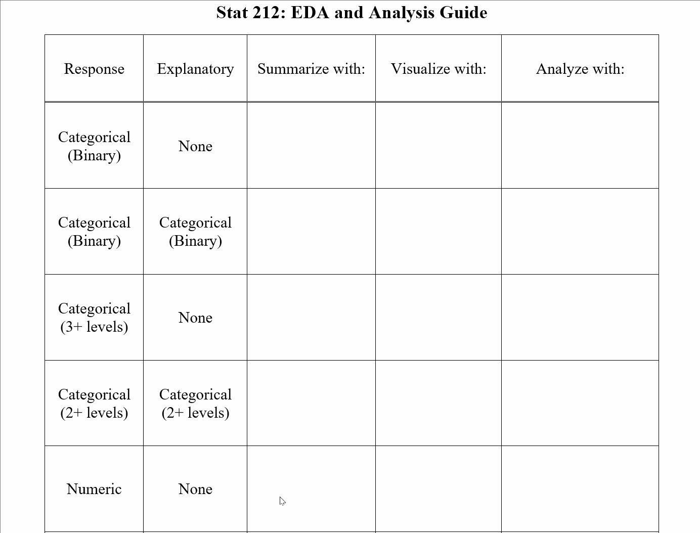
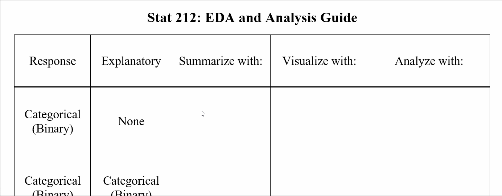
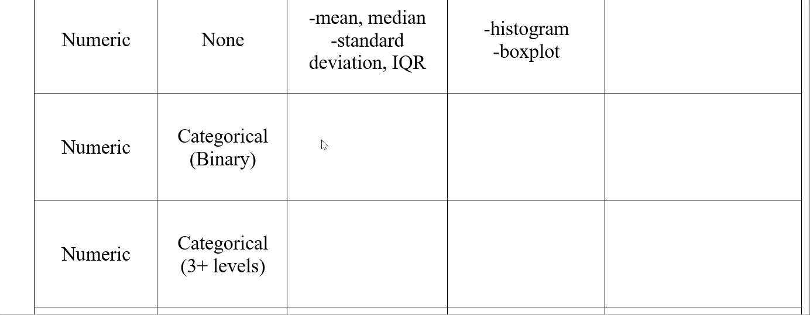
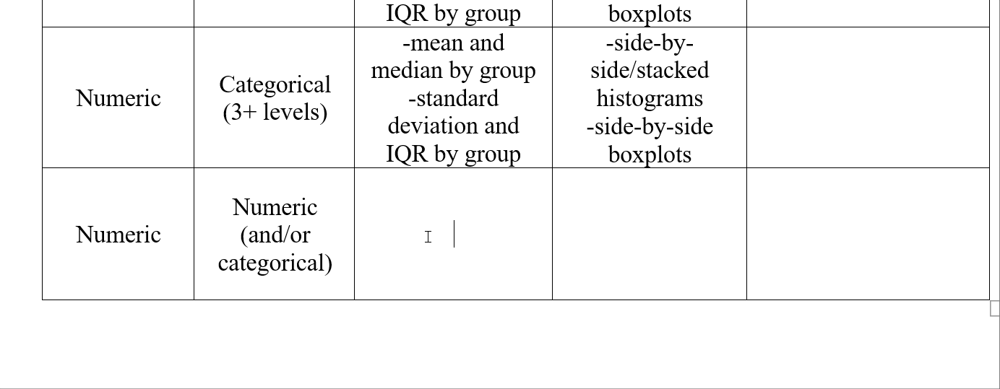
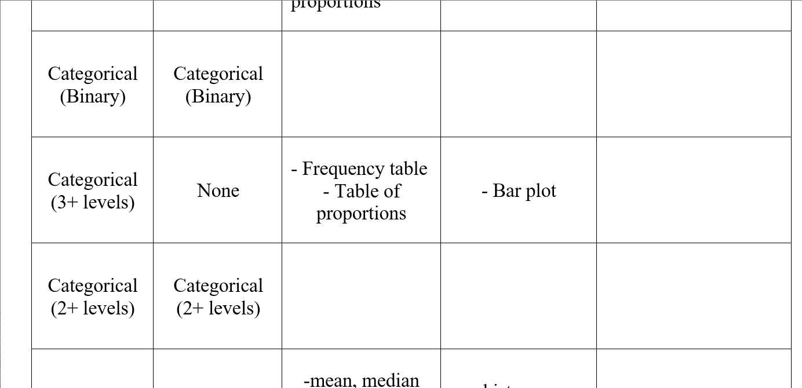

```{r setup, include=FALSE}
library(learnr)
library(openintro)  
library(mosaic)  
library(dplyr)  
library(ggplot2)
library(ggmosaic)
library(readr)

sleep <- read.csv("https://raw.githubusercontent.com/joeroith/Data/master/SleepStudy.csv")
sleep$Class = factor(sleep$ClassYear, 
  labels=c("Firstyear","Sophomore","Junior","Senior"))
mytable <- table(sleep$LarkOwl, sleep$Class)

knitr::opts_chunk$set(
  echo = FALSE,
  fig.align = "center",
  fig.width = 6, fig.height = 4)
```

## Sleep Study 

### Data Description

Circadian rhythms refer to biological processes that have a period of around 24 hours. These processes allow organisms to coordinate behavior with the day/night cycle.

Circadian rhythms vary across individuals and have been categorized into three chronotypes; morning type, evening type and intermediate type. These refer to the time of day when individuals are most active. A number of studies have indicated that chronotypes differ in aspects of personality, such as depression, creativity, and sociosexuality. 

Today we'll explore data collected by [Onyper et al](https://moodle-2019-20.stolaf.edu/pluginfile.php/117858/mod_resource/content/0/SleepStudy_OriginalArticle.pdf) on a number of variables associated with sleep. The data was collected from 253 students from a small, Northeastern liberal arts college. Students recorded their sleep habits for the previous week, took a survey about attitudes and habits, and performed cognitive tests. Information about GPA and demographic characteristics were also recorded.

### Statistical Process: Step 1

#### Import data to R

The line of code below is what allows us to take the file with the sleep data, named `SleepStudy.csv`, and bring it into our R session so we can explore it under the name `sleep`. All of the data we use will be stored in the `Data` folder under `Class`. 

> This line of code will be very useful as you import *different* data sets for future examples and homework.

```{r, eval = FALSE, echo = TRUE}
sleep <- read.csv("~/Stats 212 I21/Class/Data/SleepStudy.csv")
```


A full list of variables is provided below.

Variable | Description  | 
-------------------- | --------------------- | 
`r names(sleep)[1]`    |           Gender (1 = male, 0 = female)         |        
`r names(sleep)[2]`    |           Year in school         |        
`r names(sleep)[3]`    |           Early riser or night owl or neither        |        
`r names(sleep)[4]`    |           Number classes per week before 9:00 AM         |        
`r names(sleep)[5]`    |           Indicator for early classes         |        
`r names(sleep)[6]`    |           GPA         |        
`r names(sleep)[7]`    |           Number classes missed         |        
`r names(sleep)[8]`    |           Z score for cognitive skills test         |        
`r names(sleep)[9]`    |           Measure of sleep quality         |        
`r names(sleep)[10]`    |           Measure of degree of depression         |        
`r names(sleep)[11]`    |           Measure of amount of anxiety         |        
`r names(sleep)[12]`    |           Measure of amount of stress         |        
`r names(sleep)[13]`    |           Depression score         |        
`r names(sleep)[14]`    |           Anxiety score         |        
`r names(sleep)[15]`    |           Stress score         |        
`r names(sleep)[16]`    |           Combined score (depression + anxiety + stress)         |        
`r names(sleep)[17]`    |           Measure of degree of happiness         |        
`r names(sleep)[18]`    |           Self reported alcohol use         |        
`r names(sleep)[19]`    |           Number alcoholic drinks per week         |        
`r names(sleep)[20]`    |           Average weekday bed time (24 = midnight)         |        
`r names(sleep)[21]`    |           Average weekday rise time (8.0 = 8:00 AM)         |        
`r names(sleep)[22]`    |           Average hours of sleep on weekdays         |        
`r names(sleep)[23]`    |           Average weekend bed time (24 = midnight)         |        
`r names(sleep)[24]`    |           Average weekend rise time (8.0 = 8:00 AM)         |        
`r names(sleep)[25]`    |           Average hours of sleep on weekends         |        
`r names(sleep)[26]`    |           Average hours of sleep for all days         |        
`r names(sleep)[27]`    |           Indicator for all nighter (1 = yes, 0 = no)          |  

How many variables and cases are in the data set `sleep`? The `dim` function gives us the dimensions of a data table (# rows x # columns). The function `head` is also useful to look at the first few rows and check the data.

```{r zero, exercise = TRUE}
dim(sleep)
head(sleep)
```

### Statistical Process: Step 2

#### Identify the Research question(s)

For now we will focus on developing skills to summarize and visualize different types of data. But with such a rich dataset, it would be easy to come up with many different questions (some of which we will come back to and answer later in the course).

+ Do students average the recommended 8 hours of sleep?

+ Are the number of classes missed related to GPA?

+ How is drinking alcohol associated with stress, anxiety, and depression?

+ What other research questions can you think of using combinations of the variables above?

&nbsp;

We also want to provide the context to the data in this step. One crucial aspect of this is to clearly identify the population our sample is meant to represent. Another is to determine what type of study this data came from.

```{r prequiz}
quiz(caption = "",
     question("What is the best population to assume for this sample?",
              answer("All adults", message = "Careful, this study was only conducted on college students. Do you think that is a good representation of all adults?"),
              answer("All college-aged adults", message = "Possibly, but there are still college-aged adults that do not attend college. Those people are not represented by this sample."),
              answer("All college students", correct = TRUE, message = "This is the closest population that the sample represents. (Although you could argue not all college students are even represented by this one school)"),
              answer("The 253 students at this college", message = "This is the sample, remember that the population is a larger group we want the sample to represent."),
              allow_retry = TRUE,
              random_answer_order = TRUE
     ),
     question("What type of study is this?",
              answer("Observational study", correct = TRUE, message = "Right, this is actually a *retrospective study*, since the students were asked to think back and record their habits for the previous weeks and months."),
              answer("Designed experiment", message = "The key component for an experiment is having control over one or more of the variables and randomly assigning subjects. If the researchers controlled how much each student was able to sleep each night and recorded the effects, this would be an experiment."),
              allow_retry = TRUE,
              random_answer_order = TRUE
     )
)
```


## Exploratory Data Analysis (EDA) in `R`

### Statistical Process: Step 3

We'll use `R` to develop visualizations and summary statistics to help us explore the sleep data. 

> Remember, the goal of EDA is to *identify patterns* in the sample data. It's all about describing what we have already observed. We want to be careful not to assume these patterns exist for everyone in the population.

This tutorial will walk you through the analysis. The code is also available in the `SleepScript.Rmd` file. This contains the `R` code necessary to read in the Sleep Study data and generate summary statistics and visualizations. Visualizations demonstrated are:

+ histograms 

+ side-by-side histograms 

+ scatterplots 

+ grouped scatterplots

+ box plots 

+ side-by-side box plots

+ and a few fancier visualizations using the `ggplot2` package.


### Packages

One thing we use a lot in R is supplementary *packages* with nice built-in functions for common tasks we'd like to perform. We need to first load these packages before using the functions. The code below does this for the common packages we'll use.

```{r, eval=FALSE, echo = TRUE}
library(openintro)  
library(mosaic)  
library(dplyr)  
library(ggplot2)
library(ggmosaic)
library(readr)
```


These need to be loaded *for each* document you'd like to use the functions for.

## EDA for single numerical variable

### Summarizing and Visualizing `GPA`

> <font color='blue'>**Summarize with:**</font> Mean, median, standard deviation, interquartile range, and many more (but these are the main ones)

> <font color='green'>**Visualize with:**</font> Histograms and boxplots (also not the only options)

### []()

To do the EDA in R, we need to use **functions**. Each function we use needs to know:

1. What *variable* you want to use

1. What *data set* that variable comes from

### []()

There are two ways to provide this information. Using the `GPA` variable from the `sleep` data set. The first line of code shows the **formula template**. For many functions, we will write:

> `function_name(_________ ~ _________, data = _________)`

Where the response variable goes on the left of the `~` and the explanatory variable goes on the right. In this instance (the code below), with only one variable, it can go on the right with nothing to the left of the `~`.


The second line of code uses the same variable, `GPA`, and calculates some common descriptive statistics. In this case the function uses an older format:

> `function_name(_______$_______)`

Where the data set name is on the left of the `$` and the variable name is on the right.

We can use the `histogram` function to get a histogram and `favstats` to get a bunch of common numeric summaries.

```{r one, exercise = TRUE}
histogram( ~ GPA, data = sleep)
favstats(sleep$GPA)
```


Each function is a little different, but don't worry about memorizing which function uses which template. Just understand how it works when you see each type.

### Update the EDA and Analysis Guide

{width=80%}

## EDA for single categorical variable 

### Summarizing and Visualizing `LarkOwl`

> <font color='blue'>**Summarize with:**</font> Frequency and proportion tables

> <font color='green'>**Visualize with:**</font> Bar plots (one categorical variable is usually pretty boring and doesn't need to be visualized in most cases)

### []()

A simple **frequency table** that counts the number of responses for each <font color='purple'>*level*</font> of a categorical variable is a nice way to summarize categorical data. But finding the proportion of cases that belong to each <font color='purple'>*level*</font> is even more informative.

Only use the `table` functions for categorical variables. Notice the `mytable <-` line, often we need to save data in R to refer to it in later code or analysis. Here, you could use (almost) anything in place of `mytable`.

```{r two, exercise = TRUE}
table(sleep$LarkOwl)  # a table can be created directly from the data
mytable <- table(sleep$LarkOwl)  # a table of proportions needs to saved as a table first
prop.table(mytable)  # then converted to a table of proportions

barplot(mytable) # somewhat boring...
```

### **Never use Pie Charts!!!**

Here are some articles if you need some convincing:

+ [Pie Charts Are Bad](https://www.stevefenton.co.uk/2009/04/pie-charts-are-bad/)

+ [Death to Pie Charts!](https://www.storytellingwithdata.com/blog/2011/07/death-to-pie-charts)

But sometimes pie charts are appropriate...

### []()

{width=50%}

{width=50%}

{width=50%}

{width=50%}

### []()

{width=80%}

## EDA for one numerical and one categorical variable

### Summarizing and Visualizing `ClassesMissed` and `LarkOwl`

> <font color='blue'>**Summarize with:**</font> For each group, find the mean, median, standard deviation, interquartile range

> <font color='green'>**Visualize with:**</font> Side-by-side or stacked histograms and box plots

### []()

When there are one of each type of variables, we typically summarize the numerical one and separate it into the different levels of the categorical variable.

Be careful with the code here, notice that `histogram` and `favstats` split the different levels of `LarkOwl` with a `|`. While the box and whisker plot, `bwplot`, just separates them by the `~`. It can be tricky sometimes, but just try to follow these examples provided when handling other data sets.


```{r six, exercise = TRUE}
favstats(~ ClassesMissed | LarkOwl, data = sleep)
```

```{r three, exercise = TRUE}
histogram(~ ClassesMissed | LarkOwl, data = sleep)
histogram(~ ClassesMissed | LarkOwl, layout = c(1,3), data = sleep) # layout changes the number of rows and columns
   # stacked layout allows for better comparison
```


```{r four, exercise = TRUE}
bwplot(ClassesMissed ~ LarkOwl, data = sleep)
bwplot(LarkOwl ~ ClassesMissed, data = sleep)
   # LarkOwl on y-axis allows for easier comparisons
```

### []()

This is a slightly more advanced way to plot things. Not necessary, but a nicer way to display the relationship.

```{r five, exercise = TRUE}
ggplot(sleep, aes(x = ClassesMissed, fill = LarkOwl)) + geom_density(alpha=0.5)
   # above and beyond - if you want to get fancy with overlayed density plots
```

### []()

{width=80%}


## EDA for two numerical variables

### Summarizing and Visualizing `ClassesMissed` and `GPA`

> <font color='blue'>**Summarize with:**</font> Correlation coefficient (covered in more detail in Ch. 5)

> <font color='green'>**Visualize with:**</font> Scatterplot

### []()

**Scatterplots** can display two numerical variables. And one way to summarize them is with a line that describes the pattern (more on this in Ch. 5). **Correlation** is also a nice numerical summary for these types of variables.


```{r seven, exercise = TRUE}
gf_point(GPA ~ ClassesMissed, data = sleep)   # This plots the points

cor(sleep$GPA, sleep$ClassesMissed)
  # find correlation coefficient between two variables
```

### []()

Again, you can add certain features to visualize better. (This actually is two numerical variables and a third categorical variable)

```{r eight, exercise = TRUE}
ggplot(sleep, aes(y = GPA, ClassesMissed, color = LarkOwl)) + 
  geom_point() + 
  geom_smooth(method = lm)
  # above and beyond - if you want to include third variable
```

### []()

{width=80%}

## EDA for two categorical variables

### Summarizing and Visualizing `ClassYear` and `LarkOwl`

> <font color='blue'>**Summarize with:**</font> Two-way tables of frequencies and proportions

> <font color='green'>**Visualize with:**</font> Segmented bar plots and mosaic plots

### []()

**Two-way**, or **Contingency tables** can organize two categorical variables into how frequently they occur. The `labels` part of the code below changes the variable values from numbers, `1`, `2`, `3`, `4` to names like `Firstyear`...

```{r nine, exercise = TRUE}
sleep$Class = factor(sleep$ClassYear, 
  labels=c("Firstyear","Sophomore","Junior","Senior"))
  # create new variable Class that uses categories and not numbers

table(sleep$LarkOwl, sleep$Class)
mytable <- table(sleep$LarkOwl, sleep$Class) # save the table to use later
```

### []()

Usually the level counts don't mean much unless we know what the total count is. We can often get better information by looking at proportions. `prop.table` turns a table of counts into a table of proportions. We can then use **bar plots** and **mosaic plots** to visualize the data and any patterns that might be present.

```{r ten, exercise = TRUE}
mosaicplot(~ Class + LarkOwl, data = sleep, color = TRUE)
barplot(mytable) 
barplot(prop.table(mytable, margin = 2))
barplot(prop.table(mytable, margin = 2), legend = TRUE)
  # 3 options for plotting relationship - compare and contrast
```

### []()

The fancy-pants version...

```{r eleven, exercise = TRUE}
ggplot(data=sleep)+
    geom_mosaic(aes(x=product(Class), fill=LarkOwl))+
    labs(x="Class Year",y="Chronotype")

prop.table(mytable, 1)
  # proportions by rows
prop.table(mytable, 2)
  # proportions by columns

ggplot(data = sleep) + 
  geom_bar(mapping = aes(x = Class, fill = LarkOwl)) 
ggplot(data = sleep) + 
  geom_bar(mapping = aes(x = Class, fill = LarkOwl), position = "fill") 
  # above and beyond - a bit fancier than barplot
```

### []()

{width=80%}

## Extra

A lot of the material below we will get to in due time. But if you enjoyed the taste of R coding above, here are some extras for handling data. If what you did above was enough, you can skip this section for now.

### Data Wrangling Hints

The art of cleaning data and preparing it to work with is called *Data Wrangling*. Here is some code that can help with making your data easier to deal with. As well as more code to make plots more informative and presentable. This code is also available as an R script in the server. We will have more tutorials in the future for data wrangling.

```{r, eval = FALSE, echo = TRUE}
# Load in data
sleep <- read.csv("~/Stats 212b S20/Class/Data/SleepStudy.csv")
summary(sleep)

# Select only a few variables to keep in a dataset
sleep2 <- sleep %>% select(Gender, ClassYear, AverageSleep, AllNighter)


# Change AllNighter from 0/1 to No/Yes
sleep$AllNighter = factor(sleep$AllNighter, labels=c("No", "Yes"))
# check that code worked
table(sleep$AllNighter)


# Create new variable Class which is categorical class year
sleep$Class = factor(sleep$ClassYear, 
                     labels=c("Firstyear","Sophomore","Junior","Senior"))
# check that code worked
head(sleep %>% select(Class, ClassYear))  
```

### Filtering

Filtering out some of the cases is another vital ability for someone dealing with data. Often we only want to consider a subset of the entire group.

```{r, eval = FALSE, echo = TRUE}
######## Two ways to keep only students who are Larks or Owls
newdata <- sleep %>% filter(LarkOwl == "Lark" | LarkOwl == "Owl")
newdata <- sleep %>% filter(LarkOwl != "Neither")
```


### Changing Categorical Levels

Combining groups in a variable can help to simplify things.

```{r, eval = FALSE, echo = TRUE}
#### Recode depression and alcohol use into 2 levels each; two different methods 

# method 1: using recode()
sleep <- sleep %>%
  mutate(depress2 = recode(DepressionStatus, moderate = "high",
                           severe = "high", normal = "normal"),
         alcohol2 = recode(AlcoholUse, Abstain = "low", 
                           Light = "low", Moderate = "high",
                           Heavy = "high"))

# method 2: using if_else()
sleep <- sleep %>% 
            mutate( depress2b = if_else( DepressionStatus %in% c("moderate","severe"),"high","low"  ),
                    alcohol2b = if_else( AlcoholUse %in% c("Moderate","Heavy"),"high","low") 
                    )


# check that code worked
table(sleep$AlcoholUse)
table(sleep$alcohol2)
table(sleep$alcohol2b)

# Reorder the categories in AnxietyStatus so plots make more sense than simply 
#   alphabetical - normal then moderate then severe
histogram(~ PoorSleepQuality | AnxietyStatus, layout = c(1,3), data = sleep)
sleep$AnxietyStatus <- factor(sleep$AnxietyStatus, 
                              levels = c("normal", "moderate", "severe"))
histogram(~ PoorSleepQuality | AnxietyStatus, layout = c(1,3), data = sleep)

# Create a categorical variable by binning a numeric variable 
newdata <- sleep %>% 
  mutate(MissYN = cut(ClassesMissed, breaks=c(-Inf, 0, Inf), 
                       labels=c("No misses","Missed at least one")))
newdata <- sleep %>% 
  mutate(RiseGroups = cut(WeekdayRise, breaks=c(-Inf, 8, 9.01, Inf), 
                      labels=c("Before 8:00","8:00-9:00", "After 9:00")))
# check that code worked
head(newdata %>% select(WeekdayRise, RiseGroups))  
```


### Plotting Extras

```{r, eval = FALSE, echo = TRUE}
# Boxplot with third variable
sleep$Gender <- factor(sleep$Gender, labels = c("Female", "Male"))
bwplot(PoorSleepQuality ~ AnxietyStatus | Gender, data = sleep)

# coded scatterplot with points sized by fourth variable
ggplot(sleep, aes(y = GPA, ClassesMissed, color = LarkOwl)) + 
  geom_point(aes(size = NumEarlyClass)) + 
  geom_smooth(method = lm)

# label plots
bwplot(PoorSleepQuality ~ AnxietyStatus, data = sleep, xlab = "Anxiety Status", 
       main = "Figure 1")

plot(GPA ~ ClassesMissed, data = sleep, xlab = "Number of missed classes",
     ylab = "Grade point average", main = "Figure 2")
fitline <- lm(GPA ~ ClassesMissed, data = sleep)
abline(fitline)

ggplot(sleep, aes(y = GPA, ClassesMissed, color = LarkOwl)) + 
  geom_point() + geom_smooth(method = lm) + 
  labs(x = "Number of missed classes", y = "Grade point average", 
       title = "Figure 3", color = "Sleep preference")
```

## Play around

Feel free to open the `SleepScript.Rmd` file and play around with it on the server. Change variables and produce different plots!

