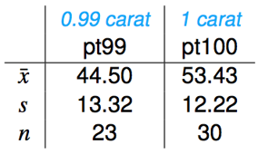

```{r setup, include=FALSE}
#library(learnr)
library(mosaic)
library(ggplot2)
#library(openintro)
knitr::opts_chunk$set(echo = FALSE)

test_stat <- 8.93 / 3.56

deprive <- read.csv("https://raw.githubusercontent.com/joeroith/Data/master/SleepDeprivation.csv")
```


## The Setup

### When to use inference for difference in two means

We are continuing to add more "tools to our statistical toolkit". We have a different analysis for different situations (some situations have multiple analysis techniques). Let's add one more for the following situation:

+ <font color='blue'>**Response Variable:**</font> Numeric

+ <font color='green'>**Explanatory Variable:**</font> Categorical (2 levels)

### []()

Remember that this is the general case for this situation, where the observations for the two categorical levels *do not correspond* with each other for the observations (like they did for paired differences).

In this case, we are interested in some variable we can measure numerically, and we want to compare that value between two groups. For example:

+ Average height between 3rd and 4th graders

+ Mean GRE scores between St. Olaf and Carlton students

+ Recovery time for treatment A compared to treatment B

Often when dealing with multiple groups, we use subscripts to identify which is which. We've done this for past examples in class and in the tutorials, but I just want to remind you. I'll use generic placeholders like $\mu_1$, and $n_2$ for formulas, but feel free to write your own when working on a specific problem, for example $\bar{x}_{Olaf}$ or $s_{3rd}$.

### []()

This is really where having a solid background in our previous analyses will help you. I *hope* you find that the concepts for estimating and testing the difference in two means **are identical** to the concepts for one/two proportions and one mean. The only things that will change are 1) the formulas and 2) the R code we use.

Ready?

### []()

{width=25%}

## Confidence Interval for $\mu_1-\mu_2$

### []()

When we would like to estimate the true difference in parameters, like between two population means, we want to create a confidence interval. This could be to actually try to quantify the difference between the groups, or just to determine if there is *any* difference between them. Creating a confidence interval means we need three pieces: <font color='red'>**Point Estimate**</font>, <font color='orange'>**Critical Value**</font>, and <font color='blue'>**Standard Error**</font>.

But first, don't forget to keep in mind we use these approaches under certain conditions.

### Check Conditions First

The conditions for using a confidence interval to estimate the difference in two means turns out to be the exact same conditions for dealing with one mean. We just need them to be true for both groups!

1. **Independent observations:** This is what distinguishes this approach from the paired difference in means approach. Here, every observation, group, and measurement should be reasonably unrelated and independent from the rest of the sample.

2. **Nearly Normal/Sample size:** Once again, we'll use the $t-$distribution to handle samples that are small and large. Remember that the $t-$distribution is adjustable based on the sample size to accommodate more uncertainty when we have less information. We also want to check the histograms for the samples if we have the raw data, just to make sure there isn't too much of a skew. But even with skewed data, the $t-$distribution works fine with samples over 30 (or over 60 for *really* skewed data). This condition is pretty loose, but we should still remember to check it.


### Confidence interval pieces

> <font color='red'>**Point Estimate**</font> $\pm$ <font color='orange'>**Critical Value**</font> $\times$ <font color='blue'>**Standard Error**</font>

+ <font color='red'>**Point Estimate**</font> = $\bar{x}_1-\bar{x}_2$

+ <font color='orange'>**Critical Value**</font> = $t^*_{df}$

    + When finding the $df$ for two means, use the smaller sample size - 1

+ <font color='blue'>**Standard Error**</font> = $SE_{\bar{x}_1-\bar{x}_2}=\sqrt{\frac{s_1^2}{n_1}+\frac{s_2^2}{n_2}}$

&nbsp;

The difference in sample means follows a $t-$distribution and the variation of values for the sample differences ($SE$) can be described by combining the individual sample mean spreads.

> Confidence interval formula for estimating $\mu_1-\mu_2$:

> $\bar{x}_1-\bar{x}_2 \pm t^*_{df}\times \sqrt{\frac{s_1^2}{n_1}+\frac{s_2^2}{n_2}}$

### Example

Let's jump right into an example. 

{width=25%}

Weights of diamonds are measured in carats. 

1 carat = 100 points, 0.99 carats = 99 points, etc.

The difference between the size of a 0.99 carat diamond and a 1 carat diamond is undetectable to the naked human eye, but does the price of a 1 carat diamond tend to be higher than the price of a 0.99 diamond?

We want to estimate (95% confidence) the actual difference in average price (in $100s) between 1 and 0.99 carat diamonds.

### EDA

First we check some visuals and numeric summaries to get a feel for the data.

{width=60%}

&nbsp;


{width=20%}

### Conditions?

+ **Independence**: Safe to assume here as long as we've selected the diamonds randomly (which we have).

+ **Nearly Normal/Sample Size**: We don't have huge samples, but the boxplots show the prices aren't heavily skewed for either sized diamond, so we're OK.

### []()

Now, identify the point estimate.

+ <font color='red'>**Point Estimate**</font> = $\bar{x}_1-\bar{x}_{0.99}=53.43-44.50=8.93$

### []()

Next, the critical value for the 95% confidence interval. Remember to use the `xqt()` function and for two means the `df` is the smaller sample size - 1.

```{r cv}
xqt(c(0.025, 0.975), df = 22)
```

+ <font color='orange'>**Critical Value**</font> = $t^*_{df=22}=2.07$


### []()

Then the standard error to quantify how much the difference in sample means should vary if we took lots and lots of samples.

```{r se}
stdev_1 <- 12.22
stdev_99 <- 13.32

n_1 <- 30
n_99 <- 23

## Don't forget to square the standard deviations when you calculate SE, and remember all of it is under the square root.
SE <- sqrt( (stdev_1^2/n_1) + (stdev_99^2/n_99) )
SE
```

+ <font color='blue'>**Standard Error**</font> = $SE_{\bar{x}_1-\bar{x}_2}=\sqrt{\frac{s_1^2}{n_1}+\frac{s_{0.99}^2}{n_{0.99}}}=\sqrt{\frac{12.22^2}{30}+\frac{13.32}{23}}=3.56$

### Margin of error

The <font color='purple'>margin of error</font> is everything on the right side of the $\pm$, the <font color='orange'>critical value</font> $\times$ <font color='blue'>standard error</font>. It's how far away from the initial guess we need to go to get our interval.

+ <font color='red'>**Point Estimate**</font> $\pm$ <font color='purple'>**Margin of error**</font>

```{r me}
2.07 * 3.56
```

+ <font color='purple'>**Margin of error**</font> = $t^*_{df=22}\times \sqrt{\frac{s_1^2}{n_1}+\frac{s_{0.99}^2}{n_{0.99}}}=2.07\times 3.56=7.37$


### The 95% confidence interval

Finally, add and subtract the <font color='purple'>margin of error</font> to the <font color='red'>point estimate</font>.

```{r ci}
8.93 + 7.37
8.93 - 7.37
```

+ <font color='red'>**Point Estimate**</font> $\pm$ <font color='purple'>**Margin of error**</font> = $8.98\pm7.37=[1.56\text{, }16.3]$

Zero is **not** included in this interval, so our sample is suggesting there is a significant difference in the mean price for all 1 and 0.99 carat diamonds.

### []() 

We are 95% confident that on average, 1 carat diamonds are somewhere between \$156 and \$1,630 more expensive than 0.99 carat diamonds.

### []()

Notice that I changed up the wording in the interpretation, without changing the actual meaning. (And I also converted our estimates into real dollars instead of hundreds of dollars).

## Order of the differences

### []()

You may have wondered for the difference in two means, the paired difference of means, or even for the difference in two proportions:

> Does the order I take my difference matter? ($\mu_1-\mu_2$ vs. $\mu_2-\mu_1$)


Let's answer that question while getting some more practice with the calculations. Use the diamond example to calculate the 95% confidence interval for $\mu_{0.99}-\mu_1$. Calculate your interval using the code box below and answer the questions about what changes and what doesn't change.

{width=20%}


Answer these questions about what changes and doesn't change when we switch the order of the difference for a 95% CI.
How, if at all, does the value of the point estimate change?^[b]

a) It does not change at all, the point estimate is still 8.93

b) The sign changes, it is now negative, -8.93

c) It becomes a completely different value, -7

d) It becomes a completely different value, -0.01

e) It becomes a completely different value, -1.1

How, if at all, does the critical value change?^[a]

a) It does not change at all, the critical value is still 2.07

b) The degrees of freedom change to $df=29$, and the critical value is now 2.04

c) The degrees of freedom change to $df=53$, and the critical value is now 2.00

d) We can just use 1.96 as the critical value

How, if at all, does the standard error change?^[a]

a) It does not change at all, the standard error is still 3.56

b) The sign changes, it is now negative, -3.56

c) It becomes a completely different value, 25.54

d) It becomes a completely different value, 12.77


How, if at all, does the margin of error change?^[a]

a) It does not change at all, the margin of error is still 7.37

b) The sign changes, it is now negative, -7.37

c) It becomes a completely different value, 5.63

d) It becomes a completely different value, 1.49

How, if at all, does the final confidence interval change?^[d]

a) It doesn't change at all, the 95% CI for the difference is still [1.56, 16.3]

b) One sign changes, the 95% CI for the difference is now [-1.56, 16.3]

c) One sign changes and the numbers are swapped, the 95% CI for the difference is now [-16.3, 1.56]

d) Both signs change and the numbers are swapped, the 95% CI for the difference is now [-16.3, -1.56]

e) It becomes completely different values, the 95% CI for the difference is now [-3.45, 10.87]

How, if at all, does the interpretation of the interval change?^[c]

a) We can now say that 0.99 carat diamond are more expensive on average than 1 carat diamonds

b) We can't say if either of the diamond weights are more expensive than the other

c) We still say that the 1 carat diamonds are more expensive on average than 0.99 carat diamonds

### []()

Hopefully it made sense to you that if we switch the order of the difference, the only thing that changes is the sign of our estimates. The magnitude of the difference and the interpretation (which group is larger/smaller) does not change. The data still tells us the same information, no matter the order

> This will be true for ANY inference we do for two sample differences, paired means or difference in proportion. So you can't go wrong in choosing an order for taking the differences. 

## Hypothesis Test for $\mu_1-\mu_2$


Besides **estimating** the actual difference in population means, we may want to **test** for a significant difference between population means (even though our interpretation for a CI already *suggests* whether there is a significant difference). Let's formally test the difference with our hypothesis test. Remember, a difference of zero implies there's actually no difference at all between the groups. You can also think about it as our numeric variable and categorical variable being independent, as in "The mean price doesn't depend on the diamond size".

### Hypotheses

> $H_0:\mu_1-\mu_2=0;$ There is no difference in the true mean for either population OR The mean value is independent of the groups we are considering.

> $H_a:\mu_1-\mu_2\ne 0 \text{ (or}>\text{, or}<\text{)};$ There is a significant difference in the true mean for these populations OR The mean value depends on which group we are considering.


### Conditions

Same as the conditions for finding a confidence interval:


1. **Independent observations:** This is what distinguishes this approach from the paired difference in means approach. Here, every observation, group, and measurement should be reasonable unrelated and independent form the rest in the sample.

2. **Nearly Normal/Sample size:** Once again, we'll use the $t-$distribution to handle samples that are small and large. Remember that the $t-$distribution is adjustable based on the sample size to accommodate more uncertainty when we have less information. We also want to check the histograms for the samples if we have the raw data, just to make sure there isn't too much of a skew. But even with skewed data, the $t-$distribution works fine with samples over 30 (or over 60 for *really* skewed data). This condition is pretty loose, but we should still remember to check it.


### Test statistic and p-value

I hope this is all starting to look familiar and repetitive...

$$\text{test statistic: }t=\frac{\text{point estimate}-\text{null value}}{\text{standard error}}$$

When testing the difference between two means:

$$t=\frac{\bar{x}_1-\bar{x}_2-0}{\sqrt{\frac{s_1^2}{n_1}+\frac{s_2^2}{n_2}}}$$


The **p-value** can be found using the test statistic value and the $t-$distribution with the $df=$ smaller $n-1$. In R, that's found using the `xpt()` function.

> Don't forget to pay attention to your sign in the alternative hypothesis. If you use a ">" you need to find the upper tail proportion on the $t-$distribution using `lower.tail = FALSE`. If you use a "<" you need to find the lower tail proportion using `lower.tail = TRUE`. And if you use a "$\ne$" you need to pay attention to the sign on the test statistic, using `lower.tail = TRUE` for negative test stats and `lower.tail = FALSE` for positive test stats. Then multiply by 2 for the opposite tail.

> Remember that p-values are a probability, so you should **never have a p-value greater than 1!**


### Example

Using our diamond example. If we want to test *specifically if 1 carat diamonds are more expensive on average than 0.99 carat diamonds*, we need a one-sided test. (I personally don't like to perform one-sided test since they don't allow for the possibility that the smaller diamonds could be more expensive, but in some cases it makes sense to only consider one side.)

> $H_0:\mu_1-\mu_{0.99}=0;$ There is no significant difference in the average price of 1 and 0.99 carat diamonds.

> $H_a:\mu_1-\mu_{0.99}>0;$ The average price of all 1 carat diamonds is significantly larger than the average price of all 0.99 carat diamonds (hence the difference is greater than zero).

### []()

Do our samples provide strong enough evidence that there is a true difference in the population mean prices? Let's calculate our test statistic and p-value to find out. Recall that we already calculated the <font color='red'>point estimate</font> and <font color='blue'>standard error</font> earlier for our confidence interval, and that's all we need to get the test statistic.

```{r tstat}
test_stat <- 8.93 / 3.56
test_stat
```


$$t=\frac{\bar{x}_1-\bar{x}_{0.99}-0}{\sqrt{\frac{s_1^2}{n_1}+\frac{s_{0.99}^2}{n_{0.99}}}}=\frac{8.93}{3.56}=2.51$$

The test statistic is 2.51, which would be borderline/marginally unusual on a Normal distribution. But we need to see how unusual it is on a $t-$distribution with $df=22$.

### []()

If we assumed that mean prices were the same for both diamond weights, what is the probability we would see our observed samples, or ones that would provide even stronger evidence that 1 carat diamonds are more expensive?

```{r pval}
xpt(test_stat, df = 22, lower.tail = FALSE)
```


Our p-value is 0.01, which is fairly strong evidence to conclude 1 carat diamonds are more expensive. The p-value here is one of those that is getting close to not being that unusual but is still pretty unlikely (1 in 100). I'd say we could reject the null hypothesis, but I wouldn't be apposed to collecting a bigger sample of diamonds to run the test again and see if we come to the same conclusion.

### []()

What would the p-value be if this had been a two-sided test, $H_a:\\mu_1-\\mu_{0.99}\\ne0$?^[d]

a) 0.01

b) 0.99

c) 1.98

d) 0.02

The 95% confidence interval was [1.56, 16.3] and the p-value was 0.01. If the estimates in the confidence interval were closer to 0, what do you think will happen to the corresponding p-value? Why?^[c]

a) The p-value will increase because we will have stronger evidence of a real difference in means

b) The p-value will decrease because we will have stronger evidence of a real difference in means

c) The p-value will increase because we will have weaker evidence of a real difference in means

d) The p-value will decrease because we will have weaker evidence of a real difference in means


## Example in R

### With raw data

Once again, now that we have the formulas and a better understanding of how confidence intervals and hypothesis tests work in theory, let's get some practice with real data and the coding in R.


### Lingering effects of sleep deprivation

Researchers have established that sleep deprivation has a harmful effect on visual learning (the subject does not consolidate information to improve on the task).  In a recent study, [Stickgold, James, and Hobson (2000)](https://www.nature.com/articles/nn1200_1237) investigated whether subjects could "make up" for sleep deprivation by getting a full night's sleep in subsequent nights.  This study involved randomly assigning 21 subjects (volunteers between the ages of 18 and 25) to one of two groups: one group was deprived of sleep on the night following training with a visual discrimination task, and the other group was permitted unrestricted sleep on that first night.  Both groups were allowed unrestricted sleep on the following two nights, and then were re-tested on the third day.  Subjects' performance on the test was recorded as the minimum time (in milliseconds) between stimuli appearing on a computer screen for which they could accurately report what they had seen on the screen.  Previous studies had shown that subjects deprived of sleep performed significantly worse the following day, but it was not clear how long these negative effects would last.  The data presented here are the **improvements in reaction time (in milliseconds), so a negative value indicates a decrease in performance.**  (Case study from Rossman and Chance, 2014).

The data are in the R server `Data` folder and listed below.

```{r, echo = TRUE}
deprive
```


### Context

Give some context to the data and identify important features before performing any analysis.

What type of study is this?^[c]

a) Prospective observational

b) Retrospective observational

c) Designed experiment

d) Survey

What is the research question here?^[b]

a) How fast can people recognize visual stimuli?

b) Does sleep after learning a task affect how well one is able to retain that knowledge several days later?

c) Does learning a new task affect how well someone sleeps afterwards?

d) Can you perform a new learned task in your sleep?

What are the response and explanatory variables and what type are they?^[b,g]

a) Response: Improvement in reaction time (categorical)

b) Response: Improvement in reaction time (numeric)

c) Response: Type of sleep after learning (categorical)

d) Response: Type of sleep after learning (numeric)

e) Explanatory: Improvement in reaction time (categorical)

f) Explanatory: Improvement in reaction time (numeric)

g) Explanatory: Type of sleep after learning (categorical)

h) Explanatory: Type of sleep after learning (numeric)


### EDA

Let's look at the data a little before we perform any inference. Use the code box below to create summaries of the numeric response variable grouped by the categorical explanatory variable. If you would like a reference for code to do this, you can look back at the `SleepScript.Rmd` file from Ch. 1.

Don't forget, you can use `names(dataset)` to get the variable names in R if you aren't sure what they are.


```{r}
favstats(~ improvement | treatment, data = deprive)
bwplot(improvement ~ treatment, data = deprive)

## Fancy histograms
ggplot(deprive, aes(x = improvement, fill = treatment)) + geom_density(alpha=0.5)
```


Questions to ask after the initial EDA:

+ What are the means, standard deviations, and sample sizes of each group?

+ What do the distributions look like (skewed, normal, other?)

+ Does it **look** like there's a difference in the sample means?


### Check conditions

Using the background information of the research and your EDA above, answer the following questions about the conditions for performing inference.
The independence condition is:^[a]

a) Reasonably met since the subjects were randomly assigned into groups and individual performances should not affect each other.

b) Reasonable met since this was an experiment

c) Not met because the individual performances will affect each other.

d) Not met because these were volunteers

The Nearly Normal/Sample size condition is:^[c]

a) Not met since we have a small sample

b) Not met since the data are skewed

c) Reasonable met because the data are not skewed

d) Reasonable met because we have a large sample


### Confidence interval and Hypothesis test

With the conditions checking out alright, let's proceed to estimating the true difference in improved reaction time between `deprived` and `unrestricted` sleep after learning a new task and testing for a significant difference at the same time. As we did with the one-sample t-test for mean, we can use the `t.test()` function in R. But in this case, we will use the `Response ~ Explanatory` variable format as the first argument. Recall the arguments from one-sample means:

> `t.test(x, conf.level, mu, alternative)`

| Argument | Purpose | Default |
| -------- | -------------------------- | --------------- |
| `x`      | the data in raw form (no summaries) | no default |
| `conf.level` | the confidence you would like for your interval as a proportion `[0.0 to 1.0]` | `conf.level = 0.95` |
| `mu` | the null value for hypothesis tests | `mu = 0` |
| `alternative` | the type of test you'd like to run `("two.sided", "less", or "greater")` | `alternative = "two.sided"` |


### []()


```{r ttest}
t.test(improvement ~ treatment, data = deprive, conf.level = 0.95, mu = 0, alternative = "two.sided")
```

### Interpretation of the output

These are some of the things we get from the function:

+ Test statistic: `t = -2.69`

+ p-value: `p-value = 0.015` (as you can see I used a two-sided test, so $H_a:\mu_{deprived}-\mu_{unrestricted}\ne0$)

+ 95% Confidence Interval: `-28.4  -3.4`

+ Sample means: `mean of depreived = 3.90`, `mean of unrestricted = 19.82`

+ Special note about degrees of freedom: Notice that `df = 17.6`. This is a more accurate calculation of degrees of freedom than simply using the smaller sample size - 1. But it is complex to derive and when we use the formulas we can use the simple value. It does mean that if you do these calculations by hand, your answers will be *slightly* off compared to R. That's OK for the homework and DARs.

### []()

The test statistic (-2.69) and p-value (0.015) give us the sense that our samples are somewhat unusual to have occurred under the null assumption that there is no difference in the improvement for the unrestricted sleep and deprived sleep groups. We have some strong evidence that there is a significant difference in the average improvement time to complete the task. 

The confidence interval let's us know that we can expect the average improvement to be anywhere from 3.4 to 28.4 milliseconds faster for the unrestricted sleep group. Since this interval does not contain zero, it also implies that the difference is significant in the populations. Furthermore, because this was a designed experiment, we can conclude that failing to get enough sleep after learning something new **can cause** a decrease in performance even if you get enough sleep the next two days (at least for 18 - 25 year olds, so take a nap after this tutorial!).

> Note: When using raw data in R, the order of the difference is chosen alphabetically. So we need to interpret the confidence interval as `deprived - unrestricted`. Keep that in mind for interpretations of output for other datasets.


### Double check

Feel free to practice your own calculations using the formulas from earlier and the summary statistics below. You can use the R code box for basic calculations and to use `xqt()` for finding the critical value and `xpt()` to find the p-value.


### Answers

```{r, echo = TRUE}
bwplot(improvement ~ treatment, data = deprive)
favstats(~ improvement | treatment, data = deprive)
```

```{r, echo = TRUE}
xbar_deprived <- 3.9
xbar_unrestricted <- 19.82

stdev_deprived <- 12.17
stdev_unrestricted <- 14.73

n_deprived <- 11
n_unrestricted <- 10

SE <- sqrt( (stdev_deprived^2/n_deprived) + (stdev_unrestricted^2/n_deprived) )
SE

## Critical value for 95% confidence interval using df = 9
tstar <- xqt(c(0.025, 0.975), df = 9)
tstar

## 95% CI
(xbar_deprived - xbar_unrestricted) + tstar*SE

## Test statistic
test_stat <- (xbar_deprived - xbar_unrestricted) / SE
test_stat

## two-sided p-value, using lower.tail = TRUE since our test stat is negative
pvalue <- 2*xpt(test_stat, df = 9, lower.tail = TRUE)
pvalue
```

Any differences in values are due to either 1) me rounding the values for mean and standard deviations, or 2) using the simplified df = 9.


