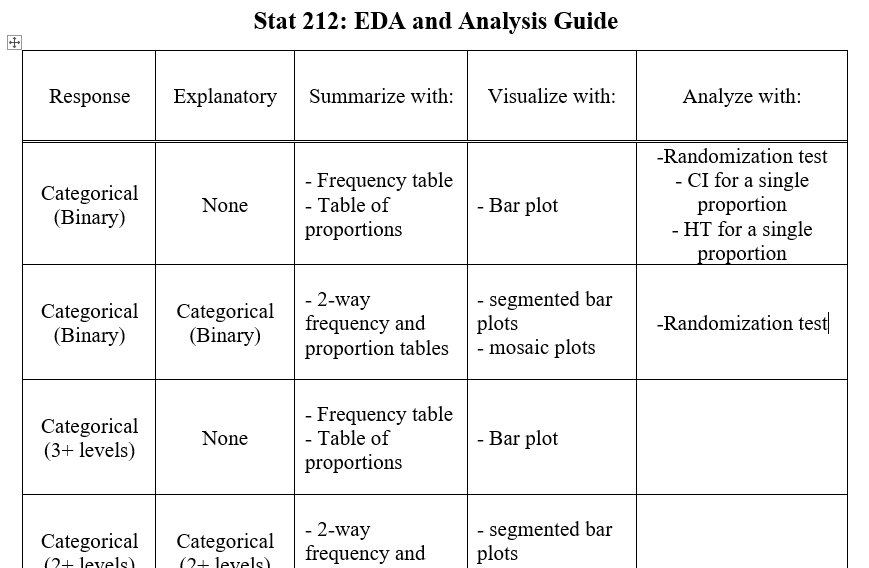

```{r setup, include=FALSE}
library(learnr)
library(mosaic)
library(infer)
library(ggpubr)
knitr::opts_chunk$set(echo = FALSE)

set.seed(7425)
X <- rnorm(100, 25, 4)
Y <- rnorm(100, 10, 2)

flu <- read.csv("https://raw.githubusercontent.com/joeroith/Data/master/textflu.csv")
flu <- flu[,-1]
```


## The Goal:

> To evaluate the association between two categorical (binary) variables.

> Is there a significant difference between two population proportions ($p_1-p_2$)?

### []()

This often leads to hypothesis formulations we have already seen with the randomization tests:

> $H_0: p_1 - p_2 =0$

> $H_a: p_1 - p_2 \ne 0$ (or $>$ or $<$)

### The Approach

Just like last time, we will use the Central Limit Theorem to understand the sampling distribution for the differences in sample proportions ($\hat{p}_1-\hat{p}_2$).

How can we know what the possible values will be for the difference in two statistics? Well, it turns out that if both of those statistics are Normally distributed, then their difference will be Normally distributed.

Consider `X` which is 100 values simulated from a Normal population $N(25, 4)$. And also `Y` which is 100 values simulated from a Normal population $N(10, 2)$. Below are their histograms.

```{r, echo = FALSE, message=FALSE, warning=FALSE}
A <- ggplot() +
  geom_histogram(bins = 20, fill = "firebrick1", alpha = 0.75, aes(x = X)) +
  labs(title = "Histogram of X") +
  xlim(c(-1, 40)) +
  theme(legend.position = "none",
        plot.title = element_text(size = 14, hjust = 0.5) #,
        #panel.grid = element_blank(),
        #axis.title = element_blank(),
        #axis.text = element_blank(),
        #axis.ticks = element_blank(),
        #panel.background = element_blank()
        )

B <- ggplot() +
  geom_histogram(bins = 20, fill = "royalblue", alpha = 0.75, aes(x = Y)) +
  labs(title = "Histogram of Y") +
  xlim(c(-1, 40)) +
  theme(legend.position = "none",
        plot.title = element_text(size = 14, hjust = 0.5) #,
       # panel.grid = element_blank(),
        #axis.title = element_blank(),
        #axis.text = element_blank(),
        #axis.ticks = element_blank(),
       # panel.background = element_blank()
       )

fig <- ggarrange(A, B, ncol = 1, nrow = 2)
fig
```


### []()

If we take the difference of `X - Y`, we know that the differences will form a Normal distribution as well.

```{r, echo = FALSE, message=FALSE, warning=FALSE}
ggplot() +
  geom_histogram(bins = 20, fill = "darkorchid3", alpha = 0.75, aes(x = X - Y)) +
  labs(title = "Histogram of X - Y") +
  xlim(c(-1, 40)) +
  theme(legend.position = "none",
        plot.title = element_text(size = 14, hjust = 0.5) #,
       # panel.grid = element_blank(),
        #axis.title = element_blank(),
        #axis.text = element_blank(),
        #axis.ticks = element_blank(),
       # panel.background = element_blank()
       )
```


### []()

Not only do we know the shape, but we also know what to expect for the center. The center of `X - Y` will be the difference in the individual centers.

```{r, echo = TRUE}
mean(X)
mean(Y)
```

```{r check1}
quiz(caption = "",
  question(
    "Using the information about the mean of $X$ and $Y$ above, what value do you expect for the mean of $X-Y$?",
    answer("15.23", correct = TRUE),
    answer("25.34"),
    answer("10.12"),
    answer("Impossible to know"),
    allow_retry = TRUE,
    random_answer_order = TRUE
  )
)
```


### []()

Even more amazing is the fact that we can understand the spread of `X - Y` just by knowing the individual standard deviations. But in the case of spread, since we are incorporating a second population, we *increase* the amount of variation we observe (even though we are taking a difference). Notice in the histograms above that the purple plot seems to be more spread out than both the blue and red ones. 

### Always Check the Conditions

This only works if the Central Limit Theorem applies for each sample. So we need to check:

+ **Sample size**
    
    - are there at least 10 successes and 10 failures in *each* group?
    
+ **Independence**

    - is it reasonable to assume each participant/case is independent of the others?
    
    - is the sample less than 10% of the total population (when the sample is too large it's harder to expect everyone to be independent from each other.)

## For Samples (Extra topic) 

### Extra topic on the theory behind the sampling distribution

The <font color='blue'>**point estimate**</font> for the difference in two population proportions ($p_1-p_2$) is the difference in sample proportions.

> Point estimate: $\hat{p_1}-\hat{p_2}$

The <font color='red'>**standard error**</font> for the difference in two population proportions is a combination of the individual spreads:

> For **confidence intervals**: $SE_{p_1-p_2}=\sqrt{\frac{\hat{p}_1(1-\hat{p}_1)}{n_1}+\frac{\hat{p}_2(1-\hat{p}_2)}{n_2}}$

When we are thinking about hypothesis tests, we need to assume that the two groups we are comparing have the same proportion (like assuming they are from the same population). So we combine our two samples into one *pooled proportion*.

$$\hat{p}_{pooled}=\frac{X_1 + X_2}{n_1+n_2}$$
where $X_1$ and $X_2$ are the number of successes in each sample respectively.

> For **hypothesis tests**: $SE_{\hat{p}_{pooled}}=\sqrt{\frac{\hat{p}_{pooled}(1-\hat{p}_{pooled})}{n_1}+\frac{\hat{p}_{pooled}(1-\hat{p}_{pooled})}{n_2}}$


## Example - Melting Ice Cap

The [General Social Survey](https://gss.norc.org/) asked the following question to U.S. adults in 2010:

*Scientists predict that global warming may have big effects on the polar regions within the next 100 years. One of the possible effects is that the northern ice cap may completely melt. Would this bother you a great deal, some, a little, or not at all if it actually happened?*

a) A great deal
    
b) Some
    
c) A little
    
d) Not at all
    
&nbsp;    

The same question was also posed to 105 Duke University students in an introductory stats class.


### []()

### Results (Get the data)

Below is the data from the two groups that answered this question:


| []() | **U.S. adults** | **Duke** |
| -------- | :-------- | :------- |
| A great deal | 454 | 69 |
| Some | 124 | 30 |
| A little | 52 | 4 |
| Not at all | 50 | 2 |
| **Total** | 680 | 105 |


### Give data context

If we are concerned with the proportion of people who are concerned a great deal by the melting ice caps, think about these questions:

+ What is the **Research Question**?

+ What is the **response variable**?

+ What is the **explanatory variable** (if there is one)?

+ How can I represent this question as a relationship between these two variables?


```{r gss-quiz}
quiz(caption = "",
  question(
    "What do you think the research question is for this data? (Hint: There are two correct answers)",
    answer("Is there a significant difference in the proportion of Duke students and U.S. adults who are concerned a great deal by the melting ice cap?", correct = TRUE),
    answer("Are level of concern and type of respondent related or independent?", correct = TRUE),
    answer("How many people are concerned a great deal about the melting ice cap?", message = "We don't care about the number, but the proportion, and we want to compare two groups."),
    answer("Is there a significant difference in the proportion of those who care a great deal that are Duke students as opposed to U.S. adults?", message = "Be careful, think about what the original question was asking. The main interest is level of concern, not the type of respondent."),
    allow_retry = TRUE,
    random_answer_order = TRUE
  ),
  question(
    "What is the response variable, and what type of variable is it?",
    answer("Level of concern about melting ice cap", correct = TRUE),
    answer("Type of respondent"),
    answer("Numeric"),
    answer("Categorical", correct = TRUE),
    allow_retry = TRUE,
    random_answer_order = TRUE
  ),
  question(
    "What is the explanatory variable, and what type of variable is it?",
    answer("Level of concern about melting ice cap"),
    answer("Type of respondent", correct = TRUE),
    answer("Numeric"),
    answer("Categorical", correct = TRUE),
    allow_retry = TRUE,
    random_answer_order = TRUE
  )
)
```


### []()

> How could you represent this question as a relationship between these two variables?


+ **Parameter of interest**: Difference between the proportions of *all* Duke students and *all* U.S. adults who would be bothered a great deal by the northern ice cap completely melting.

$$p_{Duke}-p_{US}$$


Our hypotheses:

$H_0:$ There is no difference in the proportion of all Duke students and all U.S. adults who are greatly concerned in the melting ice cap (they are *independent*).

$$p_{Duke}-p_{US}=0$$

$H_a:$ There is a significant difference in the proportion of all Duke students and all U.S. adults who are greatly concerned in the melting ice cap (they are *dependent*).

$$p_{Duke}-p_{US}\ne0$$


### The sample evidence

First let's tidy up the table from above. We want the number of people who are greatly concerned and who aren't. (Sometimes it's useful to force variables into a binary form).


| []() | **U.S. adults** | **Duke** |
| -------- | :-------- | :------- |
| A great deal | 454 | 69 |
| Not a great deal | 226 | 36 |
| **Total** | 680 | 105 |

Remember that the sample will be our starting point to evaluate the null hypothesis claim that the proportions are equal.

```{r check, exercise = TRUE}

```


```{r gss-quiz2}
quiz( caption = "Use the table and R chunk above to perform calculations to answer the following questions.",
  question(
    "What is the sample proportion of Duke students who care a great deal?",
    answer("0.657", correct = TRUE),
    answer("0.668"),
    answer("0.343"),
    answer("0.332"),
    allow_retry = TRUE,
    random_answer_order = TRUE
  ),
  question(
    "What is the sample proportion of U.S. adults who care a great deal?",
    answer("0.657"),
    answer("0.668", correct = TRUE),
    answer("0.343"),
    answer("0.332"),
    allow_retry = TRUE,
    random_answer_order = TRUE
  ),
  question(
    "Do we have large enough sample sizes?",
    answer("Yes - there are at least 10 responses in each cell of our table", correct = TRUE),
    answer("No - there are not enough 'successes' in the Duke group"),
    answer("No - there are not enough 'failures' in the U.S. group"),
    answer("Yes - we have plenty of total responses for each group", message = "It's not always the total number of responses we are looking for, rather if we see enough responses 'successes' and 'failures'"),
    allow_retry = TRUE,
    random_answer_order = TRUE
  ),
  question(
    "Can we assume independence?",
    answer("Yes - it is reasonable to assume each respondent is independent from the others and the samples make up less than 10% of the respective populations", correct = TRUE),
    answer("No - each respondents answer may affect the next answer"),
    answer("No - the samples are too large, more than 10% of the respective populations"),
    allow_retry = TRUE,
    random_answer_order = TRUE
  )
)
```

### []()

So we can calculate the difference in the sample proportions as:

$$\hat{p}_{Duke}-\hat{p}_{US}=0.657-0.668=-0.011$$

(Remember it's OK that this difference is negative, it just implies that the second group has a larger proportion.)

### Evaluate the evidence

We will do this in R. If you'd like to know how to perform the calculations by hand, you can look back at the extra topics section above to find the pooled proportion $(\hat{p}_{pooled})$, the standard error $(SE_{\hat{p}_{pooled}})$, and calculate the test statistic by finding the z-score of our sample difference.

Good news! We get to use the same function as we did for a single proportion test, `prop.test`. Only this time, we have two samples. So two "number of successes", `x` and two "sample sizes", `n`.

Fill in the values for `x` and `n` below. Remember to keep the same order (Duke, U.S.). Also fill in the `alt =` base on our alternative hypothesis.

```{r test, exercise = TRUE, eval = FALSE}
prop.test(x = c(___, ___), n = c(___, ___), alt = "_____", correct = FALSE)
```

```{r test-hint}
prop.test(x = c(69, 454), n = c(105, 680), alt = "two.sided", correct = FALSE)
```

### Read the output (Interpret)

Once again, from the output, we are interested in the **p-value** as a way to measure the strength of our evidence. In this case, `p-value = 0.8318`. This can be interpreted as meaning, when we assume that there is no difference between Duke students and U.S. adults in the proportion of those that care a great deal about the melting ice cap, we would expect to observe the difference in survey results we have, or a larger difference, about 83% of the time. Since this means our survey is *not unusual* under the null hypothesis, we **fail to reject**. Our sample doesn't show that one group is more concerned than the other. 


### Bonus interpretation

Notice the confidence interval we get with the output from `prop.test`.

> `95 percent confidence interval:`
> ` -0.1079538  0.0869454`

From this we can also say that we are 95% confident the true difference in the proportions of all Duke students and all U.S. adults is somewhere between -11% and 9%. In other words, we can't really be sure which group has a larger proportion, just like we concluded in the hypothesis test.

> When dealing with the difference in two parameters, always be on the lookout for whether **zero** is in your interval.

| Interval "contains" zero | Zero is "outside" of interval |
| -------------------------------- | ------------------------------------ |
| We can't say there is a significant difference | There is evidence of a significant difference |
| Either group could have the larger proportion | Can determine which group is larger by the sign (+/-) of upper and lower bound |

<iframe src="https://stolaf.hosted.panopto.com/Panopto/Pages/Embed.aspx?id=85f3848d-c925-406f-b43c-ab8001515f21&autoplay=false&offerviewer=true&showtitle=true&showbrand=false&start=0&interactivity=all" width=720 height=405 style="border: 1px solid #464646;" allowfullscreen allow="autoplay"></iframe>


## Another Example - Texting and Flu Vaccines

A [2012 JAMA article (Stockwell et al.)](https://moodle-2019-20.stolaf.edu/pluginfile.php/97744/mod_resource/content/0/Flu_vaccines_and_texts.pdf) reported the results of a randomized controlled study "to evaluate targeted text reminders for low-income, urban parents to promote receipt of influenza vaccination among children and adolescents." They found that "a higher proportion of children and adolescents in the intervention group (43.6\%; n=1653) compared with the usual care group (39.9\%; n=1509) had received influenza vaccine (difference, 3.7%\ [95\% CI, 1.5\% - 5.9\%]; relative rate ratio [RRR], 1.09 [95\% CI, 1.04 - 1.15]; P=.001)." 
Data relevant to this study is stored as *textflu.csv*, and R code for data analysis is stored as *TwoProportions.Rmd*

### Does texting increase vaccination rates?

Try to answer these on your own first.

+ What is the **Research Question**?

+ What is the **response variable**?

+ What is the **explanatory variable** (if there is one)?

+ How can I represent this question as a relationship between these two variables?


### []()

+ What is the **Research Question**?

    - Does sending a text message reminder change the proportion of people who will get their children vaccinated?

+ What is the **response variable**?

    - Vaccine (Categorical: Yes/No)

+ What is the **explanatory variable** (if there is one)?

    - Text Intervention (Categorical: Intervention/Usual care)

+ How can I represent this question as a relationship between these two variables?

$H_0:p_{text}-p_{usual}=0$

$H_0:p_{text}-p_{usual}\ne0$


### Sample information

| []() | **Text Intervention** | **Usual care** |
| -------- | :--------- | :-------- |
| $\hat{p}$ | 0.436 | 0.399 |
| $n$ | 1653 | 1509 |

### Check the conditions

+ Sample size: everything looks good

    - $n(\hat{p}_{text})=1653(0.436)>10$
    - $n(1-\hat{p}_{text})=1653(1-0.436)>10$
    - $n(\hat{p}_{usual})=1653(0.399)>10$
    - $n(\hat{p}_{usual})=1653(1-0.399)>10$
    
+ Independence:

    - reasonable to assume subjects are independent from one another
    - the samples are large, but we are certainly under 10% of the population


### Run the test in R

In this case, the data are available in a .csv file. How can we use raw data with `prop.test`? First read in the data as before.

```{r, eval = FALSE, echo = TRUE}
flu <- read.csv("~/Stats 212d F20/Class/Data/textflu.csv")
```

Check out the variable names and the first couple observations.

```{r flu, exercise = TRUE}
names(flu)
head(flu)
```

Do some EDA for two categorical variables...

```{r flu_eda, exercise = TRUE}
ytable <- table(flu$Group, flu$Result)   
ytable 

addmargins(ytable)

mosaicplot(ytable, color=c("blue", "light blue"), 
           main="Texting and Flu Vaccines")

ptable <- prop.table(ytable, 1)
ptable

obs.diffinprop <- ptable[1,2] - ptable[2,2]
obs.diffinprop 
```

From the tables above we can get the number of successes and the sample size. Remember to put the numbers in the order you want (`Text intervention`, `Usual care`) for the outcome you're interested in (`Vaccine`).

```{r flu_test, exercise = TRUE}
prop.test(x = c(1653, 1509), n = c(3790, 3784), alt = "two.sided", correct = FALSE)
```

### Compare to the report

*They found that "a higher proportion of children and adolescents in the intervention group compared with the usual care group had received influenza vaccine (difference, 3.7% [95% CI, 1.5% - 5.9%])"*

Notice that the difference in our `sample estimates` is $0.436-0.399=0.037$ or $3.7\%$. And the 95\% confidence interval from our output is  `[0.015, 0.059]`. We replicated the exact analysis these researchers used for their study. Notice that **zero** is not in the interval, so we can conclude that the text intervention group has a higher overall proportion of getting vaccinated.

### []()

What statements can we make about causation and generalizability?

### []()

This was a randomized controlled experiment so we can conclude that sending text reminders to get your kids vaccinated really does cause the rate of vaccinations to increase.

## Update the EDA and Analysis Guide


{width=70%}